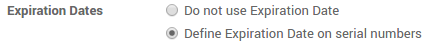
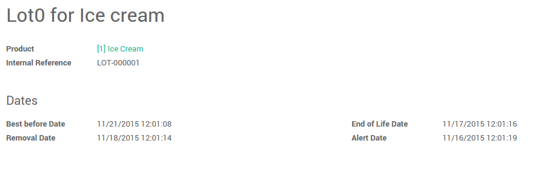

========================================================================
What is a removal strategy (FIFO, LIFO, FEFO, Specific Indentification)?
========================================================================

Overview
========

Removal strategies are usually in picking operations to select the best
products in order to optimize the distance for the worker, for quality
control purpose or due to reason of product expiration.

When a product movement needs to be done, Odoo will find available
products that can be assigned to shipping. The way Odoo assign these
products depend on the **removal strategy** that is defined on the **product
category** or on the **location**.

Configuration
=============

In the **Inventory** application, 
go to ..menuselection:`Configuration --> Settings`:

.. image:: media/removal01.png
    :align: center

.. image:: media/removal02.png
    :align: center

Check **Track lots or serial numbers**, **Manage several location per
warehouse** and **Advanced routing of products using rules**, then click
on **Apply**.

Then, open :menuselection:`Configuration --> Locations` 
and open the location on which you want to apply a removal strategy.

.. image:: media/removal03.png
    :align: center

Types of removal strategy
=========================

FIFO ( First In First Out )
---------------------------

A **First In First Out** strategy implies that the products that were
stocked first will move out first. Companies should use FIFO method if
they are selling perishable goods. Companies selling products with
relatively short demand cycles, such as clothes, also may have to pick
FIFO to ensure they are not stuck with outdated styles in inventory.

Go to :menuselection:`Inventory --> Configuration --> Locations`, 
open the stock location and set **FIFO** removal strategy.

Let's take one example of FIFO removal strategy.

In your warehouse stock (``WH/Stock``) location, there are ``3`` lots of ``iPod
32 Gb`` available.

You can find details of available inventory in inventory valuation
report.

.. image:: media/removal04.png
    :align: center

Create one sales order ``25`` unit of ``iPod 32 GB`` and confirm it.

You can see in the outgoing shipment product that the ``Ipod 32
Gb`` are assigned with the **oldest** lots, using the FIFO removal
strategy.

.. image:: media/removal05.png
    :align: center

LIFO (Last In First Out)
------------------------

In this warehouse management, the products which are brought in the
last, moves out the first. LIFO is used in case of products which do not
have a shelf life.

Go to :menuselection:`Inventory --> Configuration --> Locations`, 
open the stock location and set **LIFO** removal strategy.

In our example, let's check the current available stock of ``Ipod 32 Gb``
on ``WH/Stock`` location.

.. image:: media/removal06.png
    :align: center

Create a sale order with ``10`` units of ``Ipod 32 Gb``.

You can see in the outgoing shipment product that the ``Ipod 32
Gb`` are assigned with the **newest** lots, using the LIFO removal
strategy.

.. image:: media/removal07.png
    :align: center

FEFO ( First Expiry First Out ) 
--------------------------------

In FEFO warehouse management, the products are dispatched from the
warehouse according to their expiration date.

Go to :menuselection:`Inventory --> Configuration --> Setting`. 
Check the option **Define Expiration date on serial numbers**. 
Then click on **Apply** to save changes.

It will allow you to set **best before date**, **end of life date**, **alert
date** and **removal date** on the serial number. Go to 
:menuselection:`Inventory Control --> Serial Numbers/Lots`.

-   **Best Before Date**: This is the date on which the goods with this
    serial number start deteriorating, without being dangerous yet.

-   **End of Life Date:** This is the date on which the goods with this
    serial number may become dangerous and must not be consumed.

-   **Removal Date:** This is the date on which the goods with this
    serial Number should be removed from the stock.

-   **Alert Date:** This is the date on which an alert should be notified
    about the goods with this serial number.

Products will pick first with expiry date (removal date), So you have
to set removal date on lot/serial numbers.

To set the removal strategy on location, go to 
:menuselection:`Configuration --> Locations` and choose FEFO.

.. image:: media/removal10.png
    :align: center

Let's take an example, there are ``3`` lots of ``ice cream`` available in
``WH/Stock`` location: ``LOT0001``, ``LOT0002``, ``LOT0003`` with 
different expiration date.

+-----------------------+---------------+-----------------------+
| **Lot / Serial No**   | **Product**   | **Expiration Date**   |
+=======================+===============+=======================+
| LOT0001               | Ice Cream     | 08/20/2015            |
+-----------------------+---------------+-----------------------+
| LOT0002               | Ice Cream     | 08/10/2015            |
+-----------------------+---------------+-----------------------+
| LOT0003               | Ice Cream     | 08/15/2015            |
+-----------------------+---------------+-----------------------+

We will create a sale order with ``15kg`` of ``ice cream`` and confirm it.

The outgoing shipment related to sale order will make the move based on
removal strategy **FEFO**.

It will take ``10kg`` from ``LOT0002`` and ``5kg`` from ``LOT0003`` based on the
removal dates.

.. image:: media/removal11.png
    :align: center
