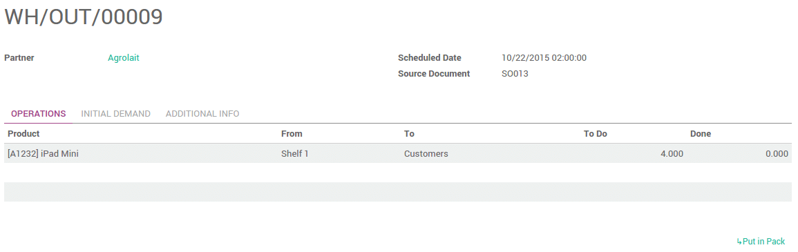
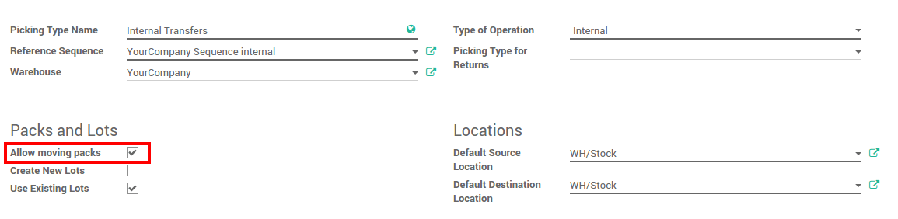

====================
How to use packages?
====================

Overview
========

The package is the physical container in which you put one or several
product.

By default, Odoo does not take into account the use of it.

Once you activate the option, you will be able to manage one or several
packages when doing your transfers.

Configuration
=============

To configure the use of packages, go to the menu 
:menuselection:`Inventory --> Configuration --> Settings`. µ
Locate the **Packages** section and tick **Record
packages used on packing: pallets, boxes,...**

.. image:: media/packages01.png
    :align: center

Click on **Apply** when you are done.

Pack products
=============

Putting products in packs is usually done when processing warehouses
transfers (receipt, internals or deliveries).

To be able to put products in pack, the status of your transfer has to
be **Available**.

In the operation tab, you can put your products into one or
multiple packages.

Choose the quantity you want to put in the first pack in the **Done**
column, then click on the link **Put in Pack**.

.. image:: media/packages03.png
    :align: center

It will automatically create a pack with the requested quantity.

Do the same steps for the other pieces you want to pack in.

.. image:: media/packages04.png
    :align: center

Click on **Validate** when you are done.

Whole packages transfers 
=========================

If you are using several locations and/or warehouses, it is possible to
transfer packages with its contents.

Configuration
-------------

You need to configure the **Operation Type** to allow moving packages. Go to
:menuselection:`Configuration --> Operations Types`. Tick **Allow moving packs**:

Transfer packages
-----------------

Create a transfer order. Choose the source and the destination
locations, then click on **Mark as todo**. Do not put anything under
the **Initial Demand** tab.

.. image:: media/packages06.png
    :align: center

In the Operation tab, click on **Add an item** under the **Package To Move**
section.

Tick the **Done** checkbox to confirm the move of the package :

.. image:: media/packages07.png
    :align: center

When it is finished, click on **Validate**.

Packages traceability
=====================

To trace a package or check its content, go to 
:menuselection:`Inventory Control --> Packages`.

Click on **Package Transfers** to see all its moves.

.. seealso::
    * :doc:`../../overview/start/setup`
    * :doc:`usage`
    * :doc:`uom`
