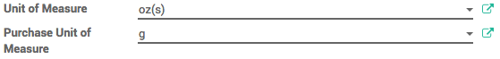
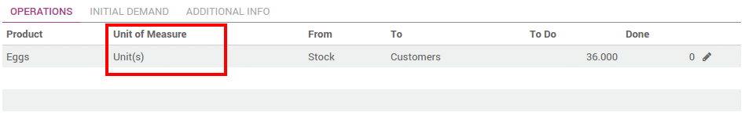

======================================
How to use different units of measure?
======================================

Overview
========

In some cases, handling products in different unit of measures is
necessary. For example, if you buy products in a country where the
metric system is of application and sell them in a country where the
imperial system is used, you will need to convert the units.

You can set up Odoo to work with different units of measure for one
product.

Configuration
=============

In the **Inventory** application, go to :menuselection:`Configuration --> Settings`.
In the **Products** section, select **Some products may be sold/purchased in
different units of measure (advanced)**, then click on **Apply**.

.. image:: media/uom09.png
   :align: center

Setting up units on your products
=================================

In :menuselection:`Master Data --> Products`, open the product which you would like to
change the purchase/sale unit of measure, and click on **Edit**.

In the **Unit of Measure** section, select the unit in which the product
will be sold and in which internal transfers will be done.

In the **Purchase Unit of Measure** section, select the unit in which
you purchase the product. When you're done, click on **Save**.

.. tip::
    Click on the edit button |edit| to create new unit of measures.

Transfer from one unit to another
=================================

When doing inter-unit transfers, the rounding is automatically done by
Odoo.

The unit of measure can be changed throughout the whole process. The
only condition is that the unit of measure is part of the same category.

In this example, we are in the egg business :

-  We buy eggs by trays (30 eggs)

-  We check all eggs individually when receiving it (quality control)

-  We sell eggs by the dozen to the customers

.. image:: media/uom01.png
   :align: center

.. note::
    The **Sale price** is expressed in the **Product unit of measure**. The
    **Cost price** is expressed in the **Purchase Unit of Measure**.

.. note::
    All internal transfers are expressed in the **Product Unit of
    Measure**.

Procurement
-----------

When doing your procurement request, you can still change the unit of
measure.

.. image:: media/uom06.png
   :align: center

The unit of measure can also be changed in the purchase order :

.. image:: media/uom03.png
   :align: center

Quality Control
---------------

The quality control is done by unit.

The basic unit of measure of our product is **Unit**. Therefore the
quality check is done by unit.

.. image:: media/uom05.png
   :align: center

.. note::
    The unit of measure can only be changed when the transfer status
    is **Draft**.

Delivery process
----------------

The eggs are sold by the dozen. You can choose the unit of measure on
the sale order document. When doing it, the price is automatically
computed from the unit to the dozen.

.. image:: media/uom04.png
   :align: center

In the delivery order, the initial demand is done in the sales order unit
of measure :

.. image:: media/uom02.png
   :align: center

But the transfer is done in the product unit of measure. Everything is
converted automatically :

.. todo::
    Create a link when the document is available
    -  When should you use packages, units of measure or kits?

