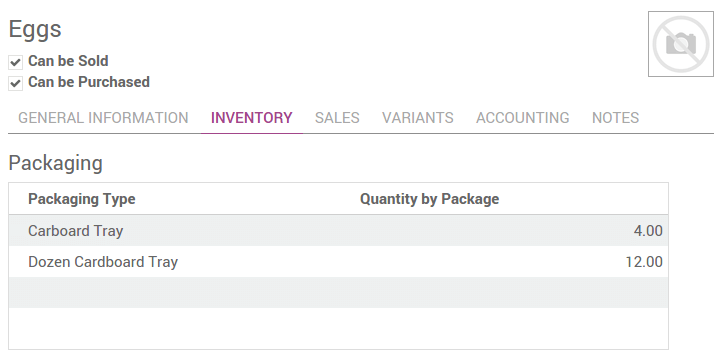

=======================================================
When should you use packages, units of measure or kits?
=======================================================

Unit of measures
================

Units of measures are an indication about the unit used to handle a
product. Products can be expressed in multiple units of measure at once.

Activate this option if you are working with several ones in your
warehouse.

The purchase unit of measure might be different that the one you use in
your warehouse.

The selling unit of measure is set on the sale order and can be
different.

.. image:: media/usage01.png
    :align: center

.. note::
    The conversion between the different units of measures is done
    automatically. The only condition is that all the units have to be in
    the same category (Unit, Weight, Volume, Length,...)

Packages
========

The package is the physical container in which you put one or several
product.

.. image:: media/usage02.png
    :align: center

Packaging
=========

Packaging is the physical container that protects your product.

If you are selling computers, the packaging contains the computer with
the notice and the power plug.

In Odoo, packagings are just used for indicative purpose.

.. note::
    You can define on the **Packages** which **Packaging** it uses. But it is
    only for indicative purpose.

When to use packages, packagings or unit of measures ? 
=======================================================

For example, you are sellings eggs. In your warehouse, you manage the
eggs individually. Lots of eggs are scrapped and you do it egg by egg.
The **unit of measure** is ``Unit(s)``.

If you are selling eggs by the dozen, the selling **unit of measure** is
the ``Dozen``. You will set it on your sale order.

The ``cardboard trays`` that contains the dozen of eggs is the **packaging**.

When you are selling several trays, you might wrap all the trays into a
``box`` or in a ``plastic`` wrapping. It is the **package**.

.. seealso::
    * :doc:`../../overview/start/setup`
    * :doc:`uom`
