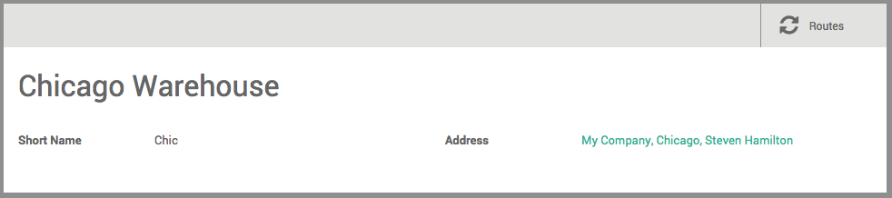

==============================
How to create a new warehouse?
==============================

Configuration
=============

Creating a new warehouse
------------------------

In order to be able to create a new warehouse, you must allow the system
to manage multiple locations. In the **Inventory** module, open the menu
:menuselection:`Settings --> Configuration`. In the **Location &
Warehouse** section, tick the **Manage several locations per warehouse**
box, then click on **apply**.

.. image:: media/warehouse_creation02.png
   :align: center

Open the menu :menuselection:`Configuration --> Warehouse Management --> Warehouses`

In the warehouses screen, click on **Create**. A new screen appears, with
3 fields :

-   In **Warehouse Name**, insert the full name of the warehouse.

-   In the **Short Name** field, insert a 5-characters code for your
    warehouse. Keep in mind that this code is the one that will appear in
    the lists, so make sure you choose a name that is easy to understand
    and easy to enter.

-   In the **Address** field, you can select an existing company or create
    one on-the-go. Therefore, the address of your warehouse will be the same
    as the one of the company you selected. You can also leave this field
    empty and edit it afterwards.

Click on **Save** to finish configuring your new warehouse.

.. note::
    When you create a warehouse, the system will create the necessary 
    picking types and main child locations for this main location in the background.

.. seealso::
    * :doc:`difference_warehouse_location`
    * :doc:`location_creation`