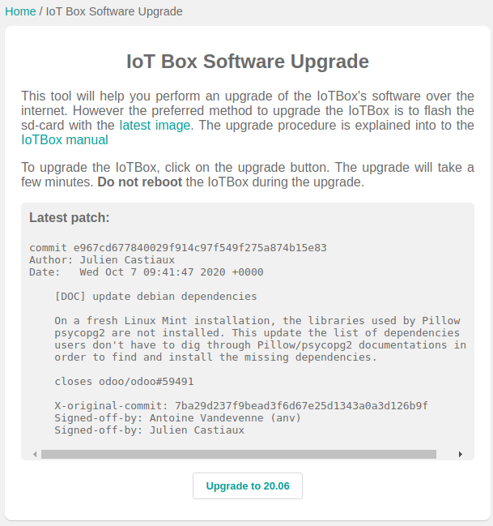

=====================
Flashing your SD Card
=====================

In some case, you may need to reflash your IoT Box’s SD Card to benefit
from our latest updates.

Updating your SD Card with Etcher
=================================

Go to Balena’s website and download
`Etcher <https://www.balena.io/>`__, It’s a free and
open-source utility used for burning image files. Install and launch it.

Now, download the latest image `here <http://nightly.odoo.com/master/posbox/iotbox/>`__, and extract it from the zip file. Then, open *Etcher* and select the image.
Select the drive to flash (where your SD Card is) and click on
*Flash*!.

Now, your image will be automatically updated. You just have to wait 5 minutes for it to finish.

