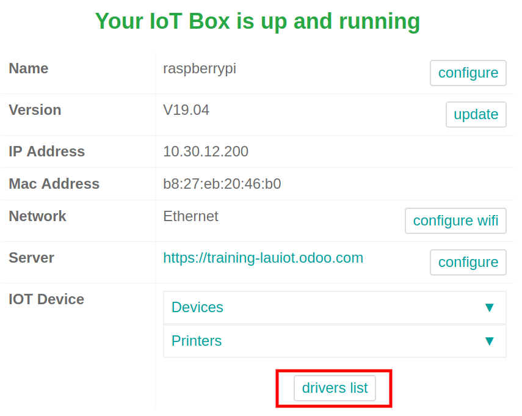
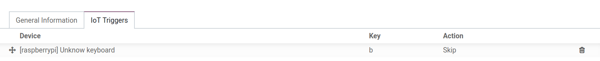

====================
Connect a Footswitch
====================

When working, it is always better to have your two hands available.
Using Odoo’s *IoT Box* and a footswitch will allow it.

In fact, you will be able to go from one screen to another by using your
foot and the footswitch. Really convenient, it can be configured in a
few steps.

Connection
==========

Connecting the footswitch to the *IoT Box* is easy, you just have to
combine the two by cable.

.. note::
		In some cases, a serial to USB adapter may be needed.

If your footswitch is a `supported
one <https://www.odoo.com/page/iot-hardware>`__, there is no need to
set up anything since it will be automatically detected when connected.

.. image:: media/footswitch_01.png
   :align: center

If it is not a supported one, you may need to restart the box and
download your footswitch’s drivers from the box. To do so, go to the
*IoT Box Home Page* and click on *drivers list*. Then, click on load
drivers.

Link a Footswitch to a Workcenter
=================================

To link the footswitch to an action, it needs to be configured on a
workcenter. Go to the workcenter you want to use the footswitch in and
add the device in the *IoT Triggers* tab. Then, you can link it to an
action and also add a key to trigger it.

Note that the one that is first in the list will be chosen. So, the
order matters! In the picture above, using the footswitch will, for
example, automatically skip the current part of the process you work on.

.. note::
		When you are on the work order screen, a status button indicates if you
		are correctly connected to the footswitch.