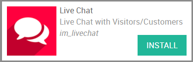
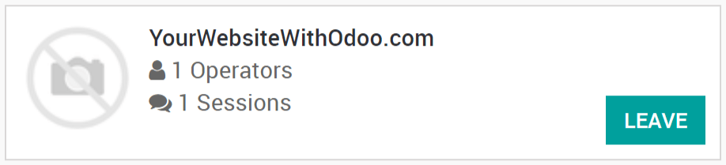
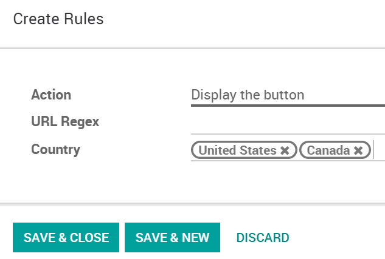
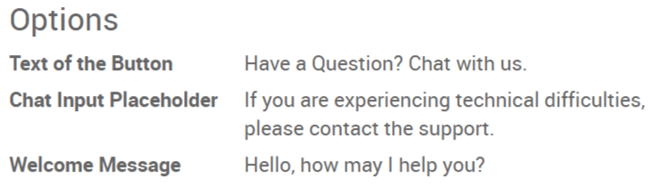
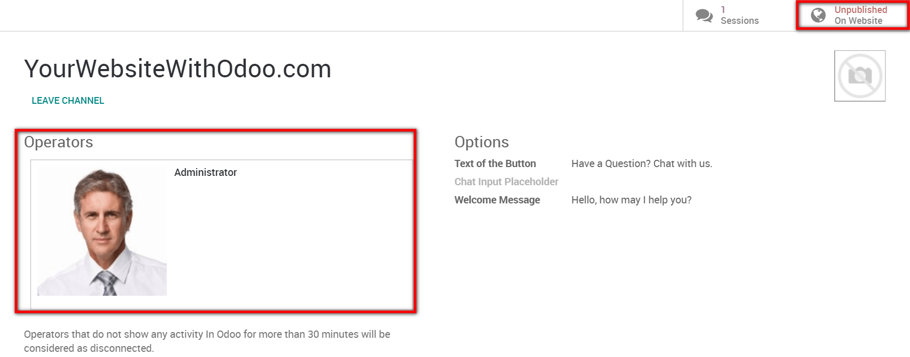

:banner: banners/livechat.jpg

=========
Live Chat
=========

Chat in real time with website visitors
=======================================

With Odoo Live Chat, you can establish a direct contact with your
website visitors. A simple dialog box will be available on their screen
and will allow them to get in touch with one of your sales
representatives. This way, you can easily turn prospects into potential
business opportunities. You will also be able to provide assistance to
your customers. Overall, this is the perfect tool to improve customer
satisfaction.

Configuration
=============

To get the Live Chat feature, open the Apps module, search for "Live
Chat" and then click on install.

The Live Chat module provides you a direct access to your channels.
There, operators can easily join and leave the chat.

Add the live chat to an Odoo website
====================================

If your website was created with Odoo, then the live chat is
automatically added to it. All that is left to do, is to go to
:menuselection:`Website --> Configuration --> Settings` to select the
channel to be linked to the website.

.. image:: media/live_chat03.png
   :align: center

Add the live chat to an external website
========================================

If your website was not created with Odoo, go to the Live Chat module
and then select the channel to be linked. There, you can simply copy
paste the code available into your website. A specific url you can send
to customers or suppliers for them to access the live chat is also
provided.

Hide / display the live chat according to rules
===============================================

Rules for the live chat can be defined on the channel form. For
instance, you can choose to display the chat in the countries you speak
the language of. On the contrary, you are able to hide the chat in
countries your company does not sell in. If you select *Auto popup*,
you can also set the length of time it takes for the chat to appear.

Prepare automatic messages
==========================

On the channel form, in the *Options* section, several messages can be
typed to appear automatically on the chat. This will entice visitors to
reach you through the live chat.

Start chatting with customers
=============================

In order to start chatting with customers, first make sure that the
channel is published on your website. To do so, select *Unpublished on
Website* on the top right corner of the channel form to toggle the
*Published* setting. Then, the live chat can begin once an operator
has joined the channel.

.. note::
   If no operator is available and/or if the channel is
   unpublished on the website, then the live chat button will not appear to
   visitors.

Conversations initiated by visitors also appear in
the Discuss module in addition to popping up as a direct message. Therefore,
inquiries can be answered wherever you are in Odoo.

If there are several operators who have all joined a channel, the system will
dispatch visitor sessions randomly between them.

Use commands
============

Commands are useful shortcuts for completing certain actions or to
access information you might need. To use this feature, simply type the
commands into the chat. The following actions are available :

**/help** : show a helper message.

**/helpdesk** : create a helpdesk ticket.

**/helpdesk\_search** : search for a helpdesk ticket.

**/history** : see 15 last visited pages.

**/lead** : create a new lead.

**/leave** : leave the channel.

.. note::
   If a helpdesk ticket is created from the chat, then the
   conversation it was generated from will automatically appear as the
   description of the ticket. The same goes for the creation of a lead.

Send canned responses
=====================

Canned responses allow you to create substitutes to generic sentences
you frequently use. Typing a word instead of several will save you a lot
of time. To add canned responses, go to :menuselection:`LIVE CHAT -->
Configuration --> Canned Responses` and create as many as you need to.
Then, to use them during a chat, simply type ":" followed by the
shortcut you assigned.

.. image:: media/live_chat07.png
   :align: center

You now have all of the tools needed to chat in live with your website
visitors, enjoy !
