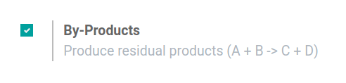

=========================
Create Bills of Materials
=========================

A *Bill of Materials* is a document defining the quantity of each
component required to manufacture a finished product. It also includes
the routing and individual steps of the manufacturing process.

With Odoo, you can link multiple BoMs to each product and use it to
describe multiple variants of them. Each BoM will, yet, be associated
with one product only.

This feature will help optimize your manufacturing process while saving
you time.

Setting up a BoM
================

You can use BoMs without routings. You will use this if you choose to
manage your manufacturing operations using manufacturing orders only. In
other words, you choose to realize your manufacturing process in one
step and do not track the steps the product goes through.

Before creating your *BoM*, you have to create the product using the
*BoM* and, at least, one of the components. Go to the :menuselection:`Master Data menu --> Products`
and create both the finished product and the component.

Once done, go to the *Bills of Materials* menu under *Master Data*.
Now, create it. Choose the product from the dropdown menu and add your
components and the quantity. In this case, keep the default *BoM*
type, which is *Manufacture this Product*.

.. image:: media/bills_of_materials_01.png
    :align: center

Using the same BoM to describe Variants
---------------------------------------

As said above, you can use *BoM* for *Product Variants*. It is
basically the same as for the standard product.

If your *BoM* is for one variant only, then specify which one in the
*Product Variant* field. If not, specify the variant it is consumed
for on each component line. You can add several variants for each
component.

.. image:: media/bills_of_materials_02.png
    :align: center

Adding a routing
================

You can add routing to your *BoM*. You will do this if you need to
define a series of operations required by your manufacturing process. To
use it, enable the *Work Orders* feature in the *Manufacturing* app
settings.

.. image:: media/bills_of_materials_03.png
    :align: center

.. note::
         Each *BoM* can have only one routing while each routing can be used
         multiple times.

Now that you have created your routing, add it to your *BoM*. You can
select when, in the work operations, your components are consumed with
the dropdown menu.

.. image:: media/bills_of_materials_04.png
    :align: center

Adding By-Products
==================

In Odoo, a *by-product* is any product produced by a *BoM* in
addition to the primary product.

To add *by-products* to a *BoM*, you will first need to enable them
from the *Manufacturing* app settings.

Once the feature is enabled, you can add your *By-Products* to your
*BoMs*. You can add as many *By-Products* as you want. Just keep in
mind that you need to register during which operation your by-product is
produced.

.. image:: media/bills_of_materials_06.png
    :align: center