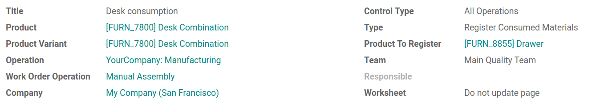

===================================
Use flexible components consumption
===================================

Sometimes, you might need more components than usual to manufacture a
product. Let’s say that you produce a desk combination of 4 desks and
two chairs but your customer asks you one more desk. Alright, you can do
that. But you will need to register it!

In case this happens, Odoo has the *flexible components consumption*
feature available. If you enable it, you will be able to consume as many
components as needed and it will make you save time in the registration
of your items consumption.

Configuration
=============

Using flexible component consumption is easy and can be done in a few
steps. All you need is a *BoM* and a *Quality Control Point*.
Therefore, you will need to activate the feature *Quality* in the
*MRP* app settings.

First, open the *BoM* you want to use for flexible component
consumption and edit it. In the *Miscellaneous* tab, choose
*Flexible* as the consumption type. Then, save.

.. image:: media/flexible_components_consumption_01.png
    :align: center

Now, in the *Quality* app, open the *Control Point* menu, under
*Quality Control* and create a new *Quality Control Point*. Choose
your product, your operation and work order operation. Then, choose
*Register Consumed Materials* as type.

Next, go back to your *Manufacturing* app and create a *Manufacturing
order*. Choose the product for which you have created the flexible
*BoM*.

Then, confirm it and launch the process step. While processing, you will
have the possibility to consume more components than expected in the
*BoM*. To do so, click on *Continue Consumption*.

.. image:: media/flexible_components_consumption_03.png
    :align: center

When the job is over, you will find a summary of your component
consumption in the *Finished Steps* tab of your work order.

.. image:: media/flexible_components_consumption_04.png
    :align: center