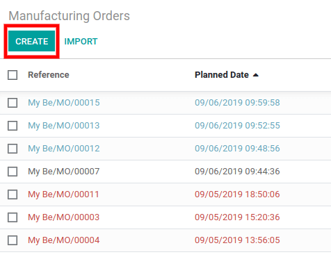

============================
Process Manufacturing Orders
============================

In Odoo, you can manage your manufacturing process in two different
ways. You can work with one document, or decide to have more information
and control over it.

In the first case, Odoo makes things easier and helps you manage work
with one document only: the manufacturing order. No complex steps during
the process, you just have to schedule the job and record the
production.

But, if you need more control, you can use additional documents (steps)
to your manufacturing process. This way, *Manufacturing Orders* are
divided into one or more steps defined by *Work Orders* and performed
in a sequence defined by *routings*.

Using Odoo will allow you to precisely schedule the job, analyze your
efficiency but also have ease when realizing each step of your
manufacturing process.

Manage Manufacturing Without Routings
=====================================

If your manufacturing process is limited to one place, one person and
one step, you will probably use manufacturing orders without routings.

In Odoo, it is the default behavior. If work this way, there are two
basic phases from planning to production:

-  Create a manufacturing order

-  Record the production

Manage Manufacturing with Routings and Work Centers
===================================================

To use *Work Centers* and *Routings*, you will need to enable the
*Work Orders* feature. To do so, go to the *Manufacturing* app
settings.

.. image:: media/process_manufacturing_orders_01.png
    :align: center

Now, you can add routings to *BoMs* and configure your operations
taking place at different *work centers*. The *Work Centers* are the
locations at which work orders are performed.

.. image:: media/process_manufacturing_orders_02.png
    :align: center

When manufacturing this way, each *Work Order* is scheduled
individually. You will also have access to time and capacity planning,
as well as reports on costing and efficiency for each *Work Center*.

.. image:: media/process_manufacturing_orders_03.png
    :align: center

Thus, the workflow is divided into three basic phases:

-  Create the manufacturing order

-  Schedule the associated work orders

.. image:: media/process_manufacturing_orders_05.png
    :align: center

-  Perform the scheduled work and record production

.. image:: media/process_manufacturing_orders_06.png
    :align: center