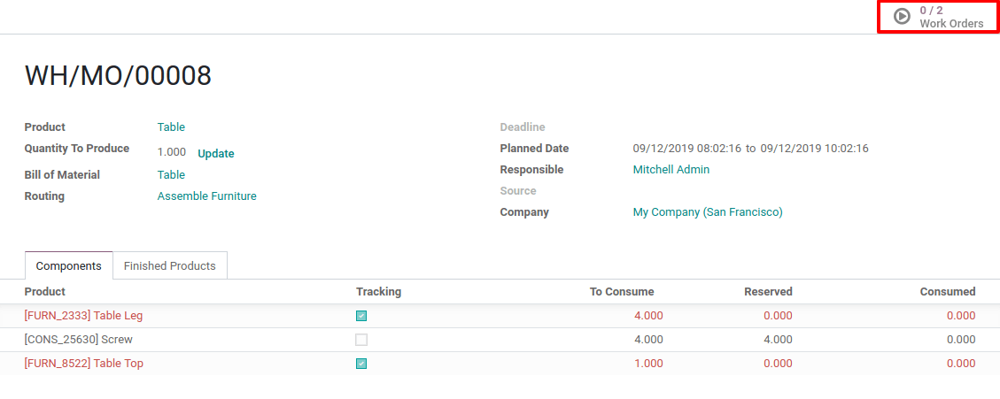
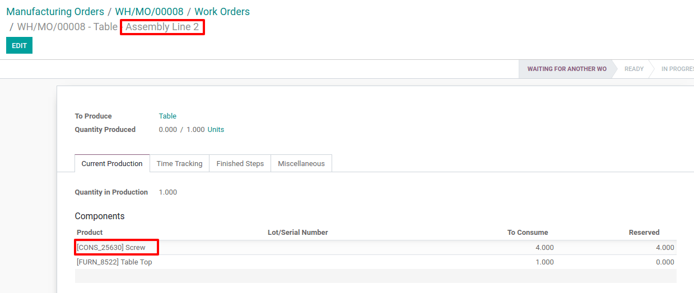
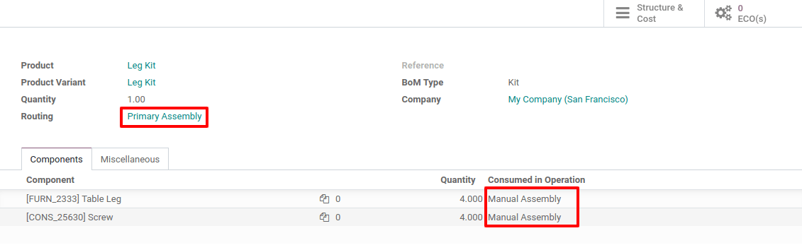
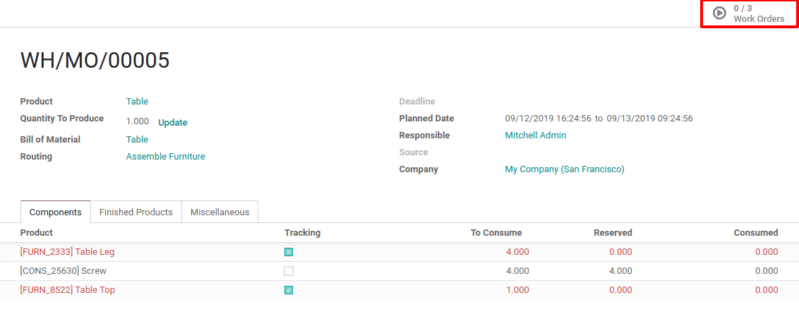
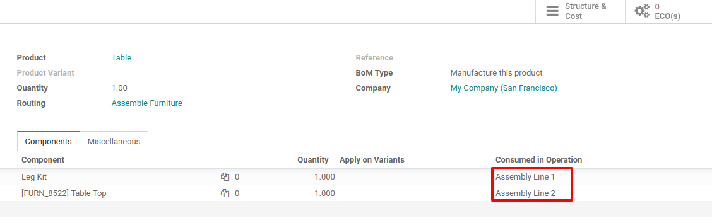

======================================
Set routings on kit Bills of materials
======================================

It often happens that you want to use kit BoM’s within manufactured
product BoM’s in order to lighten the list of components for this
manufactured product. When doing so, you would like to have the
possibility to specify, for each kit component, in which operation they
are consumed.

We will see the three use cases that you can face in these kinds of
configurations.

Finished Product & Kit Component have the same Routing
======================================================

Create BoM for the Finished Product
-----------------------------------

Create a manufactured BoM for the finished product which includes a kit
component. Set a routing on your BoM, for example, *Assemble
Furniture*.

.. image:: media/routing_kit_bom_01.png
    :align: center

Create a Kit BoM for the Kit Component
--------------------------------------

Update the kit component to define its BoM. Make sure that the routing
which is set on this BoM is the same one than on the Finished Product.

.. image:: media/routing_kit_bom_02.png
    :align: center

You can define the operations in which the kit components are used
directly in the BoM of the kit.

Manufacturing Order
-------------------

In the list of components, the kit is split. Two work orders are created
as we have two operations defined in the *Assemble Furniture* routing.
The components of the kits are well consumed in the operations defined
in the kit BoM.

.. image:: media/routing_kit_bom_04.png
    :align: center

Finished Product & Kit Component haven’t the same Routing
=========================================================

Kit Consumption set on Finished Product BoM
-------------------------------------------

Create BoM for the Finished Product
~~~~~~~~~~~~~~~~~~~~~~~~~~~~~~~~~~~

Create a manufactured BoM for the finished product which includes a kit
component. Set a routing on your BoM, for example, *Assemble
Furniture*.

.. image:: media/routing_kit_bom_01.png
    :align: center

Create a Kit BoM for the Kit Component
~~~~~~~~~~~~~~~~~~~~~~~~~~~~~~~~~~~~~~

Update the kit component to define its BoM. In this use case, the
routing which is set on this Kit BoM is different than the one of the
Finished Product. Specify the operations at which the kit components are
consumed in this BoM.

Manufacturing Order
~~~~~~~~~~~~~~~~~~~

When the manufacturing order is created for the Manufactured product,
the kit is split among its components. When the manufacturing order is
planned, three work orders are created in our case, one coming from the
routing of the manufactured products, the two other ones coming from the
routing of the kit BoM.

The components are all consumed during their respective operations.

.. image:: media/routing_kit_bom_08.png
    :align: center

.. image:: media/routing_kit_bom_09.png
    :align: center

Kit Consumption set on Kit BoM
------------------------------

Create BoM for the Finished Product
~~~~~~~~~~~~~~~~~~~~~~~~~~~~~~~~~~~

Create a manufactured BoM for the finished product which includes a kit
component. Set a routing on your BoM, for example, *Assemble
Furniture*. Precise the consumption of the components on this BoM.

Create a Kit BoM for the Kit Component
~~~~~~~~~~~~~~~~~~~~~~~~~~~~~~~~~~~~~~

Update the kit component to define its BoM. In this use case, the
routing which is set on this Kit BoM is different than the one of the
Finished Product.

.. image:: media/routing_kit_bom_11.png
    :align: center

Manufacturing Order
~~~~~~~~~~~~~~~~~~~

When the manufacturing order is created for the Manufactured product,
the kit is split among its components. When the manufacturing order is
planned, three work orders are created in our case, one coming from the
routing of the manufactured products, the two other ones coming from the
routing of the kit BoM.

.. image:: media/routing_kit_bom_08.png
    :align: center

All the components of the kits are consumed during the first operation.
The last component is consumed during the second operation.

.. image:: media/routing_kit_bom_12.png
    :align: center

.. image:: media/routing_kit_bom_13.png
    :align: center