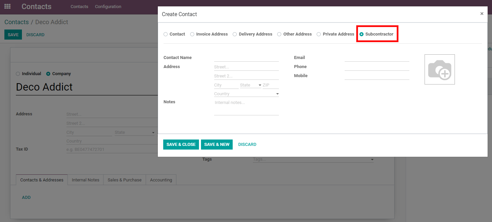
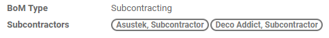
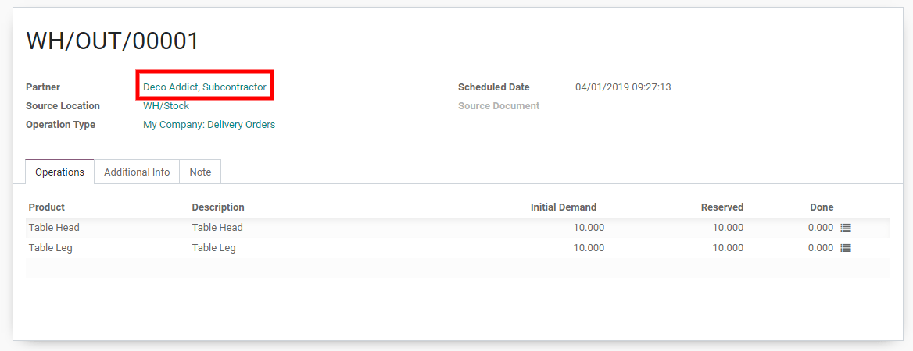
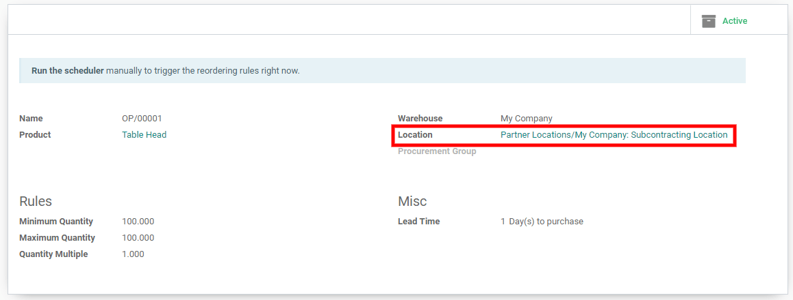
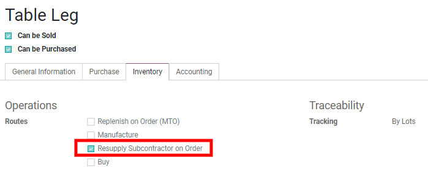

Subcontract the manufacturing of some products 
==============================================

Some business subcontract the production of some finished products
through subcontractors. This can be easily managed through Odoo.

Configuration
-------------

Go in the :menuselection:`Manufacturing --> Configuration --> Settings` and tick the box *Subcontracting*.

.. image:: media/subcontracting01.png
    :align: center

You can now define subcontractors contacts. When you purchase or receive
products from a contact of type subcontractor, the correct stock moves
are created to represent the subcontracting of the production.

The next step is to create a Bill of Material of type *subcontracted*.
In this BoM, list the components you need to supply to the
subcontractor.

.. image:: media/subcontracting03.png
    :align: center

You can also define subcontractors on the BoM.

-  If no subcontractor is set, the BoM can be used by any subcontractor

-  If some are set, the BoM can only be used for those subcontractors

The configuration part is already done!

Receive or buy a subcontracted product
--------------------------------------

You have two options to trigger a the subcontracting of a product:

-  Option A: You can buy the subcontracted product from your
       subcontractor

-  Option B: You can directly receive the subcontracted product

Let’s start with option A (option B is just a simpler version of it).

Create a new purchase order. The vendor must be a subcontractor. The
unit price should be the cost you are paying to the subcontractor for
the subcontracting (it’s thus not necessarily the total cost of the
subcontracted product).

.. image:: media/subcontracting05.png
    :align: center

The validation of the purchase order creates automatically the receipt.
Whenever you receive the product, you can validate the receipt. The
following stock moves are created:

-  For the components

    From Subcontracting To Production

-  For the subcontracted product

    From Production to Subcontracting

    From Subcontracting to Stock

The *Subcontracting Location* represents the place where the products
are at your subcontractor’s warehouse. It is configured as an internal
location, the components that are sent to the subcontractor are still
valued in your stock.

For option B, you simply can create the receipt manually with a partner
of type subcontractor defined on it.

Resupply the subcontractor with the components
----------------------------------------------

There are 3 ways to manage the resupply of your subcontractor with the
components:

-  Manually. You simply create a delivery order on which you set the
       subcontractor as partner and you choose the components to deliver

-  With reordering rules. You can define a reordering rule on the
       Subcontracting location to ensure that they are always enough
       components send to your subcontractors.

-  On order. You can also deliver the components to your subcontractors
       each time you order a subcontracted product. For this, you need
       to tick the route “Resupply Subcontractor on Order” on the
       components concerned.

