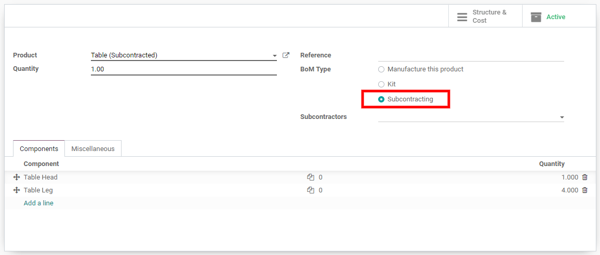
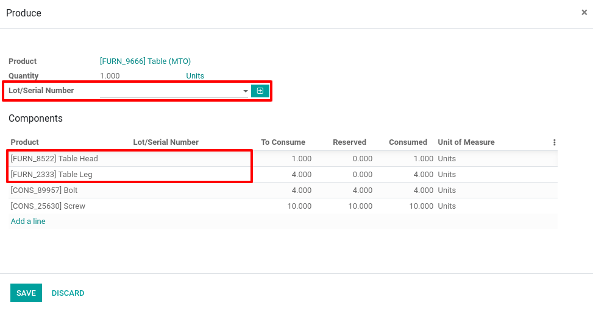

=============================
Subcontract the manufacturing
=============================

Some businesses subcontract the production of finished products through
subcontractors. This can be easily managed through Odoo.

Configuration
=============

Go to the :menuselection:`Manufacturing app --> Configuration --> Settings` and tick the
box *Subcontracting*.

You can now define subcontracted *Bill of Materials*. Therefore, you need to go to
:menuselection:`Manufacturing --> Master Data --> Bill of Materials` and hit *Create*. In this
*BoM*, list the components which will be used by the subcontractor to manufacture the subcontracted
finished product. Specify that the *BoM* type is *Subcontracting* and define one or
several subcontractors who will provide you the product.

And... the configuration part is already done!

Receive or buy a subcontracted product
======================================

You have two options to trigger the subcontracting of a product:

-  **Option A**: You can buy the subcontracted product from your subcontractor

-  **Option B**: You can directly receive the subcontracted product

Let’s start with option A (option B is just a simpler version of it).

Create a new purchase order. The vendor must be a subcontractor. The
unit price should be the cost you are paying to the subcontractor for
the subcontracting (thus, it’s not necessarily the total cost of the
subcontracted product).

.. image:: media/subcontracting_04.png
    :align: center

The validation of the purchase order automatically creates the receipt.
Whenever you receive the product, you can validate the receipt. The
following stock moves are created:

-  For the components

   -  From Subcontracting To Production

-  For the subcontracted product

   -  From Production to Subcontracting

   -  From Subcontracting to Stock

The *Subcontracting Location* represents the place where the products
are at your subcontractor’s warehouse. It is configured as an internal
location, the components that are sent to the subcontractor are still
valued in your stock.

For option B, you can simply create the receipt manually with a partner
of type subcontractor defined on it.

Receive or buy a subcontracted product with tracked components
==============================================================

In case the subcontracted product you receive from your subcontractor
contains tracked components, you will need to specify the *serial/lot
numbers* of the components in question for traceability. This operation
is included in the receipt of the subcontracted product.

On the receipt, you see a *Record Components* button appearing when
necessary. If you click on it, a *Produce* wizard opens in which you
will have to enter the *serial/lot numbers* of the components, and the
finished product if it is also tracked, like in the below example.

Once this information has been entered, you will see a new icon on the
receipt stock move, which will allow you to find back the components
which are part of the finished product.

Resupply the subcontractor with the components
==============================================

There are 3 ways to manage the resupply of your subcontractor with the
components:

-  **Manually**: You create a delivery order in which you set the subcontractor as a partner and you choose the components to deliver.

.. note::
        You therefore need to activate *Multi-locations* in the inventory settings.

-  **With reordering rules**: You can define a *reordering rule* on the *Subcontracting location* to ensure that they are always enough components sent to your subcontractors. When the reordering rule is triggered, a delivery order is created for the product is automatically created.

-  **On order**: You can also deliver the components to your subcontractors each time you order a subcontracted product. For this, you need to tick the route *Resupply Subcontractor on Order* on the wanted components.

