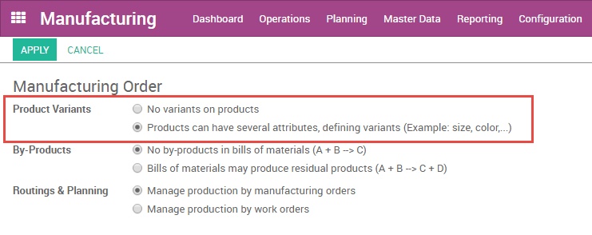

=======================================
How to manage BoMs for product variants
=======================================

Odoo allows you to use one bill of materials for multiple variants of
the same product. Simply enable variants from
:menuselection:`Configuration --> Settings`.

You will then be able to specify which component lines are to be used in
the manufacture of each product variant. You may specify multiple
variants for each line. If no variant is specified, the line will be
used for all variants.

When defining variant BoMs on a line-item-basis, the **Product
Variant** field in the main section of the BoM should be left blank.
This field is used when creating a BoM for one variant of a product
only.

.. image:: media/product_variants02.png
    :align: center
