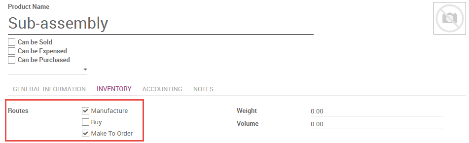

====================================
How to manage semi-finished products
====================================

A subassembly is a manufactured product which is intended to be used as
a component of another manufactured product. You may wish to employ
sub-assemblies to simplify a complex BoM, to more accurately represent
your manufacturing flow, or to use the same subassembly in multiple
BoMs. A BoM that employs subassemblies is often referred to as a
multi-level BoM.

Multi-level bills of materials in Odoo are accomplished by creating a
top-level BoM and subassembly BoMs. Next, the procurement route of the
subassembly product is defined. This ensures that every time a
manufacturing order for the top-level product is created, a
manufacturing order for each subassembly is created as well.

Configure the Top -Level Product BoM
------------------------------------

To configure a multi-level BoM, create the top-level product and its
BoM. Include any subassemblies in the list of components. Create a BoM
for each subassembly as you would for any product.

.. image:: media/sub_assemblies01.png
    :align: center

Configure the Subassembly Product Data
--------------------------------------

On the product form of the subassembly, you must select the routes
**Manufacture** and **Make To Order**. The **Manufacture**
route takes precedence over the **Buy** route, so selecting the
latter will have no effect.

If you would like to be able to purchase the subassembly in addition to
manufacturing it, select **Can be Purchased**. All other fields on
the subassembly product form may be configured according to your
preference.
