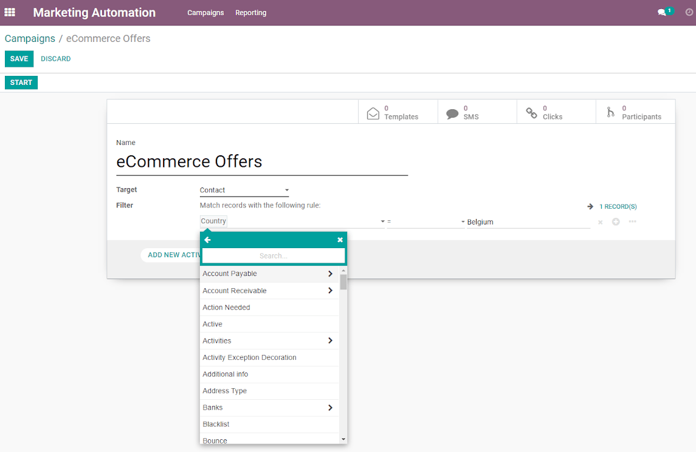
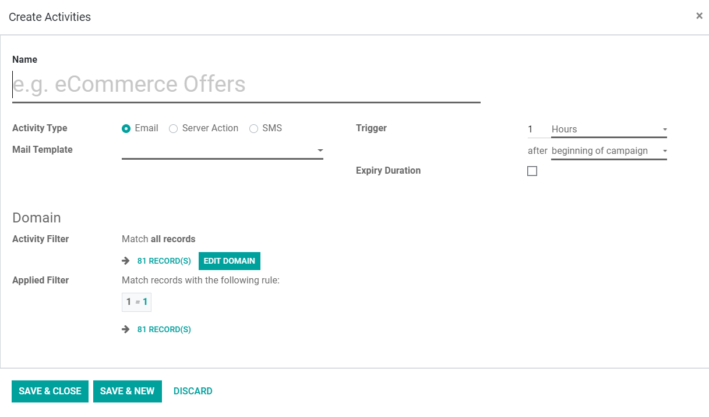

======================================
Automate Actions and Create a Workflow
======================================
Automated workflows are a sign that you are building intelligent, data-driven, multifaceted
campaigns to enable the delivery of the right message, to the right prospects, at the right time.
It also speeds up processes and creates a seamless experience for employees.

Segment and create a campaign
=============================
Go to :menuselection:`Campaigns --> Create`.

| In the example below, the *Marketing Automation* application is fully integrated with *Contacts*.
| But it can also be integrated with other apps like CRM, as long as they are installed in your
  database.

| Depending on the criteria, the *target model updates itself* while the campaign is running. That
  means that every new record that meets the criteria will be added to the workflow.
| Example: a campaign starts for leads that have no salesman assigned. If at some point, those leads
  get to have a salesman assigned to it, the campaign will stop running.

Create a parent activity and start to build a workflow
======================================================
Click on *Add new activity*.

*Trigger* is the field to set for the activity to start to de deployed.

Adopt an *Expiry Duration* if you would like to stop actions from being executed after a certain
amount of time and in subsequence to the trigger.

Under *Domain* you can narrow down your target, even more, applying filters for this specific
activity.

Add Child Activities
--------------------
| A *child activity* is an action that will take place based on a condition.
| You can either create or add a child activity if on the previous one: the email was opened or not,
  the email was replied or not, the link was clicked or not, the email bounced back.

.. image:: media/auto3.png
   :align: center
   :height: 350
   :alt: Create workflows in Odoo Marketing Automation

.. seealso::
   - :doc:`segment`