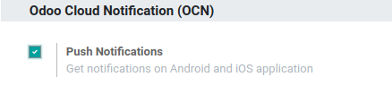

:banner: banners/mobile.jpg

======
Mobile
======

Setup your Firebase Cloud Messaging
===================================

In order to have mobile notifications in our Android app, you need an
API key.

If it is not automatically configured (for instance for On-premise or
Odoo.sh) please follow these steps below to get an API key for the
android app.

.. danger::
   The iOS app doesn't support mobile notifications for Odoo
   versions < 12.

Firebase Settings
=================

Create a new project
--------------------

First, make sure you to sign in to your Google Account. Then, go to
`https://console.firebase.google.com <https://console.firebase.google.com/>`__
and create a new project.

.. image:: media/firebase01.png
   :align: center

Choose a project name, click on **Continue**, then click on **Create
project**.

When you project is ready, click on **Continue**.

You will be redirected to the overview project page (see next
screenshot).

Add an app
----------

In the overview page, click on the Android icon.

.. image:: media/firebase02.png
   :align: center

You must use "com.odoo.com" as Android package name. Otherwise, it will
not work.

.. image:: media/firebase03.png
   :align: center

No need to download the config file, you can click on **Next** twice and
skip the fourth step.

Get generated API key
---------------------

On the overview page, go to Project settings:

.. image:: media/firebase04.png
   :align: center

In **Cloud Messaging**, you will see the **API key** and the **Sender ID**
that you need to set in Odoo General Settings.

.. image:: media/firebase05.png
   :align: center

Settings in Odoo
================

Simply paste the API key and the Sender ID from Cloud Messaging.

