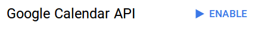
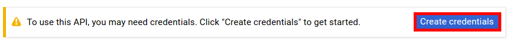
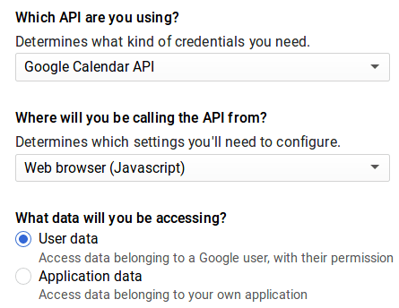
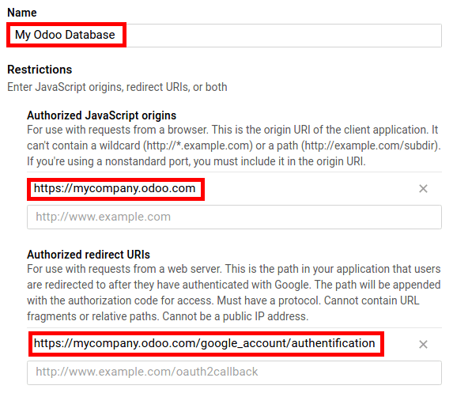
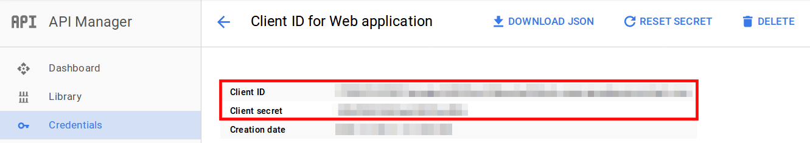
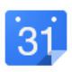

==========================================================
How to synchronize your Twenty20 Calendar with Google Calendar
==========================================================

Twenty20 is perfectly integrated with Google Calendar so that you
can see & manage your meetings from both platforms 
(updates go through both directions).

Setup in Google
===============
- Go to `Google APIs platform <https://console.developers.google.com>`__ 
  to generate Google Calendar API credentials. Log in with your Google account. 

- Choose *Calendar API*.

.. image:: media/google_calendar_credentials01.png
    :align: center

- Create a new project and give it a name (e.g. Twenty20). This project is needed
  to store your API credentials.

.. image:: media/google_calendar_credentials02.png
    :align: center

- Enable the API.

- Create credentials to use in Twenty20.

- Select *Web browser (Javascript)* 
  as calling source and *User data* as kind of data.

- Then you can create a Client ID.
  Enter the name of the application (e.g. Twenty20) and the allowed pages on
  which you will be redirected. The *Authorized JavaScript origin* is your 
  Twenty20's instance URL. The *Authorized redirect URI* is your Twenty20's instance
  URL followed by '/google_account/authentication'.

- Go through the Consent Screen step by entering a product name 
  (e.g. Twenty20). Feel free to check the customizations options
  but this is not mandatory. The Consent Screen will only show up when you 
  enter the Client ID in Twenty20 for the first time.

- Finally you are provided with your **Client ID**. Go to *Credentials* to 
  get the **Client secret** as well. You will need both of them in Twenty20.

Setup in Twenty20
=============

- Install **Google Calendar** app.

- Go to :menuselection:`Settings --> General Settings` and enter your 
  credentials in Google Calendar option.

.. image:: media/google_calendar_credentials09.png
    :align: center

- The setup is now ready. Open your Twenty20 Calendar and sync with Google.
  The first time you do it you are redirected to Google to authorize
  the connection. Once back in Twenty20, click the sync button again.
  You can click it whenever you want to synchronize your calendar.

.. image:: media/google_calendar_credentials10.png
    :align: center

As of now you no longer have excuses to miss a meeting!

