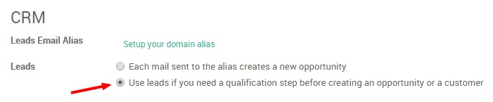
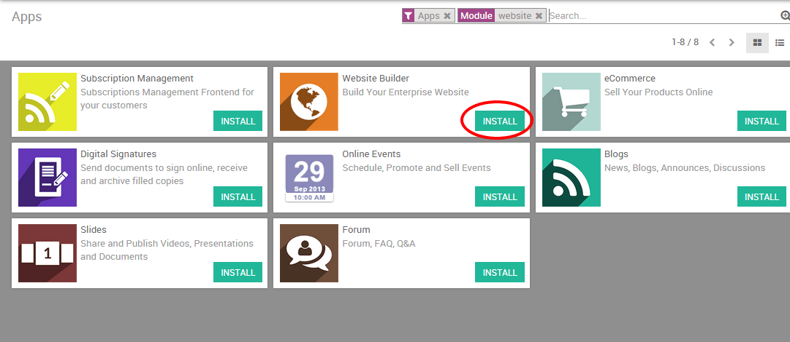
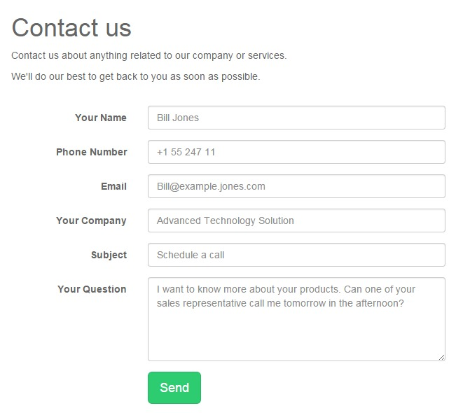
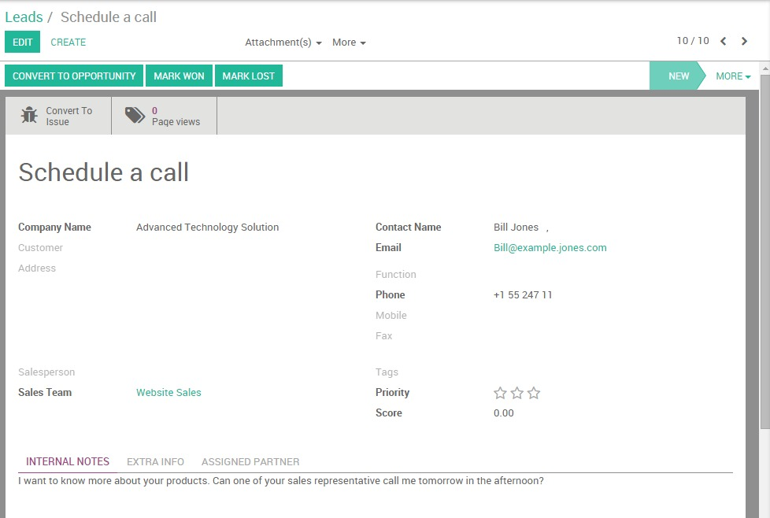
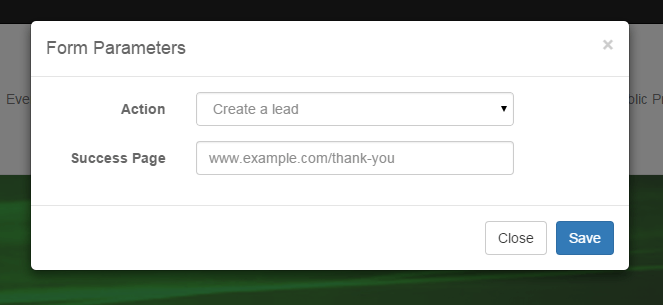

======================================
How to generate leads from my website?
======================================

Your website should be your company's first lead generation tool. With
your website being the central hub of your online marketing campaigns,
you will naturally drive qualified traffic to feed your pipeline. When a
prospect lands on your website, your objective is to capture his
information in order to be able to stay in touch with him and to push
him further down the sales funnel.

This is how a typical online lead generation process work :

-  Your website visitor clicks on a call-to action (CTA) from one of
   your marketing materials (e.g. an email newsletter, a social
   media message or a blog post)

-  The CTA leads your visitor to a landing page including a form used to
   collect his personal information (e.g. his name, his email
   address, his phone number)

-  The visitor submits the form and automatically generates a lead into
   Twenty20 CRM

.. tip::

	Your calls-to-action, landing pages and forms are the key pieces of the lead
	generation process. With Twenty20 Website, you can easily create and optimize
	those critical elements without having to code or to use third-party
	applications. Learn more `here <https://www.odoo.com/page/website-builder>`__.

In Twenty20, the Website and CRM modules are fully integrated, meaning that
you can easily generate leads from various ways through your website.
However, even if you are hosting your website on another CMS, it is
still possible to fill Twenty20 CRM with leads generated from your website.

Activate the lead stage
=======================

By default, the lead stage is not activated in Twenty20 CRM. Therefore, new
leads automatically become opportunities. You can easily activate the
option of adding the lead step. If you want to import your contacts as
leads rather than opportunities, from the Sales module go to
:menuselection:`Configuration --> Settings`, select the option **use leads
if…** as shown below and click on **Apply**.

Note that even without activating this step, the information that
follows is still applicable - the lead generated will land in the
opportunities dashboard.

From an Twenty20 Website
====================

Let's assume that you want to get as much information as possible about
your website visitors. But how could you make sure that every person who
wants to know more about your company's products and services is
actually leaving his information somewhere? Thanks to Twenty20's integration
between its CRM and Website modules, you can easily automate your lead
acquisition process thanks to the **contact form** and the **form builder**
modules

.. note::

	another great way to generate leads from your Twenty20 Website is by collecting
	your visitors email addresses thanks to the Newsletter or Newsletter Popup
	CTAs. These snippets will create new contacts in your Email Marketing's
	mailing list. Learn more `here <https://www.odoo.com/page/email-marketing>`__.

Configuration
-------------

Start by installing the Website builder module. From the main dashboard,
click on **Apps**, enter "**Website**" in the search bar and click on **Install**.
You will be automatically redirected to the web interface.

.. tip::

	A tutorial popup will appear on your screen if this is the first time you
	use Twenty20 Website. It will help you get started with the tool and you'll be
	able to use it in minutes. Therefore, we strongly recommend you to use it.

Create a lead by using the Contact Form module
----------------------------------------------

You can effortlessly generate leads via a contact form on your **Contact
us** page. To do so, you first need to install the Contact Form module.
It will add a contact form in your **Contact us** page and automatically
generate a lead from forms submissions.

To install it, go back to the backend using the square icon on the
upper-left corner of your screen. Then, click on **Apps**, enter
"**Contact Form**" in the search bar (don't forget to remove the **Apps** tag
otherwise you will not see the module appearing) and click on **Install**.

.. image:: ./media/website03.png
   :align: center

Once the module is installed, the below contact form will be integrated
to your "Contact us" page. This form is linked to Twenty20 CRM, meaning that
all data entered through the form will be captured by the CRM and will
create a new lead.

Every lead created through the contact form is accessible in the Sales
module, by clicking on :menuselection:`Sales --> Leads`. The name of the lead corresponds
to the "Subject" field on the contact form and all the other information
is stored in the corresponding fields within the CRM. As a salesperson,
you can add additional information, convert the lead into an opportunity
or even directly mark it as Won or Lost.

Create a lead using the Form builder module
-------------------------------------------

You can create fully-editable custom forms on any landing page on your
website with the Form Builder snippet. As for the Contact Form module,
the Form Builder will automatically generate a lead after the visitor
has completed the form and clicked on the button **Send**.

From the backend, go to Settings and install the
"**Website Form Builder**" module (don't forget to remove the **Apps** tag
otherwise you will not see the modules appearing). Then, back on the
website, go to your desired landing page and click on Edit to access
the available snippets. The Form Builder snippet lays under the
**Feature** section.

.. image:: ./media/website06.png
   :align: center

As soon as you have dropped the snippet where you want the form to
appear on your page, a **Form Parameters** window will pop up. From the
**Action** drop-down list, select **Create a lead** to automatically
create a lead in Twenty20 CRM. On the **Thank You** field, select the URL of
the page you want to redirect your visitor after the form being
submitted (if you don't add any URL, the message "The form has been
sent successfully" will confirm the submission).

You can then start creating your custom form. To add new fields, click
on **Select container block** and then on the blue **Customize** button. 3
options will appear:

.. image:: ./media/website08.png
   :align: center

- **Change Form Parameters**: allows you to go back to the Form
  Parameters and change the configuration

- **Add a model field**: allows you to add a field already existing in
  Twenty20 CRM from a drop-down list. For example, if you select the
  Field *Country*, the value entered by the lead will appear under
  the *Country* field in the CRM - even if you change the name of
  the field on the form.

- **Add a custom field**: allows you to add extra fields that don't exist
  by default in Twenty20 CRM. The values entered will be added under
  "Notes" within the CRM. You can create any field type : checkbox,
  radio button, text, decimal number, etc.

Any submitted form will create a lead in the backend.

From another CMS 
=================

If you use Twenty20 CRM but not Twenty20 Website, you can still automate your
online lead generation process using email gateways by editing the
"Submit" button of any form and replacing the hyperlink by a mailto
corresponding to your email alias (learn how to create your sales alias
:doc:`here <emails>`).

For example if the alias of your company is
**salesEMEA@mycompany.com**, add
``mailto:salesEMEA@mycompany.com``
into the regular hyperlink code (CTRL+K) to generate a lead into the
related sales team in Twenty20 CRM.

.. image:: ./media/website09.png
   :align: center

.. seealso::

	- :doc:`manual`
	- :doc:`import`
	- :doc:`emails`
