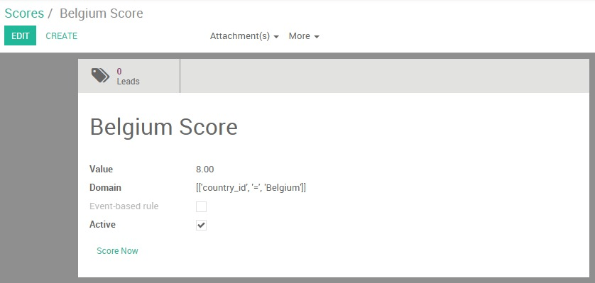
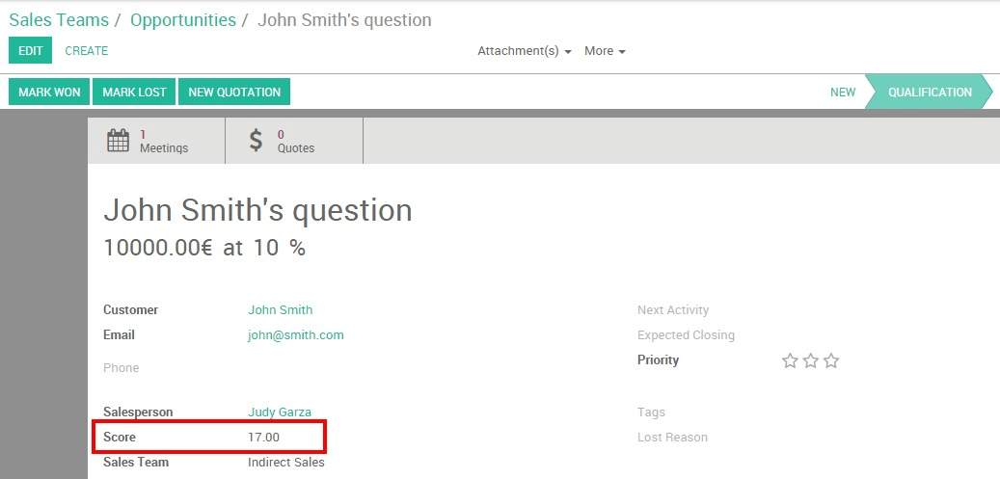
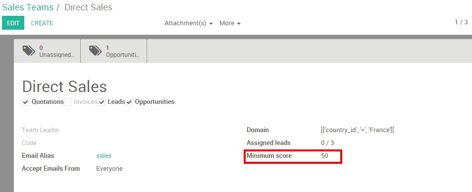

=================================
How to do efficient Lead Scoring?
=================================

Twenty20's Lead Scoring module allows you to give a score to your leads
based on specific criteria - the higher the value, the more likely the
prospect is "ready for sales". Therefore, the best leads are
automatically assigned to your salespeople so their pipe are not
polluted with poor-quality opportunities.

.. note::
    Lead scoring is a critical component of an effective lead 
    management strategy. By helping your sales representative 
    determine which leads to engage with in order of priority, 
    you will increase their overall conversion rate and your 
    sales team's efficiency.

Configuration
=============

Install the Lead Scoring module
-------------------------------

Start by installing the **Lead Scoring** module.

Once the module is installed, you should see a new menu 
:menuselection:`Sales --> Leads Management --> Scoring Rules`

.. image:: media/lead_scoring02.png
   :align: center

Create scoring rules
--------------------

Leads scoring allows you to assign a positive or negative score to your
prospects based on any demographic or behavioral criteria that you have
set (country or origin, pages visited, type of industry, role, etc.). To
do so you'll first need to create rules that will assign a score to a
given criteria.

.. tip::
    In order to assign the right score to your various rules, you can use these two methods:

    -  Establish a list of assets that your ideal customer might possess to interest your company. 
       For example, if you run a local business in California, a prospect coming from 
       San Francisco should have a higher score than a prospect coming from New York.

    -  Dig into your data to uncover characteristics shared by your closed opportunities 
       and most important clients.

    Please note that this is not an exact science, so you'll need time 
    and feedback from your sales teams to adapt and fine tune your rules 
    until getting the desired result.

In the **Scoring Rules** menu, click on **Create** to write your first rule.

First name your rule, then enter a value and a domain (refer on the
`official python documentation <https://docs.python.org/2/tutorial/>`__
for more information). For example, if you want to assign 8 points to all the
leads coming from **Belgium**, you'll need to give ``8`` as a **value** and
``[['country\_id',=,'Belgium']]`` as a domain.

.. tip::
    Here are some criteria you can use to build a scoring rule :

    -  country of origin : ``'country_id'``

    -  stage in the sales cycle : ``'stage_id'``

    -  email address (e.g. if you want to score the professional email addresses) : ``'email_from'``

    -  page visited : ``'score_pageview_ids.url'``

    -  name of a marketing campaign : ``'campaign_id'``

After having activated your rules, Twenty20 will give a value to all your
new incoming leads. This value can be found directly on your lead's form
view.

Assign high scoring leads to your sales teams
=============================================

The next step is now to automatically convert your best leads into
opportunities. In order to do so, you need to decide what is the minimum
score a lead should have to be handed over to a given sales team. Go to
your **sales dashboard** and click on the **More** button of your desired sales
team, then on **Settings**. Enter your value under the **Minimum score**
field.

From the example above, the **Direct Sales** team will only receive
opportunities with a minimum score of ``50``. The prospects with a lower
score can either stay in the lead stage or be assigned to another sales
team which has set up a different minimum score.

.. tip::
    Organize a meeting between your **Marketing** and **Sales** teams in order 
    to align your objectives and agree on what minimum score makes a sales-ready lead.

.. seealso::
    * :doc:`automatic_assignation`
