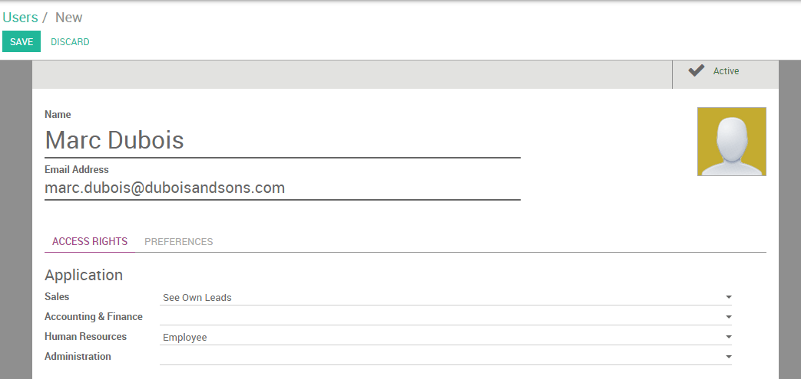
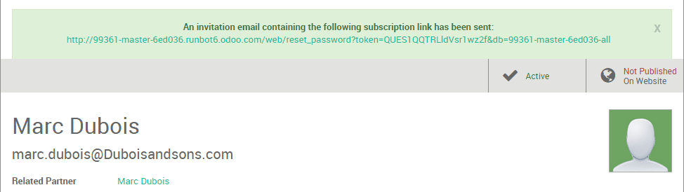
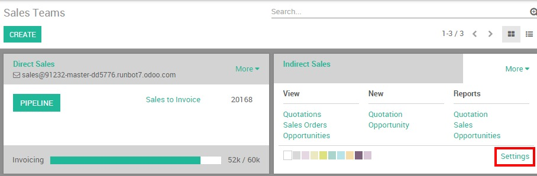
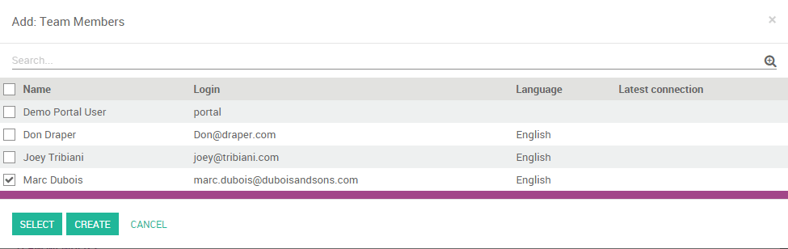

================================
How to create a new salesperson?
================================

Create a new user
=================

From the Settings module, go to the submenu :menuselection:`Users --> Users` and click on
**Create**. Add first the name of your new salesperson and his
professional email address - the one he will use to log in to his Twenty20
instance - and a picture.

Under "Access Rights", you can choose which applications your user can
access and use. Different levels of rights are available depending on
the app. For the Sales application, you can choose between three levels:

- **See own leads**: the user will be able to access his own data only

- **See all leads**: the user will be able to access all records of every
  salesman in the sales module

- **Manager**: the user will be able to access the sales configuration as
  well as the statistics reports

When you're done editing the page and have clicked on **Save**, an
invitation email will automatically be sent to the user, from which he
will be able to log into his personal account.

Register your user into his sales team
======================================

Your user is now registered in Twenty20 and can log in to his own session.
You can also add him to the sales team of your choice. From the sales
module, go to your dashboard and click on the **More** button of the
desired sales team, then on **Settings**.

.. note::

	If you need to create a new sales team first, refer to the page :doc:`../setup/create_team`

Then, under "Team Members", click on **Add** and select the name of your
salesman from the list. The salesperson is now successfully added to
your sales team.

.. tip::

	You can also add a new salesperson on the fly from your sales team even before he is registered as an Twenty20 user.
	From the above screenshot, click on "Create" to add your salesperson and enter his name and email address.
	After saving, the salesperson will receive an invite containing a link to set his password.
	You will then be able to define his accesses rights under the :menuselection:`Settings --> Users` menu.

.. seealso::

	*  :doc:`../../overview/started/setup`

	*  :doc:`../setup/create_team`
