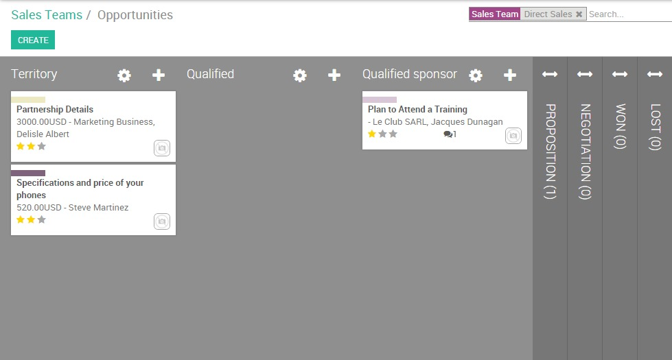
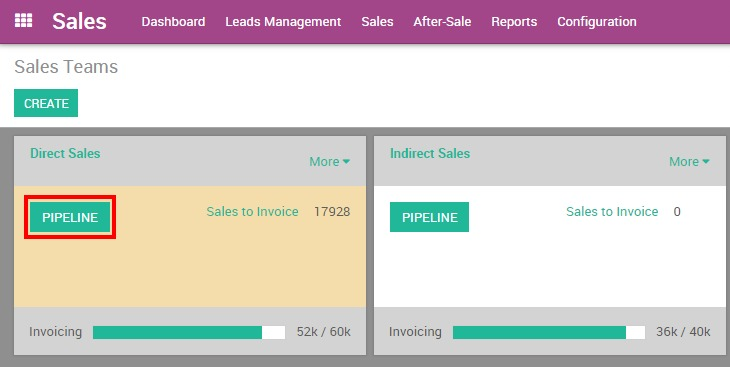
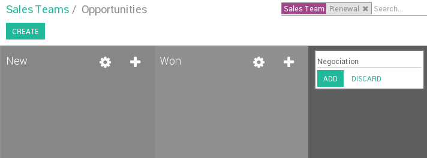

=======================================
Set up and organize your sales pipeline
=======================================

A well structured sales pipeline is crucial in order to keep control of
your sales process and to have a 360-degrees view of your leads,
opportunities and customers.

The sales pipeline is a visual representation of your sales process,
from the first contact to the final sale. It refers to the process by
which you generate, qualify and close leads through your sales cycle.
In Twenty20 CRM, leads are brought in at the left end of the sales
pipeline in the Kanban view and then moved along to the right from one
stage to another.

Each stage refers to a specific step in the sale cycle and
specifically the sale-readiness of your potential customer. The number
of stages in the sales funnel varies from one company to another. An
example of a sales funnel will contain the following stages:
*Territory, Qualified, Qualified Sponsor, Proposition, Negotiation,
Won, Lost*.

Of course, each organization defines the sales funnel depending on their
processes and workflow, so more or fewer stages may exist.

Create and organize your stages
===============================

Add/ rearrange stages
---------------------

From the sales module, go to your dashboard and click on the
**PIPELINE** button of the desired sales team. If you don't have any
sales team yet, you need to create one first.

.. todo:: link to the create salesteam page

.. todo:: ***Kanban view*** link to the CRM terminologies page

From the Kanban view of
your pipeline, you can add stages by clicking on **Add new column.**
When a column is created, Twenty20 will then automatically propose you to
add another column in order to complete your process. If you want to
rearrange the order of your stages, you can easily do so by dragging and
dropping the column you want to move to the desired location.

.. tip::

    You can add as many stages as you wish, even if we advise you not having
    more than 6 in order to keep a clear pipeline

Activate the lead stage
-----------------------

Some companies use a pre qualification step to manage their leads before
to convert them into opportunities. To activate the lead stage, go to
:menuselection:`Configuration --> Settings` and select the radio button as shown
below. It will create a new submenu **Leads** under **Sales** that
gives you access to a listview of all your leads.

.. image:: ./media/image01.jpg
   :align: center

Set up stage probabilities
==========================

What is a stage probability?
----------------------------

To better understand what are the chances of closing a deal for a given
opportunity in your pipe, you have to set up a probability percentage
for each of your stages. That percentage refers to the success rate of
closing the deal.

.. note:: Setting up stage probabilities is essential if you want to estimate the expected revenues of your sales cycle

.. todo:: estimate the expected revenues of your sales cycle (*link to the related topic*)

For example, if your sales cycle contains the stages *Territory,
Qualified, Qualified Sponsor, Proposition, Negotiation, Won and Lost,*
then your workflow could look like this :

- **Territory** : opportunity just received from Leads Management or
  created from a cold call campaign. Customer's Interest is not
  yet confirmed.

  *Success rate : 5%*

- **Qualified** : prospect's business and workflow are understood,
  pains are identified and confirmed, budget and timing are known
  
  *Success rate : 15%*

- **Qualified sponsor**: direct contact with decision maker has been
  done
  
  *Success rate : 25%*

- **Proposition** : the prospect received a quotation
  
  *Success rate : 50%*

- **Negotiation**: the prospect negotiates his quotation
  
  *Success rate : 75%*

- **Won** : the prospect confirmed his quotation and received a sales
  order. He is now a customer
 
  *Success rate : 100%*

- **Lost** : the prospect is no longer interested
  
  *Success rate : 0%*

.. tip:: 

      Within your pipeline, each stage should correspond to a defined goal with
      a corresponding probability. Every time you move your opportunity to the
      next stage, your probability of closing the sale will automatically adapt.

      You should consider using probability value as **100** when the deal is
      closed-won and **0** for deal closed-lost.

How to set up stage probabilities? 
-----------------------------------

To edit a stage, click on the **Settings** icon at the right of the
desired stage then on EDIT

.. image:: ./media/image08.jpg
   :align: center

Select the Change probability automatically checkbox to let Twenty20 adapt
the probability of the opportunity to the probability defined in the
stage. For example, if you set a probability of 0% (Lost) or 100% (Won),
Twenty20 will assign the corresponding stage when the opportunity is marked
as Lost or Won.

.. tip::

    Under the requirements field you can enter the internal requirements for
    this stage. It will appear as a tooltip when you place your mouse over the
    name of a stage.

.. todo:: Read more

  - *How to estimate the effectiveness of my sales cycle?*
  - *How to estimate expected revenues ?*

