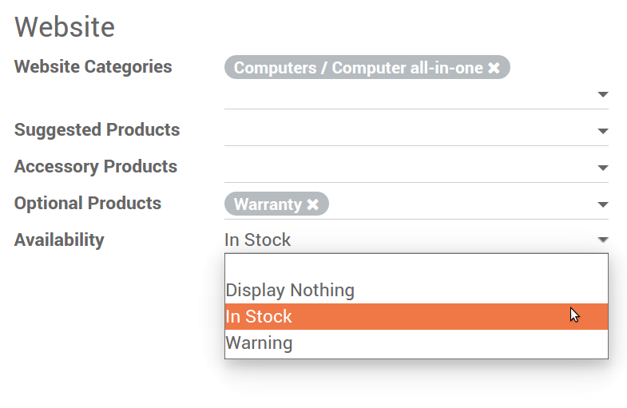

---------------------------------
How to show product availability
---------------------------------

The availability of your products can be shown on the website to reassure your customers.

.. image:: ./media/stock_web.png
   :align: center

To display this, open the *Sales* tab in the product detail form and select an option in 
*Availability*.

A custom warning message can be anything related to a stock out, delivery delay, etc.

.. image:: ./media/stock_warning.png
   :align: center

.. note::
    This tool does not require the Inventory app to be installed.

.. tip::
    If one item is no longer sellable, unpublish it from your website. If it comes to
    one particular product variant, deactivate the variant in the backend (see :doc:`../maximizing_revenue/pricing`).
