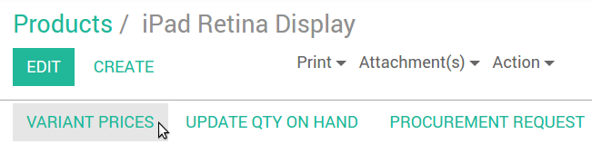
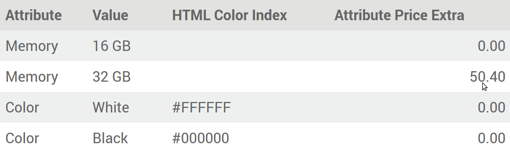

==============================
How to manage product variants
==============================

Product variants are used to offer variations of the same product to your
customers on the products page. For example, the customer chooses a T-shirt
and then selects its size and color.  In the example below, the customer
chooses a phone, and then selects the memory; color and Wi-Fi band from the
available options.

.. image:: ./media/variants.png
   :align: center

How to create attributes & variants
===================================

* Turn on *Products can have several attributes, defining variants (Example:
  size, color,...)* in :menuselection:`Sales --> Settings`.

* Select a product from the Products list, go to the *Variants* tab.

* Add as many attributes as you need from 3 different types: radio buttons,
  drop-down menu or color buttons. You get several variants as soon as there are
  2 values for 1 attribute.

.. image:: ./media/variants_setup.png
   :align: center

How to edit variants
====================

See all the variants from the product template detail form.

.. image:: ./media/variants_button.png
   :align: center
   :scale: 50
   :width: 50
   :height: 50

You can edit following data:

* Picture (will update in real time on the website),
* Barcode,
* Internal Reference (SKU #),
* Volume,
* Weight,
* Active (available in quotes & website).

.. note::
   Both the Barcode and the Internal Reference are variant-specific.
   You need to populate them once the variants generated.

.. tip::
   See and edit all the variants from :menuselection:`Sales --> Sales --> Product Variants`
   as well. This might be quicker if you manage lots of variants.

How to set specific prices per variant
======================================

You can also set a specific public price per variant by clicking *Variant Prices*
in the product detail form (action in top-left corner).

The Price Extra is added to the product price whenever the corresponding attribute
value is selected.

.. image:: ./media/variant_prices_web.png
   :align: center

.. tip::
   Pricelist formulas let you set advanced price computation methods for product variants.
   See :doc:`../maximizing_revenue/pricing`.

How to disable/archive variants
===============================

You can disable/archive specific variants so that they are no longer available in quotes &
website (not existing in your stock, deprecated, etc.). Simply uncheck *Active* in their detail form.

.. image:: ./media/variant_active.png
   :align: center

To retrieve such archived items, hit *Archived* on searching the variants list. You can
reactivate them the same way.

.. image:: ./media/variant_archive.png
   :align: center
