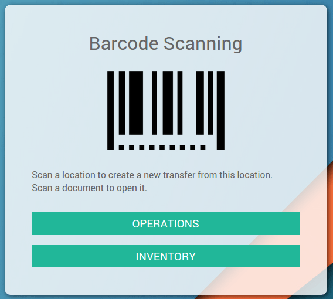
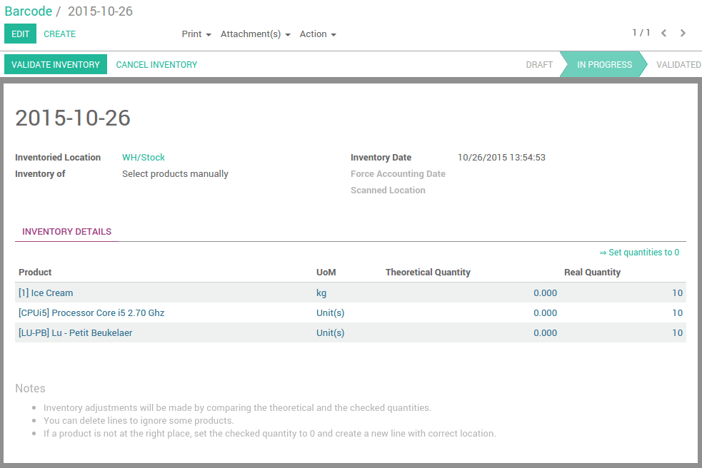

================================================
How to do an inventory adjustment with barcodes?
================================================

From the Barcode application:

-   Click on **Inventory**

-   Scan all the products (if you have 5 identical articles, scan it 5
    times, or use the keyboard to set the quantity).

.. note::
    If you manage multiple locations, scan the location before scanning the
    products. Eg. scan a shelf's barcode ; scan each product on the
    shelf ; repeat for each shelf in the wharehouse.

-   When you've scanned all the items of the location, validate the
    inventory manually or by scanning the **Validate** barcode.

