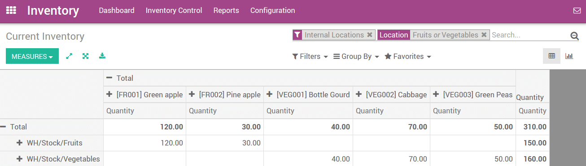

===========================
What is a putaway strategy?
===========================

Overview
========

A good warehouse implementation takes care that products automatically
move to their appropriate destination location. Putaway is the process
of taking products off the receiving shipment and putting them into the
most appropriate location.

If for instance a warehouse contains volatile substances, it is
important to make sure that certain products are not stored close to
each other because of a potential chemical reaction.

A putaway strategy follows the same principle as removal strategies but
affects the destination location. Putaway strategies are defined at
the location level (unlike removal strategies which are defined at the
product level).

Configuration
=============

Go to :menuselection:`Inventory --> Configuration --> Settings` and check option 
**Manage several location per warehouse & Advance routing of products using
rules**, then click on **Apply**.

.. image:: media/putaway01.png
    :align: center

Setting up a strategy
=====================

Let's take as an example a retail shop where we store vegetables and
fruits.

We have to store this type of product in different locations to maintain
product quality.

Suppose there is one warehouse location **WH/Stock** and there is
sub location **WH/Stock/Vegetables** & **WH/Stock/Fruits**.

You can create a putaway strategy from 
:menuselection:`Inventory --> Configuration --> Locations`. 
Open any location where you want to set a putaway strategy,
click on **Edit** and locate the option **Put Away Strategy**.

.. image:: media/putaway02.png
    :align: center

Open the roll-down menu and click on **Create and Edit**. This will open a
form view of put away strategy on which you have to set a name for the
strategy, and set the method and fixed location for each category.

.. image:: media/putaway03.png
    :align: center

When you have entered all the necessary information, click on **Save**.

Now, when you purchase products with those categories, they will
automatically be transferred to the correct location.

To check current inventory, Go to 
:menuselection:`Inventory --> Inventory Control --> Current Inventory`

There you can see current inventory by location.

