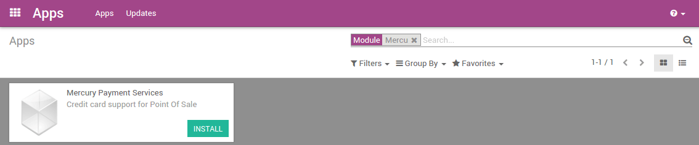
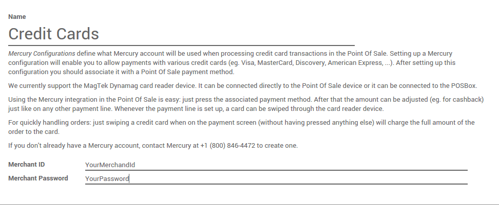
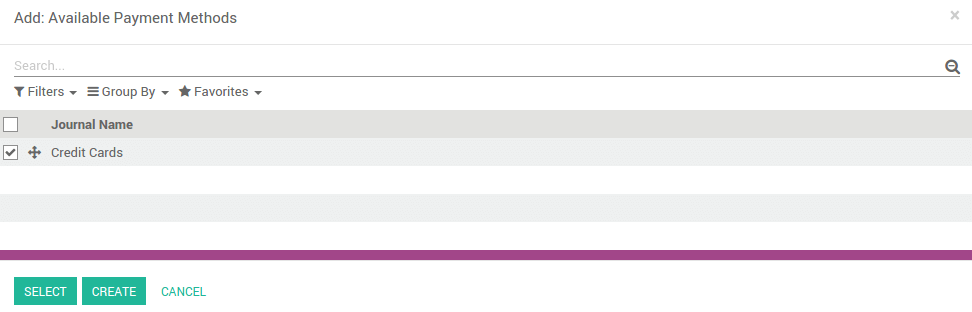
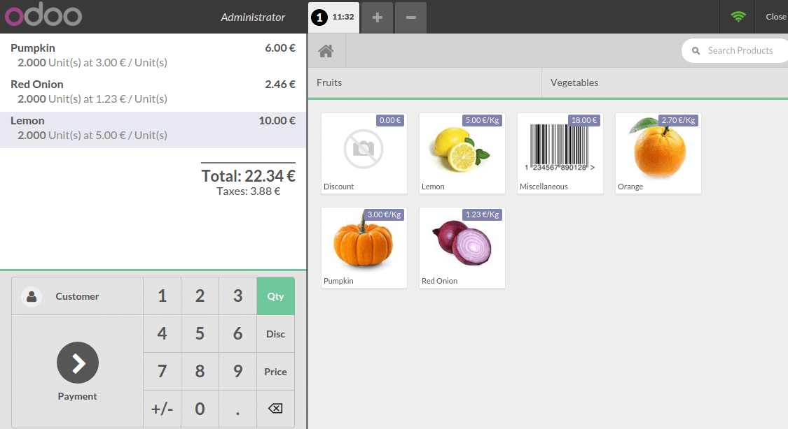

=============================================================
How to accept credit card payments in Twenty20 POS using Mercury?
=============================================================

Overview
========

A **MercuryPay** account (see `MercuryPay website <https://www.mercurypay.com>`__.) 
is required to accept credit
card payments in Twenty20 9 POS with an integrated card reader. MercuryPay
only operates with US and Canadian banks making this procedure only
suitable for North American businesses. An alternative to an integrated
card reader is to work with a standalone card reader, copy the
transaction total from the Twenty20 POS screen into the card reader, and
record the transaction in Twenty20 POS.

Module installation
===================

Go to **Apps** and install the **Mercury Payment Services** application.

Mercury Configuration
=====================

In the **Point of Sale** application, click on 
:menuselection:`Configuration --> Mercury Configurations` 
and then on **Create**.

.. image:: media/mercury02.png
    :align: center

Introduce your **credentials** and then save them.

Then go to :menuselection:`Configuration --> Payment methods` 
and click on **Create**. Under the **Point of Sale** tab you 
can set a **Mercury configuration** to the **Payment method**.

.. image:: media/mercury04.png
    :align: center

Finally, go to 
:menuselection:`Configuration --> Point of Sale` and add 
a new payment method on the point of sale by editing it.

.. image:: media/mercury05.png
    :align: center

Then select the payment method corresponding to your mercury
configuration.

Save the modifications.

Register a sale
===============

On the dashboard, you can see your point(s) of sales, click on 
**New Session**:

.. image:: media/mercury07.png
    :align: center

You will get the main point of sale interface:

On the right you can see the list of your products with the categories
on the top. If you click on a product, it will be added in the cart. You
can directly set the correct quantity or weight by typing it on the
keyboard.

Payment with credit cards
=========================

Once the order is completed, click on **Payment**. You can choose the credit
card **Payment Method**.

.. image:: media/mercury09.png
    :align: center

Type in the **Amount** to be paid with the credit card. Now you can swipe
the card and validate the payment.

.. seealso::
    * :doc:`../shop/cash_control`
    * :doc:`../shop/invoice`
    * :doc:`../shop/refund`
    * :doc:`../shop/seasonal_discount`