================================
How to manage multiple cashiers?
================================

This tutorial will describe how to manage multiple cashiers. There are
four differents ways to manage several cashiers.

Switch cashier without any security
===================================

As prerequisite, you just need to have a second user with the **Point of
Sale User** rights (Under the :menuselection:`General Settings --> Users` menu).
On the **Dashboard** click on **New Session** as the main user.

.. image:: media/multi_cashier01.png
    :align: center

On the top of the screen click on the **user name**.

.. image:: media/multi_cashier02.png
    :align: center

And switch to another cashier.

.. image:: media/multi_cashier03.png
    :align: center

The name on the top has changed which means you have changed the cashier.

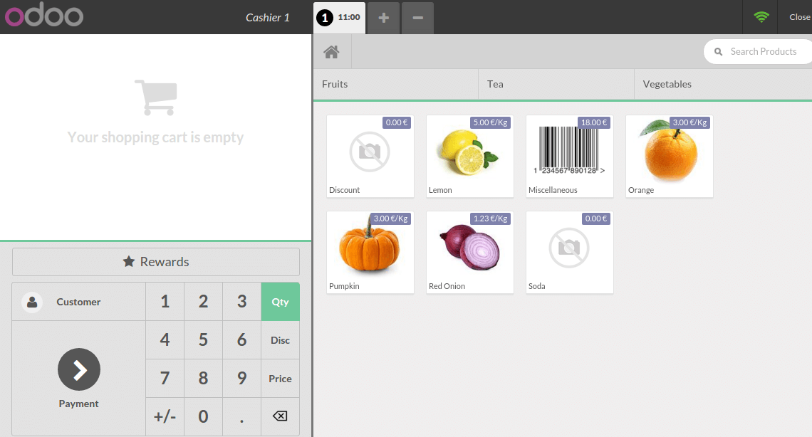

Switch cashier with pin code
============================

Configuration
-------------

If you want your cashiers to need a pin code to be able to use it, you
can set it up in by clicking on **Settings**.

.. image:: media/multi_cashier05.png
    :align: center

Then click on **Manage access rights**.

.. image:: media/multi_cashier06.png
    :align: center

**Edit** the cashier and add a security pin code on the **Point of Sale**
tab.

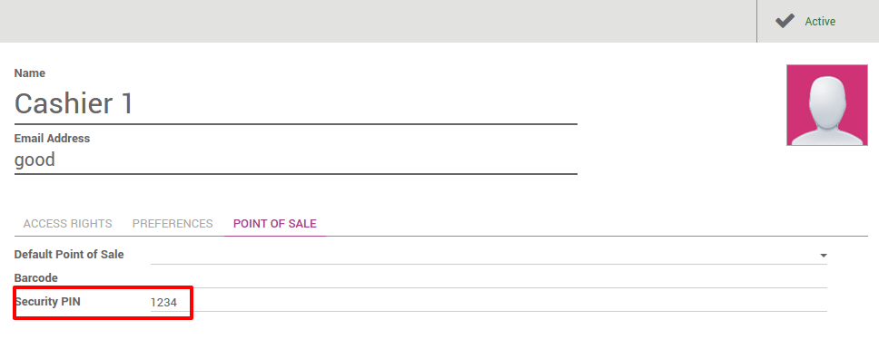

Change cashier
--------------

On the **Dashboard** click on **New Session**.

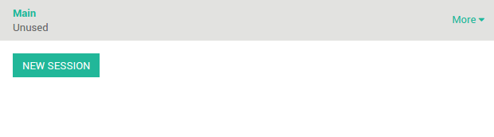

On the top of the screen click on the **user name**.

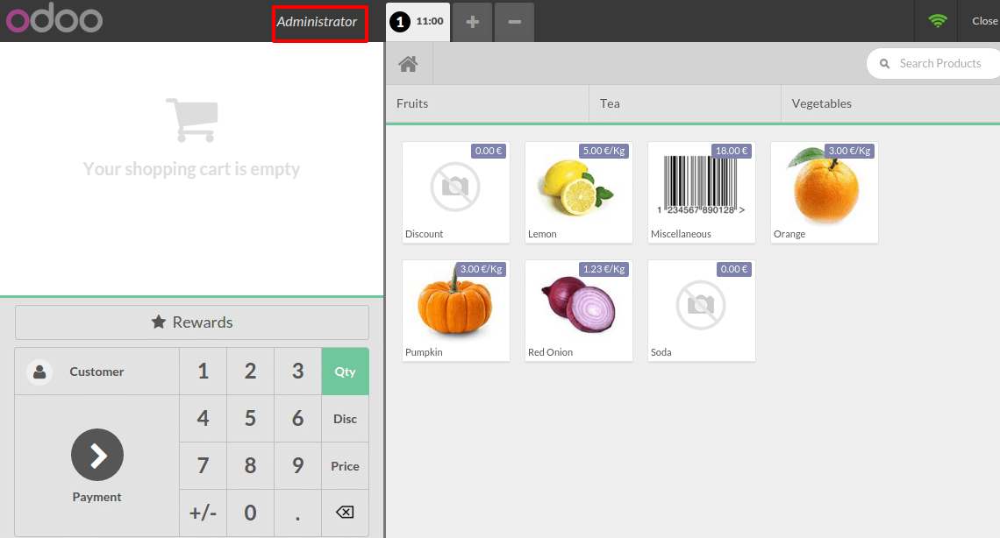

Choose your **cashier**:

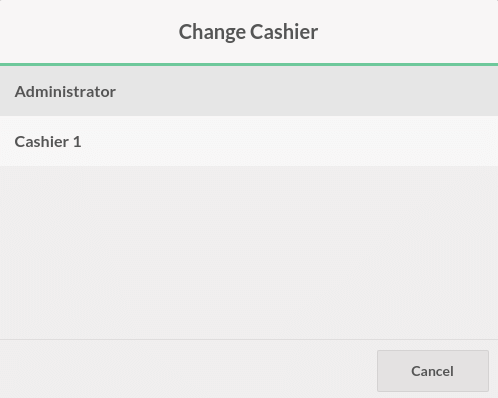

You will have to insert the user's **pin code** to be able to continue.

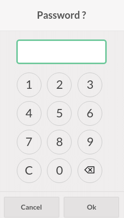

Now you can see that the cashier has changed.

.. image:: media/multi_cashier12.png
    :align: center

Switch cashier with cashier barcode badge
=========================================

Configuration
-------------

If you want your cashiers to scan its badge, 
you can set it up in by clicking on **Settings**.

.. image:: media/multi_cashier13.png
    :align: center

Then click on **Manage access rights**

.. image:: media/multi_cashier14.png
    :align: center

**Edit** the cashier and add a **security pin code** on the **Point of Sale**
tab.

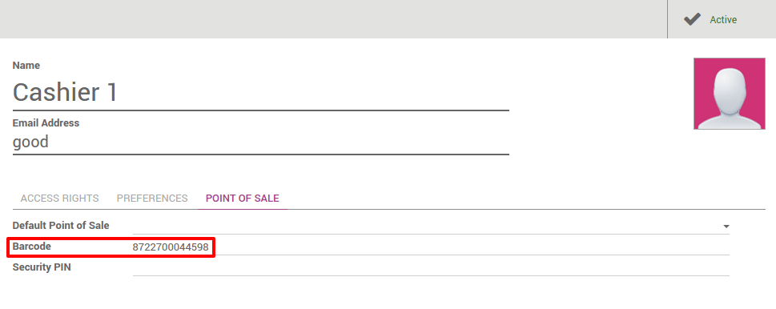

.. tip::
    Be careful of the barcode nomenclature, the default one forced you
    to use a barcode starting with ``041`` for cashier barcodes. To change that
    go to :menuselection:`Point of Sale --> Configuration --> Barcode Nomenclatures`.

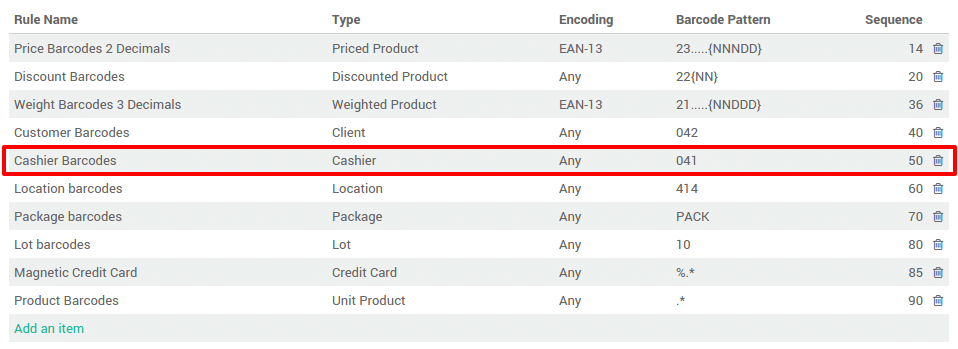

Change Cashier
--------------

On the **Dashboard** click on **New Session**.

.. image:: media/multi_cashier17.png
    :align: center

On the top of the screen click on the **user name**.

.. image:: media/multi_cashier18.png
    :align: center

When the cashier scans his own badge, you can see on the top that the
cashier has changed.

Assign session to a user
========================

Click on the menu :menuselection:`Point of Sale --> Orders --> Sessions`.

.. image:: media/multi_cashier19.png
    :align: center

Then, click on **New** and assign as **Responsible** the correct cashier to the
point of sale.

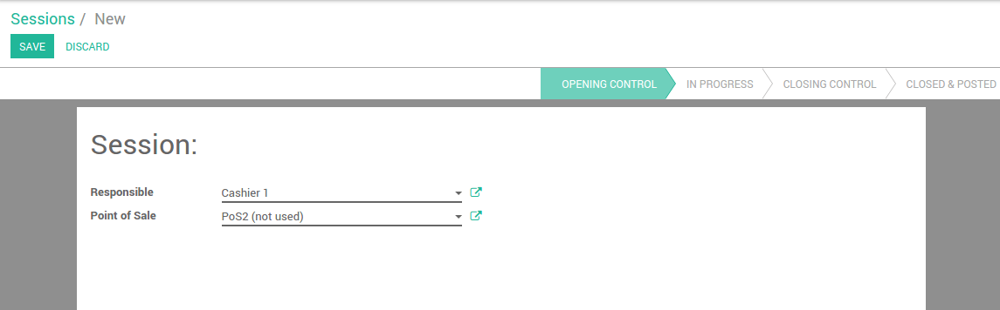

When the cashier logs in he is able to open the session

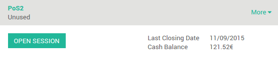

Assign a default point of sale to a cashier
===========================================

If you want your cashiers to be assigned to a point of sale, go to
:menuselection:`Point of Sales --> Configuration --> Settings`.

.. image:: media/multi_cashier22.png
    :align: center

Then click on **Manage Access Rights**.

.. image:: media/multi_cashier23.png
    :align: center

**Edit** the cashier and add a **Default Point of Sale** under the **Point of
Sale** tab.

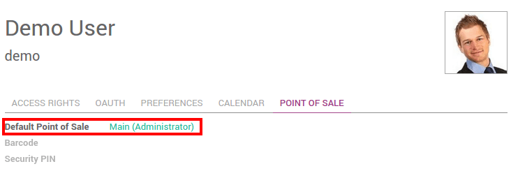

.. seealso::
    * :doc:`../shop/cash_control`
    * :doc:`../shop/invoice`
    * :doc:`../shop/refund`
    * :doc:`../shop/seasonal_discount`