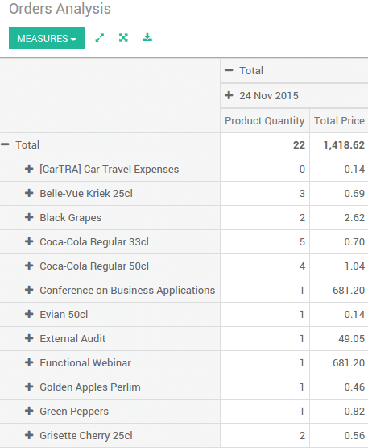
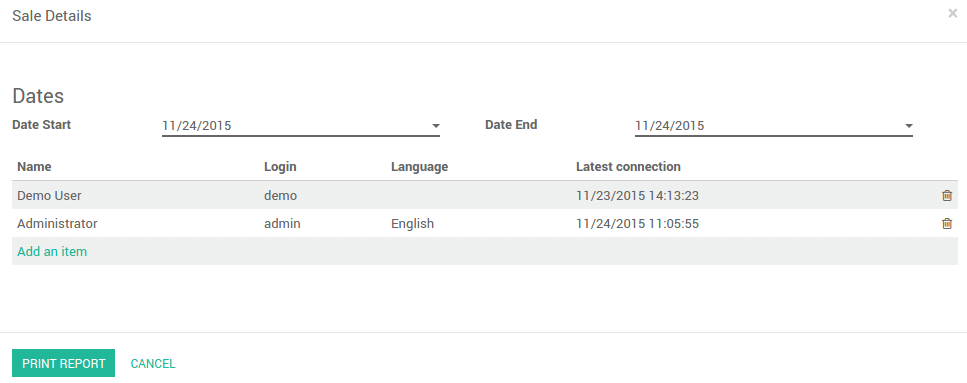
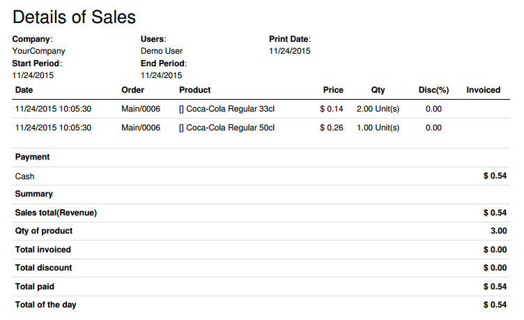

==============================
Getting daily sales statistics
==============================

Point of Sale statistics
========================

On your dashboard, click on the **More** button on the point of sale you
want to analyse. Then click on **Orders**.

.. image:: media/statistics01.png
    :align: center

You will get the figures for this particular point of sale.

Global statistics
=================

Go to :menuselection:`Reports --> Orders`.

You will get the figures of all orders for all point of sales.

.. image:: media/statistics03.png
    :align: center

Cashier statistics
==================

Go to :menuselection:`Reports --> Sales Details`.

Choose the dates. Select the cashiers by clicking on **Add an item**. Then
click on **Print Report**.

You will get a full report in a PDF file. Here is an example :

