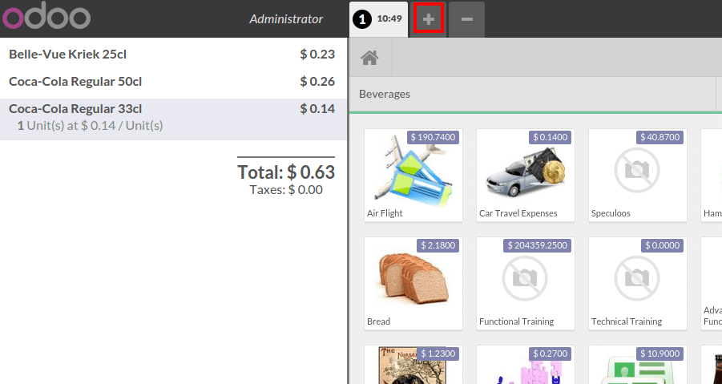
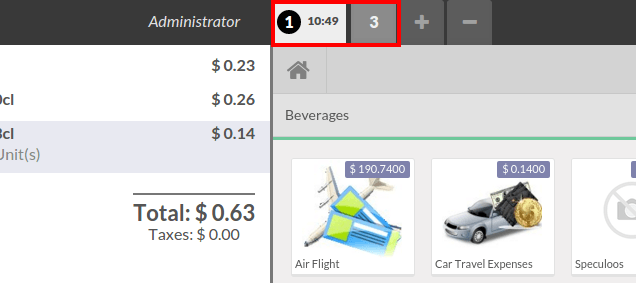
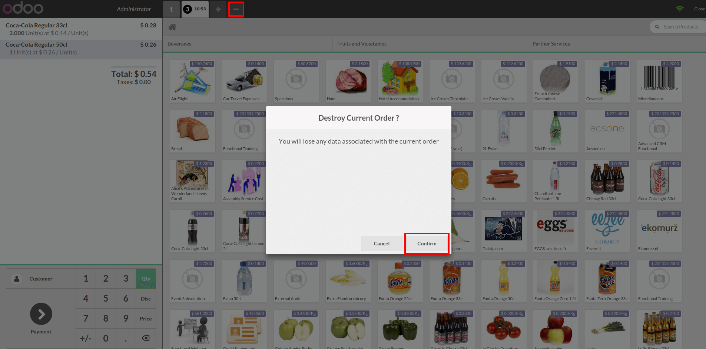

===============================================
How to register multiple orders simultaneously?
===============================================

Register simultaneous orders
============================

On the main screen, just tap on the **+** on the top of the screen to
register another order. The current orders remain opened until the
payment is done or the order is cancelled.

Switch from one order to another
================================

Simply click on the number of the order.

Cancel an order
===============

If you made a mistake or if the order is cancelled, just click on the **-**
button. A message will appear to confirm the order deletion.

.. seealso::
    * :doc:`../advanced/register`
    * :doc:`../advanced/reprint`
    * :doc:`transfer`
