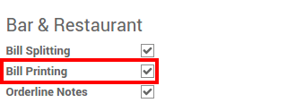
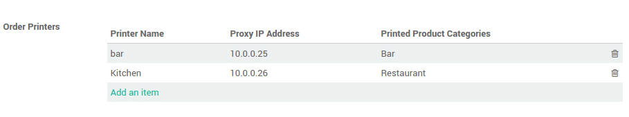
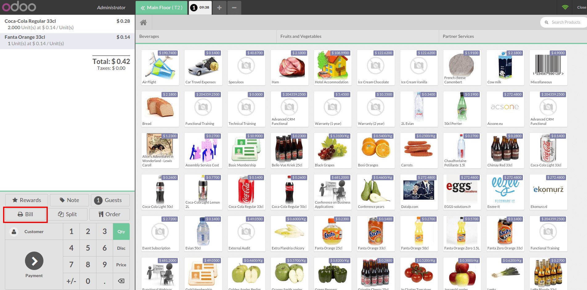
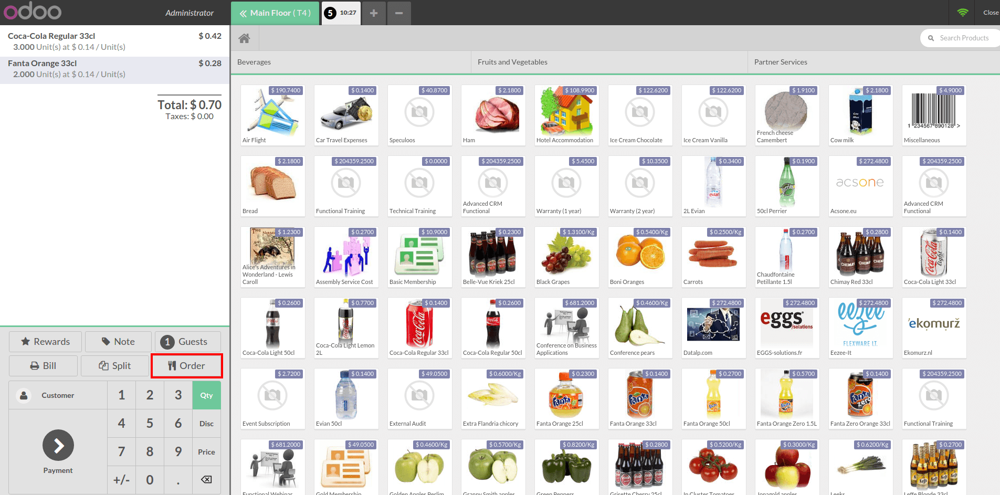

===========================================
How to handle kitchen & bar order printing?
===========================================

Configuration
=============

From the dashboard click on :menuselection:`More --> Settings`:

.. image:: media/print01.png
    :align: center

Under the **Bar & Restaurant** section, tick **Bill Printing**.

In order printers, click on **add an item** and then **Create**.

.. image:: media/print03.png
    :align: center

Set a printer **Name**, its **IP address** and the **Category** 
of product you want to print on this printer. The category 
of product is useful to print the order for the kitchen.

.. image:: media/print04.png
    :align: center

Several printers can be added this way

Now when you register an order, products will be automatically
printed on the correct printer.

Print a bill before the payment
===============================

On the main screen, click on the **Bill** button.

Finally click on **Print**.

.. image:: media/print07.png
    :align: center

Click on **Ok** once it is done.

Print the order (kitchen printing)
==================================

This is different than printing the bill. It only prints the list of the
items.

Click on **Order**, it will automatically be printed.

.. note::
    The printer is automatically chosen according to the products
    categories set on it.

.. seealso::
    * :doc:`../shop/cash_control`
    * :doc:`../shop/invoice`
    * :doc:`../shop/refund`
    * :doc:`../shop/seasonal_discount`
