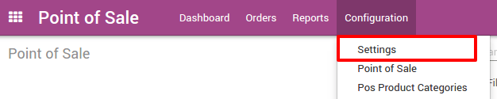
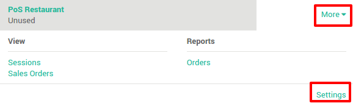

======================================
How to setup Point of Sale Restaurant?
======================================

Go to the **Point of Sale** application, 
:menuselection:`Configuration --> Settings`

Enable the option **Restaurant: activate table management** and
click on **Apply**.

.. image:: media/setup02.png
    :align: center

Then go back to the **Dashboard**, on the point of sale you want to use in
restaurant mode, click on :menuselection:`More --> Settings`.

Under the **Restaurant Floors** section, click on **add an item** 
to insert a floor and to set your PoS in restaurant mode.

.. image:: media/setup04.png
    :align: center

Insert a floor name and assign the floor to your point of sale.

.. image:: media/setup05.png
    :align: center

Click on **Save & Close** and then on **Save**. 
Congratulations, your point of sale is
now in Restaurant mode. The first time you start a session, you will
arrive on an empty map. 

.. seealso::
    * :doc:`table`
