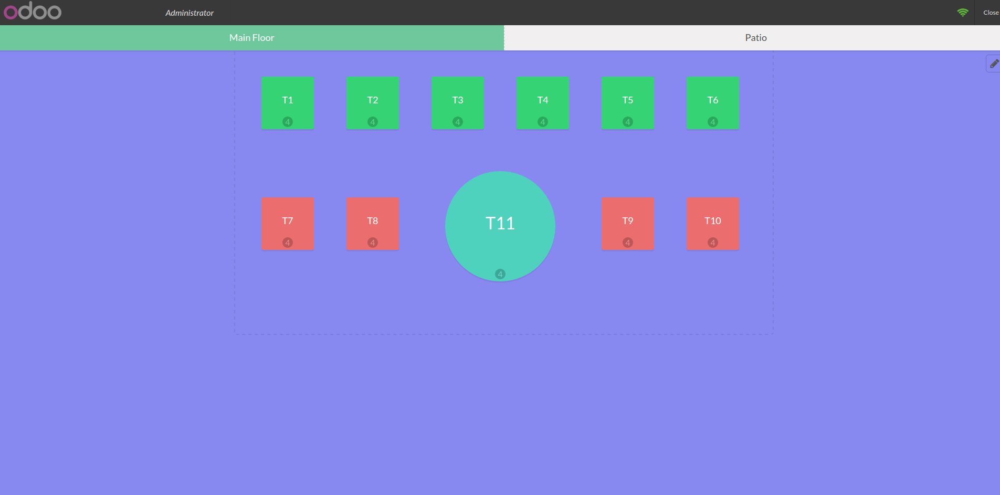
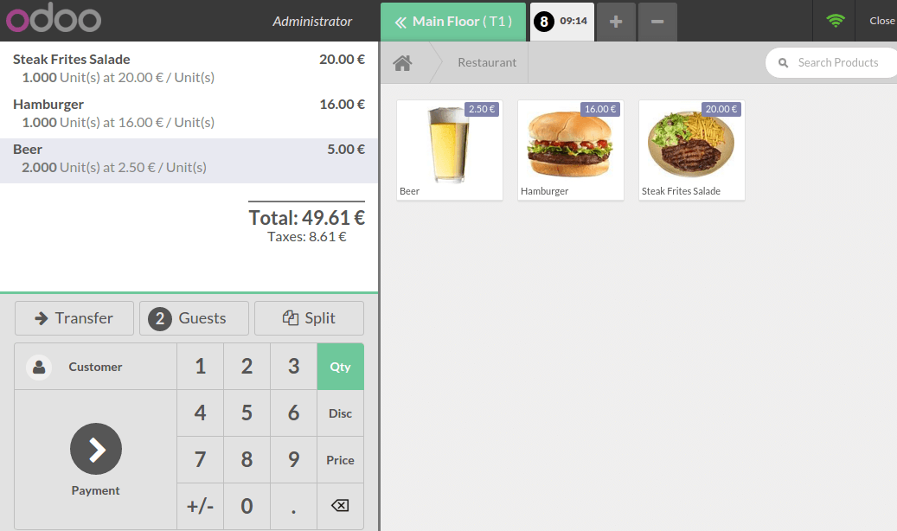
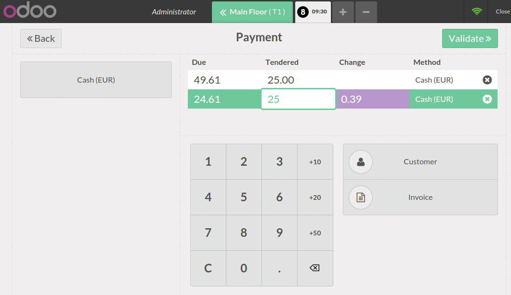
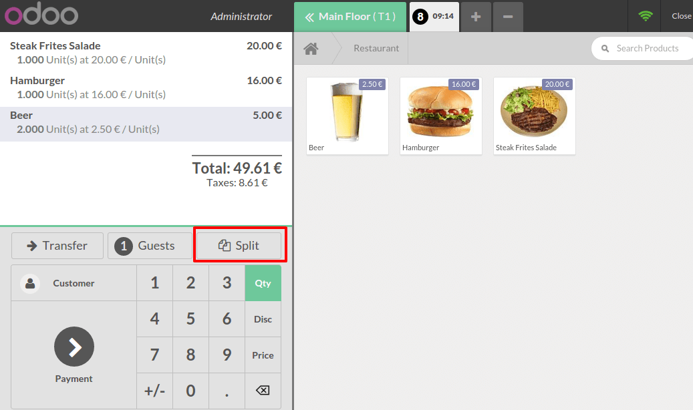
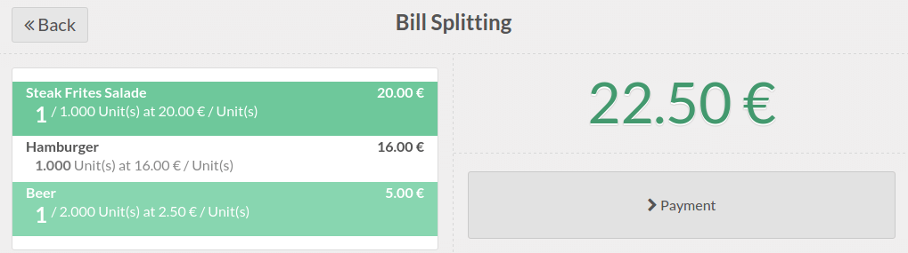
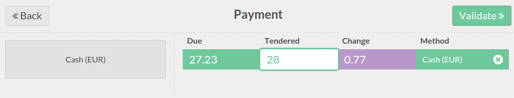

==========================
How to handle split bills?
==========================

Configuration
=============

Split bills only work for point of sales that are in **restaurant** mode.

From the dashboard click on :menuselection:`More --> Settings`:

.. image:: media/split01.png
    :align: center

In the settings tick the option **Bill Splitting**.

.. image:: media/split02.png
    :align: center

Register an order
=================

From the dashboard, click on **New Session**.

.. image:: media/split03.png
    :align: center

Choose a table and start registering an order.

When customers want to pay and split the bill, there are two ways to
achieve this:

-  based on the total

-  based on products

Splitting based on the total
----------------------------

Just click on **Payment**. You only have to insert the money tendered by
each customer.

Click on the payment method (cash, credit card,...) and enter the
amount. Repeat it for each customer.

When it's done, click on validate. This is how to split the bill based
on the total amount.

Split the bill based on products
--------------------------------

On the main view, click on **Split**

Select the products the first customer wants to pay and click on **Payment**

You get the total, process the payment and click on **Validate**

Follow the same procedure for the next customer of the same table.

When all the products have been paid you go back to the table map.

.. seealso::
    * :doc:`../shop/cash_control`
    * :doc:`../shop/invoice`
    * :doc:`../shop/refund`
    * :doc:`../shop/seasonal_discount`
