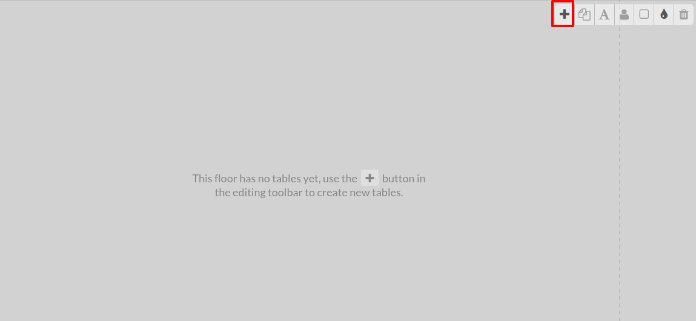
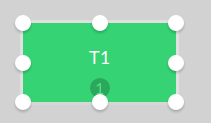
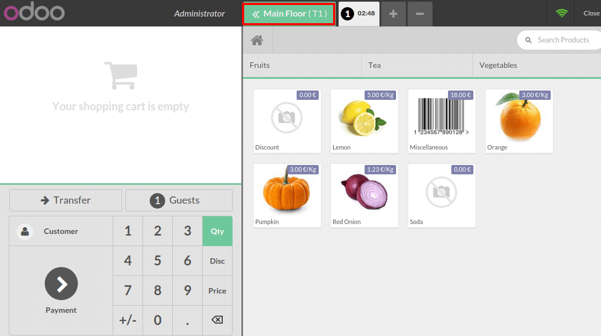
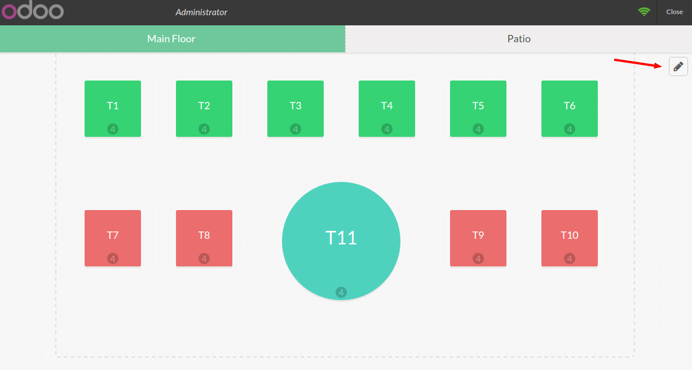

================================
How to configure your table map?
================================

Make your table map
===================

Once your point of sale has been configured for restaurant usage, click
on **New Session**:

.. image:: media/table01.png
    :align: center

This is your main floor, it is empty for now. Click on the **+** icon to
add a table. 

Drag and drop the table to change its position. Once you click on it,
you can edit it.

Click on the corners to change the size.

The number of seats can be set by clicking on this icon:

.. image:: media/table04.png
    :align: center

The table name can be edited by clicking on this icon:

.. image:: media/table05.png
    :align: center

You can switch from round to square table by clicking on this icon:

The color of the table can modify by clicking on this icon :

This icon allows you to duplicate the table:

To drop a table click on this icon:

Once your plan is done click on the pencil to leave the edit mode. The
plan is automatically saved.

.. image:: media/table10.png
    :align: center

Register your orders
====================

Now you are ready to make your first order. You just have to click on a
table to start registering an order.

You can come back at any time to the map by clicking on the floor name :

Edit a table map
================

On your map, click on the pencil icon to go in edit mode :

