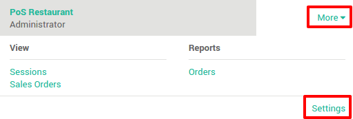
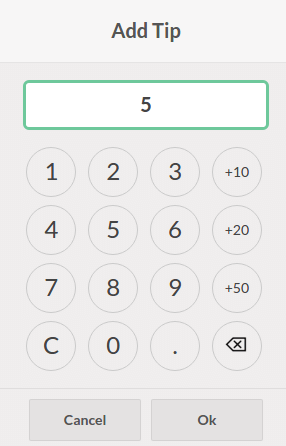

===================
How to handle tips?
===================

Configuration
=============

From the dashboard, click on :menuselection:`More --> Settings`.

Add a product for the tip.

.. image:: media/tips02.png
    :align: center

In the tip product page, be sure to set a sale price of ``0€`` 
and to remove all the taxes in the accounting tab.

.. image:: media/tips03.png
    :align: center

Adding a tip
============

On the payment page, tap on **Tip**

.. image:: media/tips04.png
    :align: center

Tap down the amount of the tip:

The total amount has been updated and you can now register the payment.

.. image:: media/tips06.png
    :align: center

.. seealso::
    * :doc:`../shop/cash_control`
    * :doc:`../shop/invoice`
    * :doc:`../shop/refund`
    * :doc:`../shop/seasonal_discount`