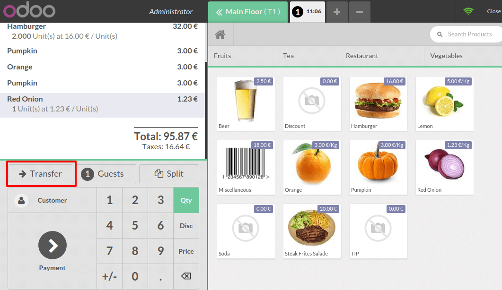
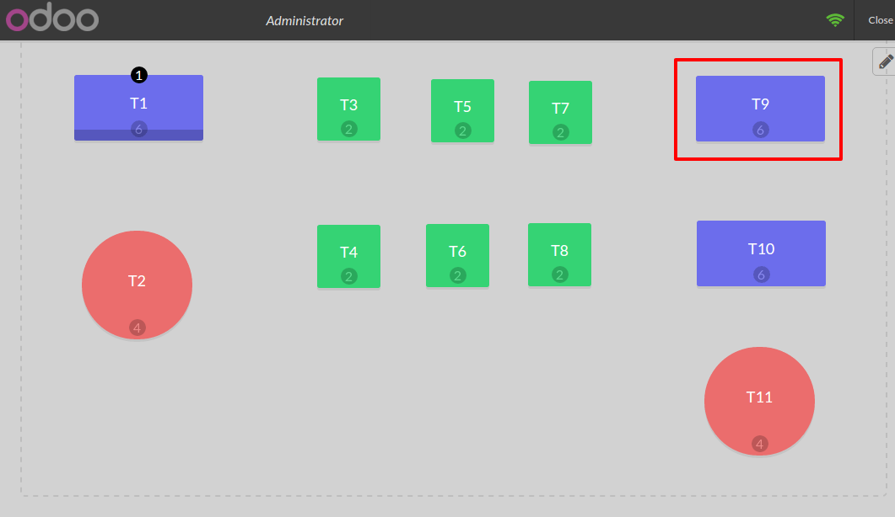
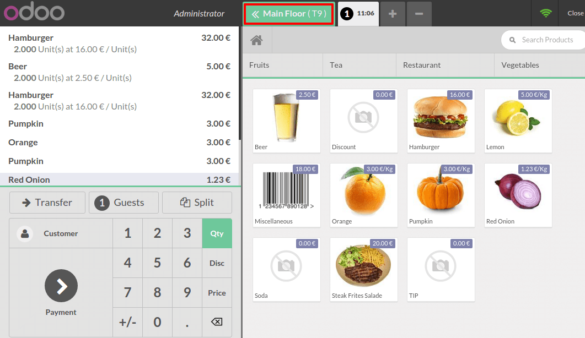

======================================
How to transfer a customer from table?
======================================

This only work for Point of Sales that are configured in restaurant
mode.

From the dashboard, click on **New Session**.

.. image:: media/transfer01.png
    :align: center

Choose a table, for example table ``T1`` and start registering an order.

.. image:: media/transfer02.png
    :align: center

Register an order. For some reason, customers want to move to table ``T9``.
Click on **Transfer**.

Select to which table you want to transfer customers.

You see that the order has been added to the table ``T9``

.. seealso::
    * :doc:`../shop/cash_control`
    * :doc:`../shop/invoice`
    * :doc:`../shop/refund`
    * :doc:`../shop/seasonal_discount`