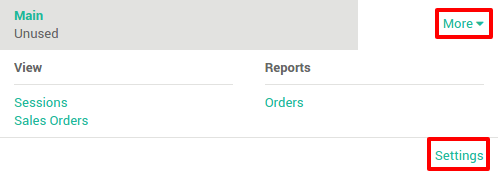
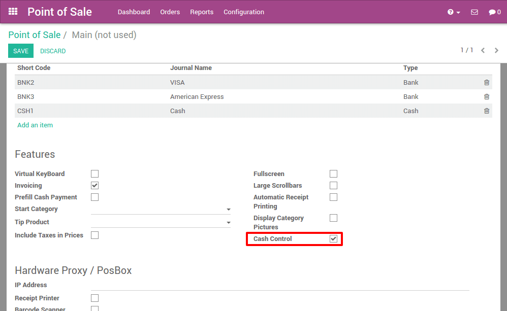
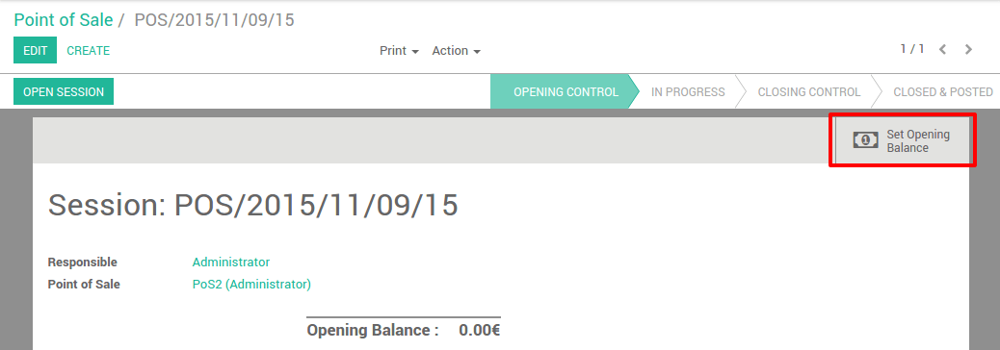
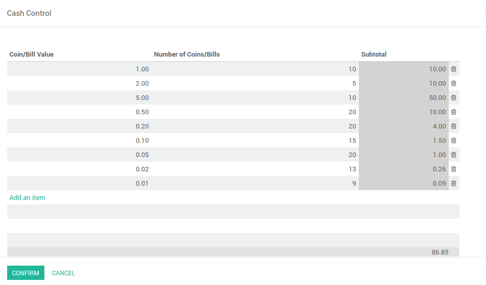
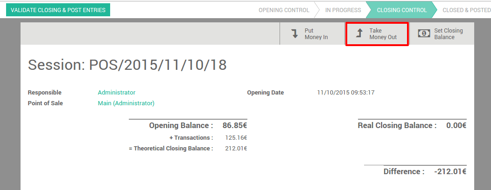
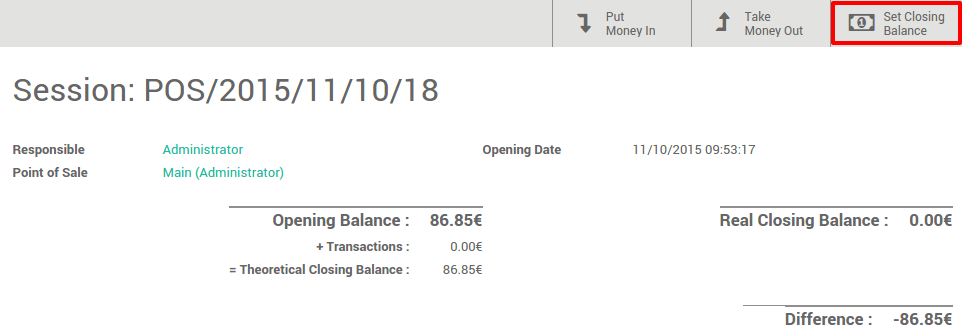

===========================
How to set up cash control?
===========================

Cash control permits you to check the amount of the cashbox at the
opening and closing.

Configuring cash control
========================

On the **Point of Sale** dashboard, 
click on :menuselection:`More --> Settings`.

On this page, scroll and tick the the option **Cash Control**.

Starting a session
==================

On your point of sale dashboard click on **new session**:

.. image:: media/cash_control03.png
    :align: center

Before launching the point of sale interface, you get the open control
view. Click on set an opening balance to introduce the amount in the
cashbox.

Here you can insert the value of the coin or bill, and the amount present in
the cashbox. The system sums up the total, in this example we have
``86,85€`` in the cashbox. Click on **confirm**.

You can see that the opening balance has changed and when you click on
**Open Session** you will get the main point of sale interface.

Register a sale
===============

.. image:: media/cash_control06.png
    :align: center

On the right you can see the list of your products with the categories
on the top. If you click on a product, it will be added in the cart. You
can directly set the correct quantity or weight by typing it on the
keyboard.

Payment
=======

Once the order is completed, click on **Payment**. You can choose the
customer payment method. In this example, the customer owes you ``10.84€``
and pays with a ``20€`` note. When it's done, click on **Validate**.

.. image:: media/cash_control07.png
    :align: center

Your ticket is printed and you are now ready to make your second order.

Closing a session
=================

At the time of closing the session, click on the **Close** button on the top
right. Click again on the **Close** button to exit the point of sale interface. 
On this page, you will see a summary of the transactions. At this moment you can
take the money out.

For instance you want to take your daily transactions out of your
cashbox.

.. image:: media/cash_control09.png
    :align: center

Now you can see that the theoretical closing balance has been updated
and it only remains you to count your cashbox to set a closing balance.

You can now validate the closing.

.. seealso::
    * :doc:`invoice`
    * :doc:`refund`
    * :doc:`seasonal_discount`