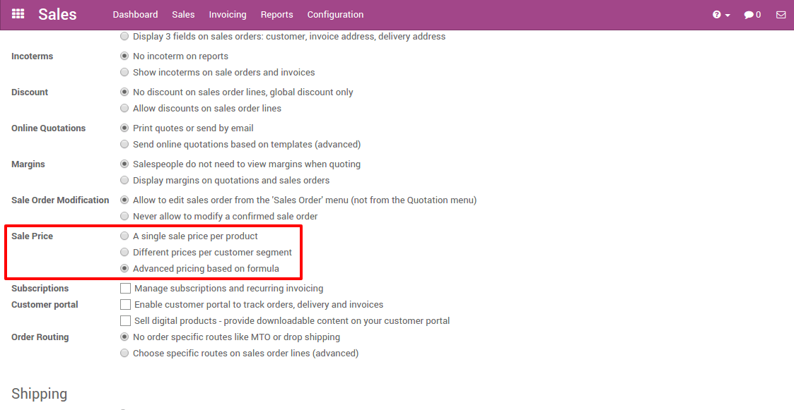
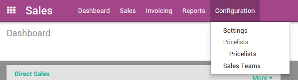
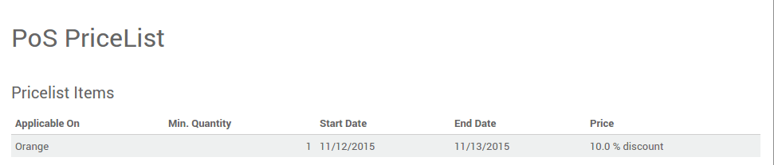
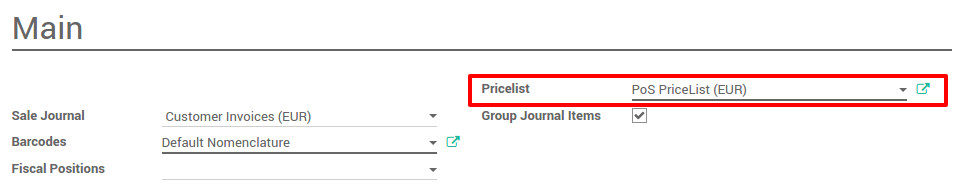
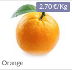

================================================
How to apply Time-limited or seasonal discounts?
================================================

Configuration
=============

To apply time-limited or seasonal discount, use the pricelists.

You have to create it and to apply it on the point of sale.

Sales application configuration
-------------------------------

In the **Sales** application, go to
:menuselection:`Configuration --> Settings`. Tick
**Advanced pricing based on formula**.

Creating a pricelist
--------------------

Once the setting has been applied, a **Pricelists** section appears under 
the configuration menu on the sales application.

Click on it, and then on **Create**.

.. image:: media/seasonal_discount03.png
    :align: center

Create a **Pricelist** for your point of sale. Each pricelist can contain
several items with different prices and different dates. It can be done
on all products or only on specific ones. Click on **Add an item**.

.. image:: media/seasonal_discount04.png
    :align: center

.. demo:fields:: product.product_pricelist_action2

For example, the price of the oranges costs ``3€`` but for two days, we want
to give a ``10%`` discount to our PoS customers.

.. image:: media/seasonal_discount05.png
    :align: center

You can do it by adding the product or its category and applying a
percentage discount. Other price computation can be done for the
pricelist.

After you save and close, your pricelist is ready to be used.

Applying your pricelist to the Point of Sale
--------------------------------------------

From the dashboard, click on :menuselection:`More --> Settings`.

.. image:: media/seasonal_discount07.png
    :align: center

On the right, you will be able to assign a pricelist.

.. note:: 
    You just have to update the pricelist to apply the time-limited
    discount(s).

Register an order
=================

When you start a new session, you can see that the price have
automatically been updated.

.. note::
    When you update a pricelist, you have to close and open the
    session.

.. seealso::
    * :doc:`cash_control`
    * :doc:`invoice`
    * :doc:`refund`
