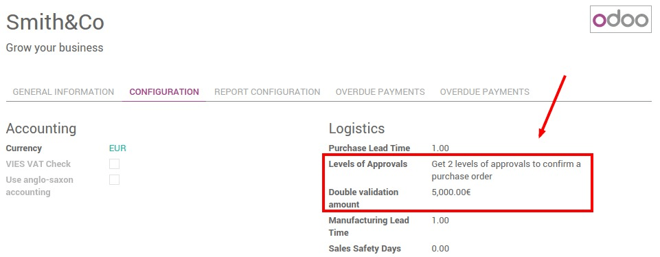
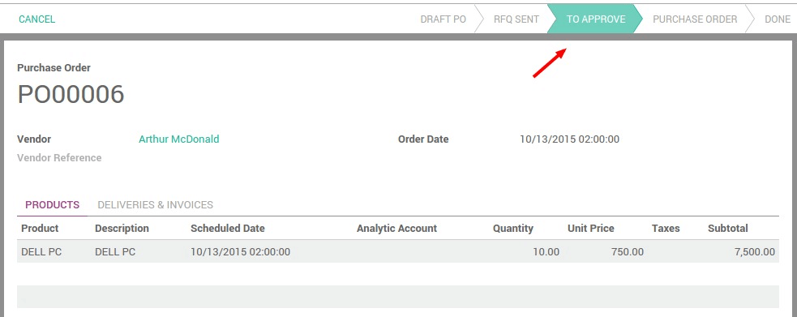
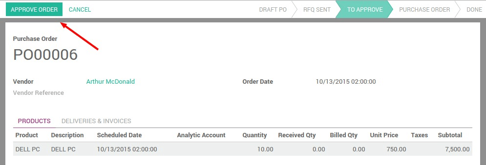

========================================================
How to setup two levels of approval for purchase orders?
========================================================

Two level approval setup
========================

Double validation on purchases forces a validation when the purchased amount
exceeds a certain limit.

Install **Purchase Management** module and then go to **General Settings** to
configure the company data.

Set here the amount limit for second approval and set approval from
manager side.

Process
=======

Logged as a purchase user, create a purchase order for more than the amount set
above, and confirm it. The purchase order is set in a state **To Approve**

The manager gets the order to approve and validates the final order.

Once approved, the purchase order follows the normal process.
