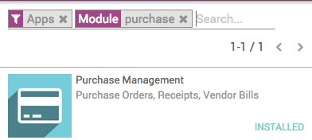
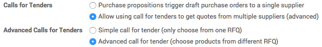
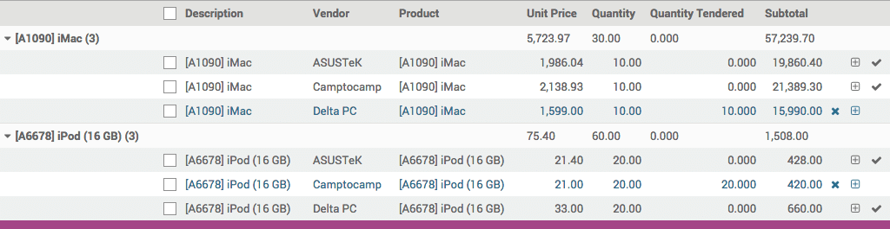

=======================================================================
How to purchase partially at two vendors for the same purchase tenders?
=======================================================================

For some Purchase Tenders (PT), you might sometimes want to be able to
select only a part of some of the offers you received. In Twenty20, this is
made possible through the advanced mode of the **Purchase** module.

.. note::
    If you want to know how to handle a simple **Purchase Tender**, 
    read the document on :doc:`manage_multiple_offers`.

Configuration
-------------

Install the Purchase Management module
~~~~~~~~~~~~~~~~~~~~~~~~~~~~~~~~~~~~~~

From the **Apps** menu, install the **Purchase Management** app.

Activating the Purchase Tender and Purchase Tender advanced mode
~~~~~~~~~~~~~~~~~~~~~~~~~~~~~~~~~~~~~~~~~~~~~~~~~~~~~~~~~~~~~~~~

In order to be able to select elements of an offer, you must activate
the advanced mode.

To do so, go into the **Purchases** module, open the **Configuration** menu and
click on **Settings**.

In the **Calls for Tenders** section, tick the option **Allow using call
for tenders to get quotes from multiple suppliers(...)**, and in the
**Advanced Calls for Tenders** section, tick the option **Advanced call
for tender (...)** then click on **Apply**.

Selecting elements of a RFQ/Bid
~~~~~~~~~~~~~~~~~~~~~~~~~~~~~~~

Go to :menuselection:`Purchase --> Purchase Tenders`. 
Create a purchase tender containing
several products, and follow the usual sequence all 
the way to the **Bid Selection** status.

When you closed the call, click on **Choose Product Lines** to access the
list of products and the bids received for all of them.

.. image:: media/partial_purchase04.png
    :align: center

Unroll the list of offers you received for each product, and click on
the *v* symbol (**Confirm order**) next to the offers you wish to proceed
with. The lines for which you've confirmed the order turn blue. When
you're finished, click on **Generate PO** to create a purchase order for
each product and supplier.

When you come back to you purchase tender, you can see that the status has switched
to **PO Created** and that the **Requests for Quotations** now have a status
of **Purchase Order** or **Cancelled**.

.. image:: media/partial_purchase03.png
    :align: center

.. tip::
    From there, follow the documentation :doc:`../../overview/process/from_po_to_invoice`
    to proceed with the delivery and invoicing.

.. seealso::
    * :doc:`manage_multiple_offers`
    * :doc:`../../overview/process/from_po_to_invoice`