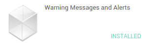
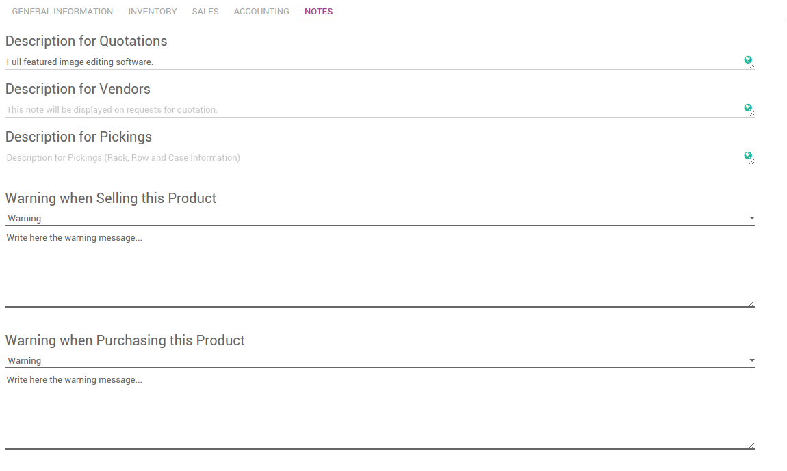
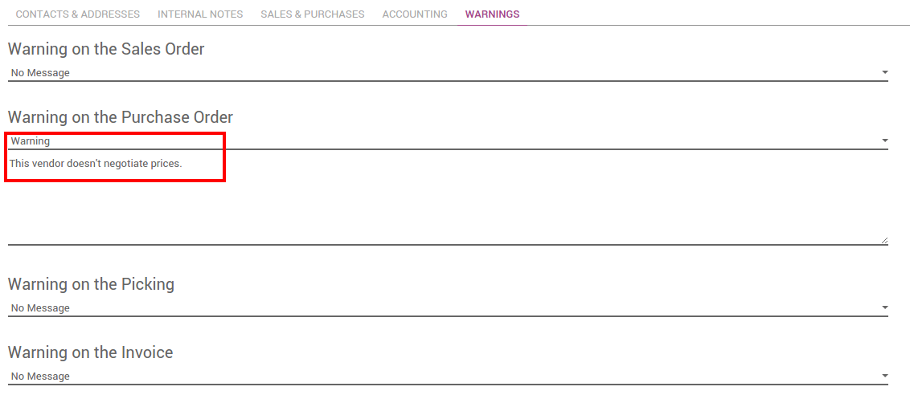

==============================================================
How to trigger a warning when purchasing at a specific vendor?
==============================================================

Overview
========

The **Warning Messages and Alerts** module allow you to configure alerts
on the customers and vendors or products.

You can select the following types of warnings and create different
warnings for purchases and sales:

-   Warning: This option displays the warning message during the process, 
    but allows the user to continue.

-   Blocking Message: The message displays a warning message, but the 
    user cannot continue the process further.

Configuration
=============

Module Installation
-------------------

First, you need to install the **Warning Messages and Alerts** module. Go
to **Apps** and look for it (don't forget to remove the **Apps** filter).

Vendor or Customer warnings
---------------------------

Go to :menuselection:`Purchases --> Vendors` or to :menuselection:`Sales --> Customers`.

Open the vendor or the customer and click on the **Warnings** tab.

.. image:: media/warning_triggering02.png
    :align: center

The available warnings are:

-  Warning on the **Sales Order**

-  Warning on the **Purchase Order**

-  Warning on the **Picking**

-  Warning on the **Invoice**

Product Warnings
----------------

Go to :menuselection:`Purchases --> Products` or to :menuselection:`Sales --> Products`.

Open the product and click on the **Notes** tab.

The available warnings are:

-  Warning when selling this product.

-  Warning when Purchasing this product.

How to trigger a warning when purchasing at a specific vendor?
==============================================================

Go to the Purchases application, click on :menuselection:`Purchase --> Vendors`. 
Go to the **Warnings** tab.

Under **Warning on the Purchase Order**, choose **Warning** and write your
warning.

Create a **Request for Quotation**. Go to 
:menuselection:`Purchase --> Request for Quotation` and click on **Create**. 
Choose the vendor on which a warning was set.

When choosing the vendor, the warning will appear.

.. note::
    If you set a blocking message instead of a warning message, you
    won't be able to choose the vendor.