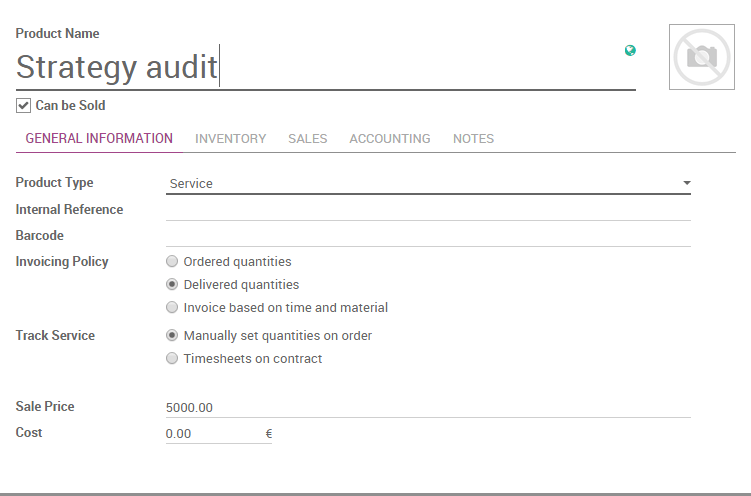
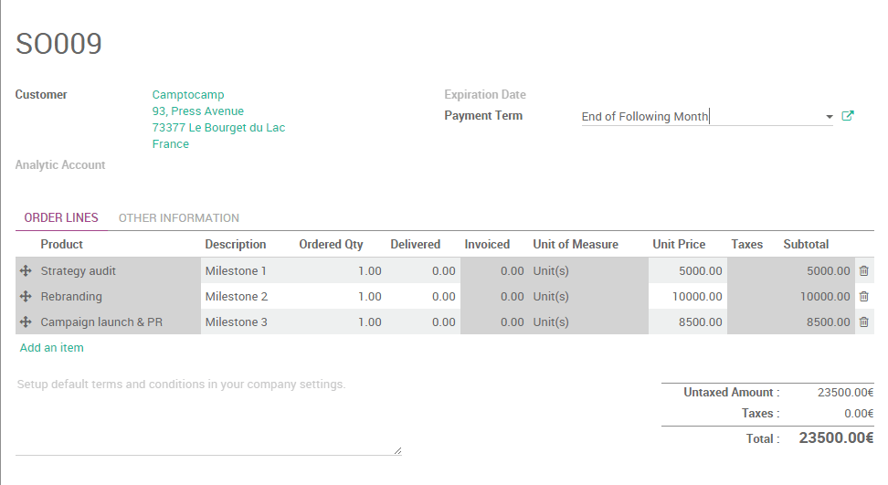

=======================================
How to invoice milestones of a project?
=======================================

There are different kind of service sales: prepaid volume of hours/days
(e.g. support contract), billing based on time and material (e.g.
billing consulting hours) or a fixed price contract (e.g. a project).

In this section, we will have a look at how to invoice milestones of a
project.

Milestone invoicing can be used for expensive or large scale projects,
with each milestone representing a clear sequence of work that will
incrementally build up to the completion of the contract. For example, a
marketing agency hired for a new product launch could break down a
project into the following milestones, each of them considered as one
service with a fixed price on the sale order :

-  Milestone 1 : Marketing strategy audit - 5 000 euros

-  Milestone 2 : Brand Identity - 10 000 euros

-  Milestone 3 : Campaign launch & PR - 8 500 euros

In this case, an invoice will be sent to the customer each time a
milestone will be successfully reached. That invoicing method is
comfortable both for the company which is ensured to get a steady cash
flow throughout the project lifetime and for the client who can monitor
the project's progress and pay in several times.

.. note::
    You can also use milestones to invoice percentages of the entire 
    project. For example, for a million euros project, your company 
    might require a 15% upfront payment, 30% at the midpoint and the 
    balance at the contract conclusion. In that case, each payment will 
    be considered as one milestone.

Configuration
=============

Install the Sales application
-----------------------------

In order to sell services and to send invoices, you need to install the
**Sales** application, from the **Apps** icon.

.. image:: media/milestones01.png
    :align: center

Create products
---------------

In Twenty20, each milestone of your project is considered as a product. From
the **Sales** application, use the menu :menuselection:`Sales --> Products`, 
create a new product with the following setup:

-   **Name**: Strategy audit

-   **Product Type**: Service

-   **Invoicing Policy**: Delivered Quantities, since you will invoice
    your milestone after it has been delivered

-   **Track Service**: Manually set quantities on order, as you
    complete each milestone, you will manually update their quantity
    from the **Delivered** tab on your sale order

.. note::
    Apply the same configuration for the others milestones.

Managing your project
=====================

Quotations and sale orders
--------------------------

Now that your milestones (or products) are created, you can create a
quotation or a sale order with each line corresponding to one milestone.
For each line, set the **Ordered Quantity** to ``1`` as each milestone is
completed once. Once the quotation is confirmed and transformed into a
sale order, you will be able to change the delivered quantities when the
corresponding milestone has been achieved.

Invoice milestones
------------------

Let's assume that your first milestone (the strategy audit) has been
successfully delivered and you want to invoice it to your customer. On
the sale order, click on **Edit** and set the **Delivered Quantity** of the
related product to ``1``.

.. tip::
    As soon as the above modification has been saved, you will notice 
    that the color of the line has changed to blue, meaning that the 
    service can now be invoiced. In the same time, the invoice status 
    of the SO has changed from **Nothing To Invoice** to **To Invoice**

Click on **Create invoice** and, in the new window that pops up, select
**Invoiceable lines** and validate. It will create a new invoice (in draft
status) with only the **strategy audit** product as invoiceable.

.. image:: media/milestones04.png
    :align: center

.. note::
    In order to be able to invoice a product, you need to set up the 
    **Accounting** application and to configure an accounting journal 
    and a chart of account. Click on the following link to learn more:
    :doc:`../../../accounting/overview/getting_started/setup`

Back on your sale order, you will notice that the **Invoiced** column of
your order line has been updated accordingly and that the **Invoice
Status** is back to **Nothing to Invoice**.

Follow the same workflow to invoice your remaining milestones.

.. seealso::
    * :doc:`reinvoice`
    * :doc:`support`