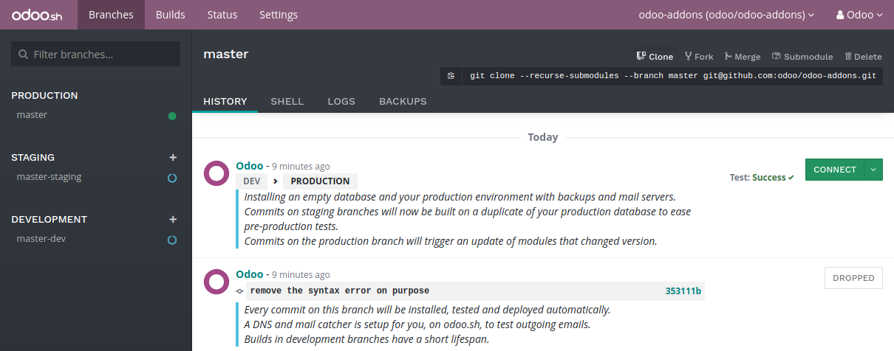
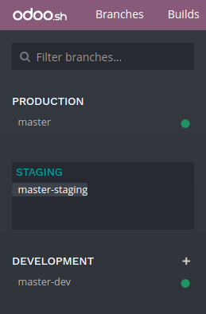
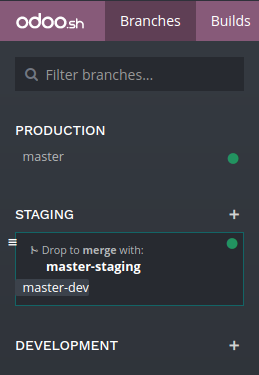
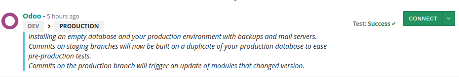
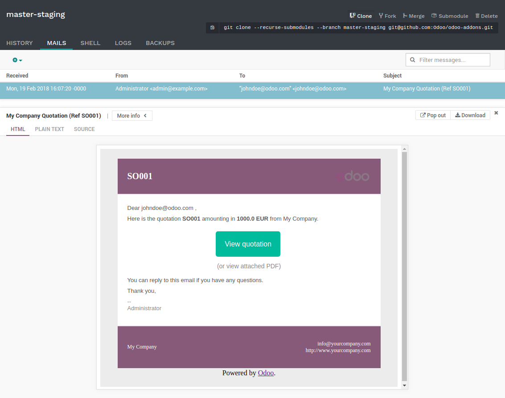
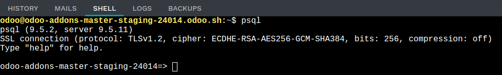
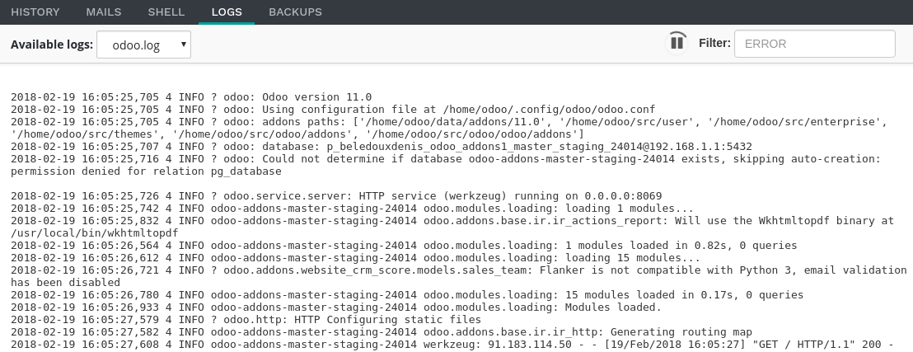
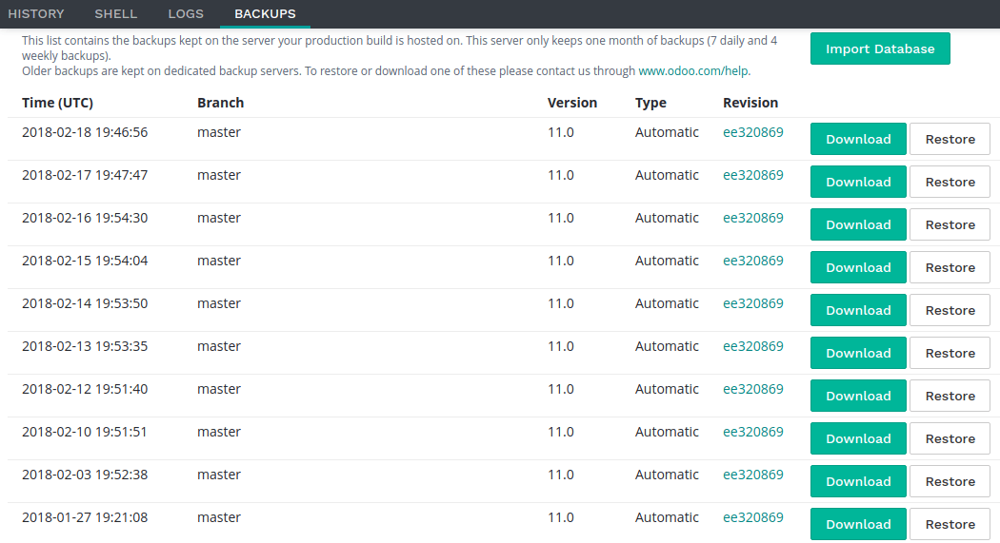
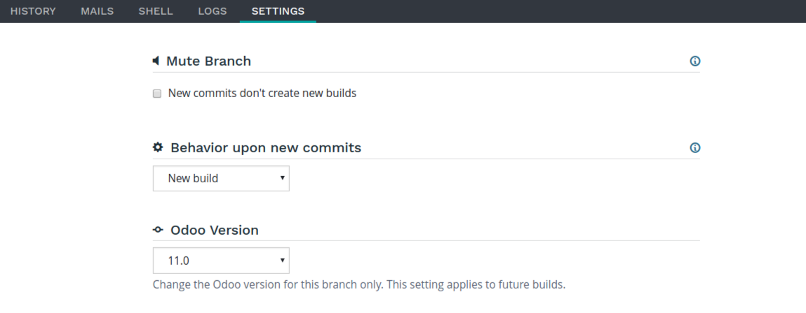
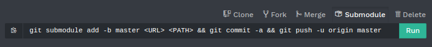

:banner: banners/odoo-sh.jpg

==================================
Branches
==================================

Overview
========

The branches view gives you an overview of the different branches your repository has.

.. _odoosh-gettingstarted-branches-stages:

Stages
===============

Odoo.sh offers three different stages for your branches: production, staging and development.

You can change the stage of a branch by drag and dropping it on the stage section title.

.. _stage_production:

Production
----------
This is the branch holding the code on which your production database run.
There can be only one production branch.

When you push a new commit in this branch,
your production server is updated with the code of the new revision and is then restarted.

If your changes require the update of a module, such as a change in a form view,
and you want it to be performed automatically,
increase the version number of the module in its manifest (*__manifest__.py*).
The platform will then take care to perform the update during which the
instance will be held temporarily unavailable for maintenance reason.

This method is equivalent to perform an upgrade of the module through the Apps menu,
or through the :code:`-u` switch of
`the command line <https://www.odoo.com/documentation/11.0/reference/cmdline.html>`_.

In the case the changes in the commit prevent the server to restart,
or if the modules update fails,
the server is automatically reverted to the previous successful code revision and
the database is roll-backed as it was before the update.
You still have access to the log of the failed update, so you can troubleshoot it.

The demo data is not loaded, as it is not meant to be used in a production database.
The unit tests are not performed, as it would increase the unavailabity time of the production database during the updates.

Partners using trial projects should be aware their production branch, along with all the staging branches,
will automatically be set back to the development stage after 15 days.

Staging
-------
Staging branches are meant to test your new features using the production data.

Pushing a new commit in one of these branches will either
* start a new server, using a duplicate of the production database and the new revision of the branch
* or update the previous database running on the branch,
depending on the push behaviour configured in the :ref:`branch's settings <odoosh-gettingstarted-branches-tabs-settings->`.

You can therefore test your latest features using the production data without compromising the actual
production database with test records.

The outgoing emails are not sent: They are intercepted by the mailcatcher,
which provides an interface to preview the emails sent by your database.
That way, you do not have to worry about sending test emails to your contacts.

Scheduled actions are disabled. If you want to test them, you have to enable them or trigger their action manually.
Be careful though: If these actions perform changes on third-party services (FTP servers, email servers, ...)
used by your production database as well, you might cause unwanted changes in your production.

The latest database will be kept alive indefinitely, older ones may get garbage collected automatically.
If you make configuration changes or view changes in these branches, make sure to document them or write them directly
in the modules of the branch, using XML data files overriding the default configuration or views.

The unit tests are not performed as, in Odoo, they currently rely on the demo data, which is not loaded in the
production database. In the future, if Odoo supports to run the unit tests without the demo data,
Odoo.sh will then consider running the tests on staging databases.

Development
-----------
Development branches create new databases using the demo data to run the unit tests.
The modules installed and tested by default are the ones included in your branches.
You can change this list of modules to install in your projects settings.

When you push a new commit in one of these branches,
a new server is started, with a database created from scratch and the new revision of the branch.
The demo data is loaded, and the unit tests are performed.
This verifies your changes do not break any of the features tested by them.

Similar to staging branches, the emails are not sent: They are intercepted by the mailcatcher.

The databases created for development branches are meant to live around three days.
After that, they can be garbage collected automatically.

.. _odoosh-gettingstarted-branches-mergingbranches:

Merging your branches
---------------------
You can merge your branches easily by drag and dropping them on each other.

When you want to test the changes of your development branches with the production data,
you can either:

* merge the development branch into your staging branch, by drag and dropping it onto the desired staging branch,
* drag and dropping the development branch on the staging section title, to make it become a staging branch.

When your latest changes are ready for production,
you can drag and drop your staging branch onto your production branch
to merge and deploy in production your newest features.

If you are bold enough,
you can merge your development branches into your production branch as well.
It just means you skip the validation of your changes with the production data through a staging branch.

You can merge your development branches into each other, and your staging branches into each other.

Of course, you can also use :code:`git merge` directly on your workstation to merge your branches.
Odoo.sh will be notified when new revisions have been pushed in your branches.

Merging a staging branch in the production branch only merges the source code: Any configuration changes you made in the
staging databases are not passed to the production database.

If you test configuration changes in staging branches, and want them to be applied in the production, you have to either:

* write the configuration changes in XML data files
  overriding the default configuration or views in your branches,
  and then increase the version of your module in its manifest (*__manifest__.py*) to trigger the update of the module
  when you merge your staging branch in your production branch.
  This is the best practice for a better scalability of your developments as you will use the Git versioning features
  for all your configuration changes, and therefore have a traceability for your changes.
* pass them manually from your staging to your production database, by copy/pasting them.

.. _odoosh-gettingstarted-branches-tabs:

Tabs
=============

History
-------
An overview of your branch history:

* The messages of the commits and their authors,
* The various events linked to the platform, such as stage changes, database imports, backup restores.

For each event, a status is displayed in the top right-hand corner.
It can provide information about the ongoing operation on the database (installation, update, backup import, ...),
or its result (tests feedback, successful backup import, ...).
When an operation is successful, you can access the database thanks to the *connect* button.

Mails
-----
This tab contains the mail catcher. It displays an overview of the emails sent by your database.
The mail catcher is available for your development and
staging branches as the emails of your production database are really sent instead of being intercepted.

Shell
-----
A shell access to your container. You can perform basic linux command (:code:`ls`, :code:`top`)
and open a shell on your database by typing :code:`psql`.

.. Note::
  Long running shell instances are not guaranteed. Idle shells can be
  disconnected at anytime in order to free up resources.

Logs
----
A viewer to have a look to your server logs.

Different logs are available:

* install.log: The logs of the database installation. In a development branch, the logs of the tests are included.
* pip.log: The logs of the Python dependencies installation.
* odoo.log: The logs of the running server.
* update.log: The logs of the database updates. This is available only for the production database.

If new lines are added in the logs, they will be displayed automatically.
If you scroll to the bottom, the browser will scroll automatically each time a new line is added.

You can pause the logs fetching by clicking on the according button in the upper right corner of the view.
The fetching is automatically stopped after 5 minutes. You can restart it using the play button.

Backups
-------
A list of the backups available for download and restore, the ability to perform a manual backup and to import a
database.

Odoo.sh makes daily backups of the production database. It keeps 7 daily, 4 weekly and 3 monthly backups.
Each backup includes the database dump, the filestore (attachments, binary fields), logs and sessions.

Staging and development databases are not backed up.
You nevertheless have the possibility to restore a backup of the production database in your staging branches, for
testing purposes, or to manually recover data that has been deleted by accident from the production database.

The list contains the backups kept on the server your production database is hosted on.
This server only keeps one month of backups: 7 daily and 4 weekly backups.

Dedicated backup servers keep the same backups, as well as 3 additional monthly backups.
To restore or download one of these monthly backups, please `contact us <https://www.odoo.com/help>`_.

You can make a backup manually before making big changes in your production database in case something goes wrong.
To avoid abuse, we limit manual backups to 5 per day.

The *import database* feature accepts database archives in the format provided by:

* the standard Odoo databases manager,
  (available for on-premise Odoo servers under :code:`/web/database/manager`)
* the Odoo online databases manager,
* the Odoo.sh backup download button of this *Backups* tab,
* the Odoo.sh dump download button in the :ref:`Builds view <odoosh-gettingstarted-builds>`.

.. _odoosh-gettingstarted-branches-tabs-settings:

Settings
--------
Here you can find a couple of settings that only apply to the currently selected branch.

**Mute Branch**

You have the possibility to mute a branch, so that new commits won't trigger builds on Odoo.sh. You can activate this
should you have branches that are used for other purposes than on Odoo.sh. By default, when creating a project from an
existing repository, all branches except the default branch are muted.

**Push Behavior**

You can change the branch's behavior upon receiving a new commit. By default, it will create a new build, but you can
choose to have it update your previous build same as for your production branch (see the
:ref:`Production Stage <stage_production>`). This is especially useful should the feature you're working on require a
particular setup or configuration, to avoid having to manually set it up again on every commit.

**Odoo Version**

For development branches only, you can change the version of Odoo, should you want to test upgraded code or develop
features while your production database is in the process of being upgraded to a newer version.

The production branch has no settings. It can't be muted, will always update the existing production database and will
run on the project's version of Odoo. If you want to upgrade your production to a newer version please refer to the
:ref:`Upgrade section <odoosh-advanced-upgrade_your_database>`.

Git commands
============
In the top right-hand corner of the view, different Git commands are available.

Each command can be copied in the clipboard to be used in a terminal,
and some of them can be used directly from Odoo.sh by clicking the *run* button
in such case a popup will prompt the user in order to define eventual placeholders
such as ``<URL>``, ``<PATH>``, ...

Clone
-----
Download the Git repository.

.. code-block:: bash

  $ git clone --recurse-submodules --branch master git@github.com:odoo/odoo.git

Clones the repository *odoo/odoo*.

* :code:`--recurse-submodules`: Downloads the submodules of your repository. Submodules included in the submodules are downloaded as well.
* :code:`--branch`: checks out a specific branch of the repository, in this case *master*.

The *run* button is not available for this command, as it is meant to be used on your machines.

Fork
----
Create a new branch based on the current branch.

.. code-block:: bash

  $ git checkout -b feature-1 master

Creates a new branch called *feature-1* based on the branch *master*, and then checkouts it.

.. code-block:: bash

  $ git push -u origin feature-1

Uploads the new branch *feature-1* on your remote repository.

Merge
-----
Merge the current branch in another branch.

.. code-block:: bash

  $ git merge staging-1

Merges the branch *staging-1* in the current branch.

.. code-block:: bash

  $ git push -u origin master

Uploads the changes you just added in the *master* branch on your remote repository.

Submodule
---------

Add a branch from another repository in your current branch as a *submodule*.

*Submodules* allows you to use modules from other repositories in your project.

The submodules feature is detailed in the chapter
:ref:`Submodules <odoosh-advanced-submodules>` of this documentation.

.. code-block:: bash

  $ git submodule add -b master <URL> <PATH>

Adds the branch *master* of the repository *<URL>* as a submodule under the path *<PATH>* in your current branch.

.. code-block:: bash

  $ git commit -a

Commits all your current changes.

.. code-block:: bash

  $ git push -u origin master

Uploads the changes you just added in the *master* branch on your remote repository.

Delete
------

Delete a branch from your repository.

.. code-block:: bash

  $ git push origin :master

Deletes the branch in your remote repository.

.. code-block:: bash

  $ git branch -D master

Deletes the branch in your local copy of the repository.
