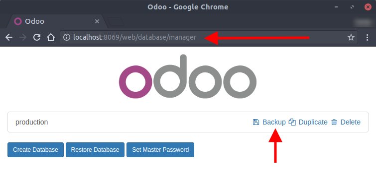
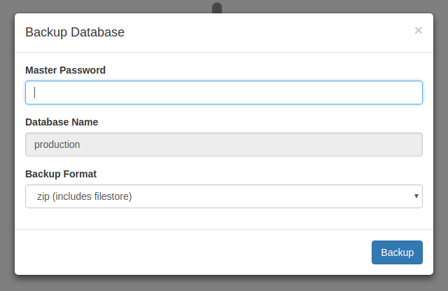
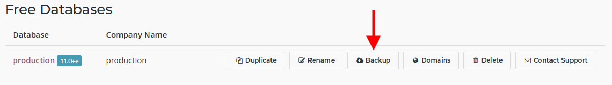
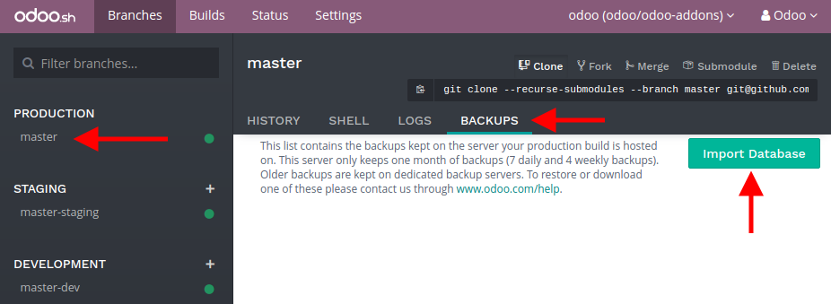
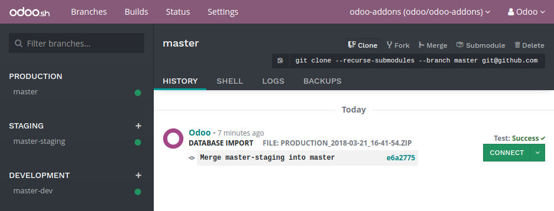

:banner: banners/odoo-sh.jpg

.. _odoosh-gettingstarted-create:

==================================
Create your project
==================================

Deploy your platform
====================

Go to `Odoo.sh <https://www.odoo.sh/>`_ and hit the button *Deploy your platform*.

.. image:: ./media/deploy.png
   :align: center

Sign in with Github
===================

Sign in with your Github account. If you do not have an account yet, hit the link *Create an account*.

.. image:: ./media/github-signin.png
   :align: center

Authorize Odoo.sh
=================

Grant Odoo.sh the required accesses to your account by clicking the button *Authorize*.

.. image:: ./media/github-authorize.png
   :align: center

Odoo.sh basically needs:

* to know your Github login and email,
* to create a new repository in case you decide to start from scratch,
* to read your existing repositories, including the ones of your organizations, in case you want to start from an existing repository,
* to create a webhook to be notified each time you push changes,
* to commit changes to make your deployment easier, merging branches or adding new `submodules <https://git-scm.com/book/en/v2/Git-Tools-Submodules>`_ for example.

Submit your project
===================

Choose if you want to start from scratch by creating a new repository, or if you want to use an existing repository.

Then, choose a name or select the repository you want to use.

Choose the Odoo version you want to use. If you plan to import an existing database or an existing set of applications, you might need to choose the according version. If you start from scratch, use the latest version.

Enter your *subscription code*. This is also called *subscription referral* or *contract number*.

For partners, Odoo.sh is free. If the free offer changes in the future, we guarantee that any project created under this offer will remain free for the same set of features.

For customers, your Enterprise subscription needs to include Odoo.sh.

After submitting the form, if you are notified your subscription is not valid, it either means:

* it is not an existing subscription,
* it is not a partnership subscription,
* it is an enterprise subscription, but which does not include Odoo.sh,
* it is neither a partnership subscription or an enterprise subscription (e.g. an online subscription).

.. image:: ./media/deploy-form.png
   :align: center

You're done !
=============

You can begin to use Odoo.sh. Your first build is about to be created. You will soon be able to connect to your first database.

.. image:: ./media/deploy-done.png
   :align: center

Import your database
====================

You can import your database in your Odoo.sh project as long as this is an Odoo 10.0 or 11.0 database.

Push your modules in production
-------------------------------

If you use community or custom modules, add them in a branch in your Github repository.
Databases hosted on the Odoo.com online platform do not have any custom modules.
Users of these databases can therefore skip this step.

You can structure your modules as you wish, Odoo.sh will automatically detect the folders containing Odoo addons.
For instance, you can put all your modules folder in the root directory of your repository,
or group the modules in folders by categories that you define (accounting, project, ...).

For community modules availabe in public Git repositories,
you can also consider to add them using :ref:`Submodules <odoosh-advanced-submodules>`.

Then, either :ref:`make this branch the production branch <odoosh-gettingstarted-branches-stages>`,
or :ref:`merge it into your production branch <odoosh-gettingstarted-branches-mergingbranches>`.

Download a backup
-----------------

On-premise databases
~~~~~~~~~~~~~~~~~~~~

Access the URL :file:`/web/database/manager` of your on-premise database and download a backup.

You will need the master password of your database server. If you do not have it, contact your system administrator.

Choose a zip including the filestore as the backup format.

Odoo Online databases
~~~~~~~~~~~~~~~~~~~~~

`Access your databases manager <https://accounts.odoo.com/my/databases/manage>`_ and download a backup of your database.

.. Warning::

  Saas releases (e.g. *saas-**) are not supported on Odoo.sh.

Upload the backup
-----------------

Then, in your Odoo.sh project, in the backups tab of your production branch, import the backup you just downloaded.

Once the backup imported, you can access the database using the *Connect* button in the history of the branch.

Check your outgoing email servers
---------------------------------

There is a default mail server provided with Odoo.sh.
If you want to use it, just delete or disable all your outgoing mail servers configured in your database in
:menuselection:`Settings --> Technical --> Outgoing Mail Servers` (Developer mode must be activated).

.. Warning::

  Ports 25, 465 and 587 are blocked. If you want to use your own email servers, they must be configured on other ports.
