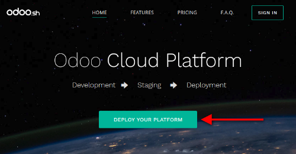
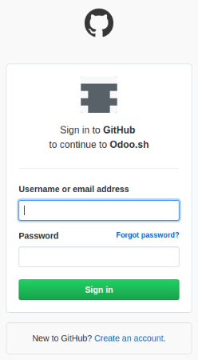
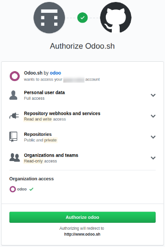
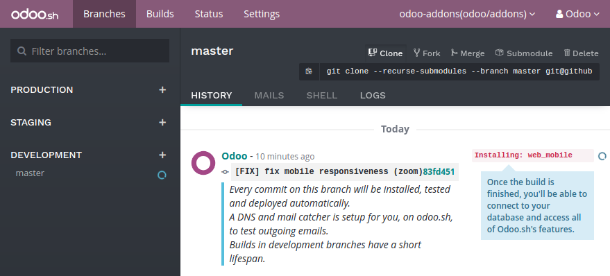

:banner: banners/odoo-sh.jpg

==================================
Create your project
==================================

Deploy your platform
====================

Go to `Odoo.sh <https://www.odoo.sh/>`_ and hit the button *Deploy your platform*.

Sign in with Github
===================

Sign in with your Github account. If you do not have an account yet, hit the link *Create an account*.

Authorize Odoo.sh
=================

Grant Odoo.sh the required accesses to your account by clicking the button *Authorize*.

Odoo.sh basically needs:

* to know your Github login and email,
* to create a new repository in case you decide to start from scratch,
* to read your existing repositories, including the ones of your organizations, in case you want to start from an existing repository,
* to create a webhook to be notified each time you push changes,
* to commit changes to make your deployment easier, merging branches or adding new `submodules <https://git-scm.com/book/en/v2/Git-Tools-Submodules>`_ for example.

Submit your project
===================

Choose if you want to start from scratch by creating a new repository, or if you want to use an existing repository.

Then, choose a name or select the repository you want to use.

Choose the Odoo version you want to use. If you plan to import an existing database or an existing set of applications, you might need to choose the according version. If you start from scratch, use the latest version.

Enter your *subscription code*. This is also called *subscription referral* or *contract number*.

For partners, Odoo.sh is free. If the free offer changes in the future, we guarantee that any project created under this offer will remain free for the same set of features.

For customers, your Enterprise subscription needs to include Odoo.sh.

After submitting the form, if you are notified your subscription is not valid, it either means:

* it is not an existing subscription,
* it is not a partnership subscription,
* it is an enterprise subscription, but which does not include Odoo.sh,
* it is neither a partnership subscription or an enterprise subscription (e.g. an online subscription).

.. image:: ./media/deploy-form.png
   :align: center

You're done !
=============

You can begin to use Odoo.sh. Your first build is about to be created. You will soon be able to connect to your first database.

