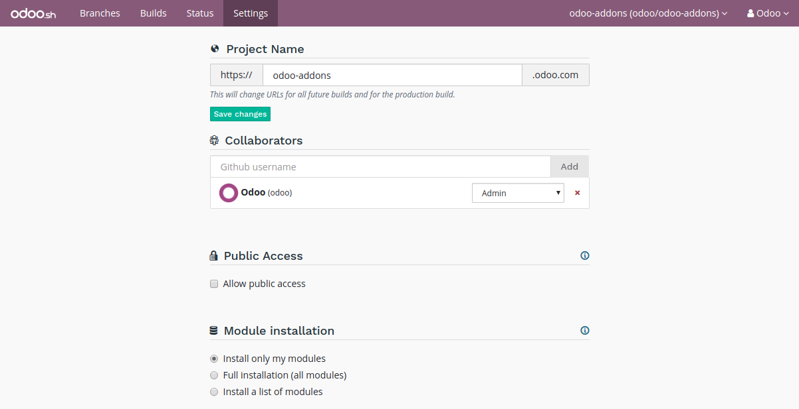
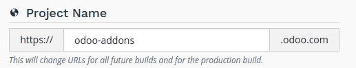
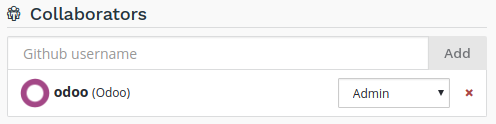
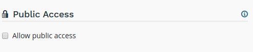
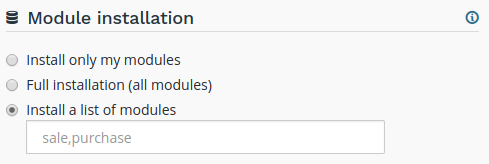
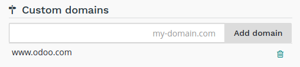
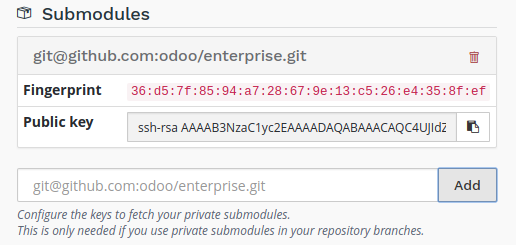
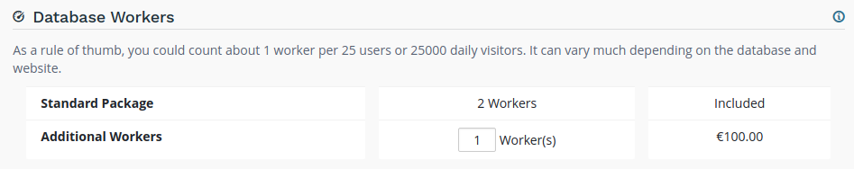
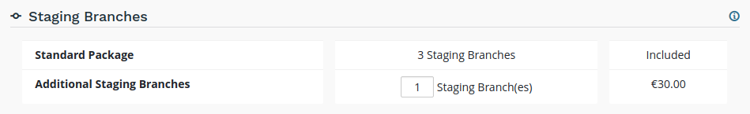
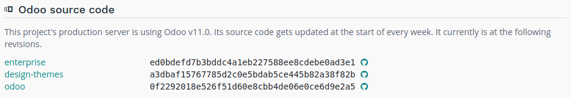

:banner: banners/odoo-sh.jpg

==================================
Settings
==================================

Overview
========

The settings allows you to manage the configuration of your project.

Project name
============

The name of your project.

This defines the address that will be used to access your production database.

Addresses of your staging and development builds are derived from this name and assigned automatically.
However, when you change your project name, only future builds will use the new name.

Collaborators
=============

Manage the Github users who can access your project.

There are two levels of users:

* Admin: has access to all features of Odoo.sh.
* User: does not have access to the project settings nor to the production and staging databases.

The user group is meant for developers who can make modifications in your code but are not allowed to access the
production data.
Users of this group cannot connect to the production and staging databases using the *1-click connect* feature,
but they can of course use their regular account on these databases if they have one, using their regular credentials.

In addition, they cannot use the webshell nor have access to the server logs.

+---------------------+-----------------+-----------+-----------+
|                     |                 | User      | Admin     |
+=====================+=================+===========+===========+
|Development          | History         |     X     |     X     |
+---------------------+-----------------+-----------+-----------+
|                     | 1-click connect |     X     |     X     |
+---------------------+-----------------+-----------+-----------+
|                     | Logs            |     X     |     X     |
+---------------------+-----------------+-----------+-----------+
|                     | Shell           |     X     |     X     |
+---------------------+-----------------+-----------+-----------+
|                     | Mails           |     X     |     X     |
+---------------------+-----------------+-----------+-----------+
|                     | Settings        |     X     |     X     |
+---------------------+-----------------+-----------+-----------+
|Production & Staging | History         |     X     |     X     |
+---------------------+-----------------+-----------+-----------+
|                     | 1-click connect |           |     X     |
+---------------------+-----------------+-----------+-----------+
|                     | Logs            |           |     X     |
+---------------------+-----------------+-----------+-----------+
|                     | Shell           |           |     X     |
+---------------------+-----------------+-----------+-----------+
|                     | Mails           |           |     X     |
+---------------------+-----------------+-----------+-----------+
|                     | Backups         |           |     X     |
+---------------------+-----------------+-----------+-----------+
|                     | Settings        |     X     |     X     |
+---------------------+-----------------+-----------+-----------+
|Status               |                 |     X     |     X     |
+---------------------+-----------------+-----------+-----------+
|Settings             |                 |           |     X     |
+---------------------+-----------------+-----------+-----------+

Public Access
=============

Allow public access to your development builds.

If activated, this option exposes the Builds page publicly, allowing visitors to connect to your development builds.

In addition, visitors have access to the logs, shell and mails of your development builds.

Production and staging builds are excluded, visitors can only see their status.

Modules installation
====================

Choose the modules to install automatically for your development builds.

* *Install only my modules* will install the modules of the branch only.
  The :ref:`submodules <odoosh-advanced-submodules>` are excluded.
* *Full installation (all modules)* will install the modules of the branch, the modules included in the submodules
  and all standard modules of Odoo.
* *Install a list of modules* will install the modules specified in the input just below this option.
  The names are the technical name of the modules, and they must be comma-separated.

All installed modules will be tested.
The tests in the standard Odoo modules suite can take up to 1 hour.
This setting applies to development builds only.
Staging builds duplicate the production build and the production build only installs base.

Custom domains
==============

Configure your own domain name.

If you would like to access your production database using your own domain name, you have to:

* own or purchase the domain name,
* add the domain name in this list,
* in your registrar's domain name manager,
  configure the domain name with a ``CNAME`` record set to your production database domain name.

For instance, to associate *www.mycompany.com* to your database *mycompany.odoo.com*:

* in Odoo.sh, add *www.mycompany.com* in the custom domains of your project settings,
* in your domain name manager (e.g. *godaddy.com*, *gandi.net*, *ovh.com*),
  configure *www.mycompany.com* with a ``CNAME`` record with as value *mycompany.odoo.com*.

Bare domains (e.g. *mycompany.com*) are not accepted:

* they can only be configured using ``A`` records,
* ``A`` records only accept IP addresses as value,
* the IP address of your database can change, following an upgrade, a hardware failure or
  your wish to host your database in another country or continent.

Therefore, bare domains could suddenly no longer work because of this change of IP address.

In addition, if you would like both *mycompany.com* and *www.mycompany.com* to work with your database,
having the first redirecting to the second is amongst the
`SEO best practices <https://support.google.com/webmasters/answer/7451184?hl=en>`_
(See *Provide one version of a URL to reach a document*)
in order to have one dominant URL. You can therefore just configure *mycompany.com* to redirect to *www.mycompany.com*.
Most domain managers have the feature to configure this redirection. This is commonly called a web redirection.

HTTPS/SSL
---------

You can use a third-party CDN such as *Cloudflare.com* to enable the *HTTPS* support for your custom domain:

* `Create a Cloudflare account <https://support.cloudflare.com/hc/en-us/articles/201720164-Step-2-Create-a-Cloudflare-account-and-add-a-website>`_
* `Change your domain name servers to Cloudflare <https://support.cloudflare.com/hc/en-us/articles/205195708-Step-3-Change-your-domain-name-servers-to-Cloudflare>`_
* `Choose an SSL mode <https://support.cloudflare.com/hc/en-us/articles/201897700-Step-4-Recommended-First-Steps-for-all-Cloudflare-users#sslmode>`_
* `Redirect your visitors to HTTPS <https://support.cloudflare.com/hc/en-us/articles/200170536-How-do-I-redirect-all-visitors-to-HTTPS-SSL->`_

SPF and DKIM compliance
-----------------------
In case the domain of your users email address uses SPF (Sender Policy Framework) or DKIM (DomainKeys Identified Mail)
to increase the deliverability of your outgoing emails,
don't forget to authorize Odoo as a sending host in your domain name settings.
The configuration steps are explained in the :ref:`Discuss app documentation <discuss-email_servers-spf-compliant>`.

.. Warning::
  Forgetting to configure your SPF or DKIM to authorize Odoo as a sending host can lead to the delivery of your emails as spam in your contacts inbox.

.. _odoosh-gettingstarted-settings-submodules:

Submodules
==========

Configure the deploy keys for the private repositories you use
as submodules in your branches to allow Odoo.sh to download them.

.. Warning::
  These settings are required for **private repositories** only.
  If you are looking on how to set up your submodules,
  instructions are available in the chapter :ref:`Submodules <odoosh-advanced-submodules>` of this documentation.

When a repository is private, this is not possible to publicly download its branches and revisions.
For that reason, you need to configure a deploy key for Odoo.sh,
so the remote Git server allows our platform to download the revisions
of this private repository.

To configure the deploy key for a private repository, proceed as follow:

* in the input, paste the SSH URL of your private sub-repository and click on *Add*,

  * e.g. *git@github.com:USERNAME/REPOSITORY.git*
  * it can be another Git server than Github, such as Bitbucket, Gitlab or even your own self-hosted server

* copy the public key,

  * it should look like *ssh-rsa some...random...characters...here...==*

* in the settings of the private sub-repository, add the public key amongst the deploy keys.

  * Github.com: :menuselection:`Settings --> Deploy keys --> Add deploy key`
  * Bitbucket.com: :menuselection:`Settings --> Access keys --> Add key`
  * Gitlab.com: :menuselection:`Settings --> Repository --> Deploy Keys`
  * Self-hosted: append the key to the git user’s authorized_keys file in its .ssh directory

Storage Size
============

This section shows a small description of the storage size used by your project.

.. image:: ./media/interface-settings-storage.png
   :align: center

If your production database exceeds 4 GB, you will automatically be billed on the subscription activating the project with the excess size.

Database Workers
================

Additional database workers can be configured here. More workers help increase the load your production database is able to handle.

.. Warning::
  Adding more workers will not magically solve all performance issues. It mainly allows the server to handle more connections at the same time.

Staging Branches
================

Additional staging branches allow you to develop and test more features at the same time.

Odoo Source Code
================

Lists the source code's revisions of your production database. Useful if you need to know if a recent bugfix has already been deployed or not.

Activation
==========

Shows the status of the project's activation. You can change the project's activation code if needed.

.. image:: ./media/interface-settings-activation.png
   :align: center
