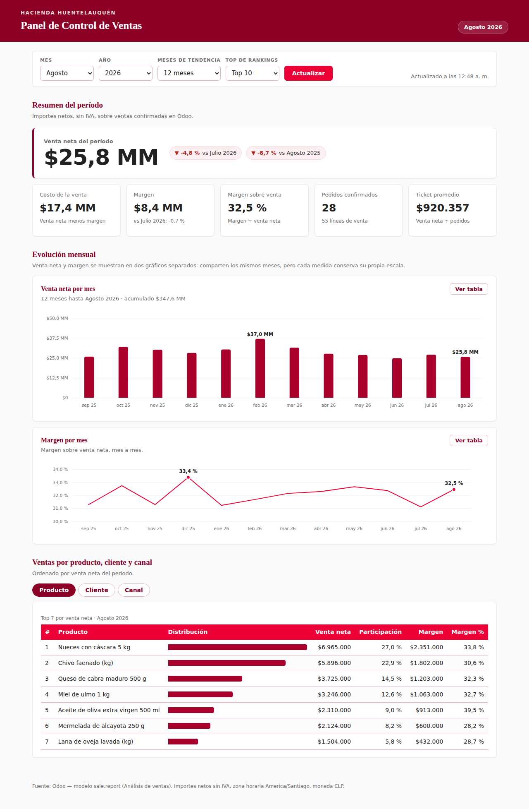

# Panel de Control de Ventas — Hacienda Huentelauquén

Aplicación web que lee las ventas directamente de Odoo y las muestra como panel
de control: venta neta y margen del período, evolución mes a mes y ranking de
ventas por producto, cliente y canal.

Es una aplicación **independiente y de solo lectura**: se conecta al Odoo
productivo por el API externo (XML-RPC), no instala módulos, no modifica datos y
no requiere tocar el servidor de Odoo.



## Qué muestra

| Bloque | Contenido |
|---|---|
| Resumen del período | Venta neta (cifra protagonista), costo, margen, margen sobre venta, pedidos confirmados y ticket promedio, comparados contra el mes anterior y contra el mismo mes del año anterior |
| Evolución mensual | Venta neta por mes y margen por mes, en gráficos separados (cada medida conserva su escala) |
| Ventas por dimensión | Top por producto, por cliente y por canal (equipo de ventas), con monto, participación y margen |

Todos los importes son **netos, sin IVA** — la misma base imponible del Libro de
Ventas —, y sólo consideran ventas confirmadas: los presupuestos y los pedidos
cancelados quedan fuera.

## Requisitos

- **Python 3.11 o superior.** No se necesita ninguna dependencia externa.
- **Un usuario de Odoo de solo lectura** con acceso a Ventas y una clave de API.
- Para el margen: el módulo **Margen en ventas** (`sale_margin`) instalado en
  Odoo. Sin él, el panel muestra la venta pero deja el margen en blanco y lo
  advierte en pantalla, en lugar de inventar una cifra.

### Preparar el usuario en Odoo

1. **Ajustes → Usuarios y compañías → Usuarios → Nuevo.** Cree, por ejemplo,
   `panel.ventas@huentelauquen.cl`.
2. En **Permisos de acceso**, deje Ventas en *Solo lectura* (o *Usuario: sus
   propios documentos* según corresponda) y no le dé permisos de administración.
3. Inicie sesión con ese usuario, vaya a **Preferencias → Seguridad de la cuenta
   → Claves de API** y genere una clave nueva. Esa clave es la que va en
   `ODOO_PASSWORD`.

Usar una clave de API en vez de la contraseña permite revocar el acceso del panel
sin cambiar la contraseña del usuario.

## Instalación

```bash
git clone <este repositorio>
cd panel_ventas_huentelauquen
cp .env.example .env
$EDITOR .env            # complete ODOO_URL, ODOO_DB, ODOO_USERNAME y ODOO_PASSWORD
```

## Configuración

Todo se configura por variables de entorno (o por el archivo `.env`):

| Variable | Obligatoria | Por defecto | Para qué sirve |
|---|---|---|---|
| `ODOO_URL` | sí | — | URL del Odoo, con `https://` |
| `ODOO_DB` | sí | — | Nombre de la base de datos |
| `ODOO_USERNAME` | sí | — | Usuario de solo lectura |
| `ODOO_PASSWORD` | sí | — | Clave de API de ese usuario |
| `PANEL_COMPANY_ID` | no | todas | Limita el panel a una compañía |
| `PANEL_TIMEZONE` | no | `America/Santiago` | Zona con la que se recortan los meses |
| `PANEL_CURRENCY` | no | `CLP` | Moneda con la que se formatean los montos |
| `PANEL_SALE_STATES` | no | `sale,done` | Estados que cuentan como venta confirmada |
| `PANEL_ORG` | no | `Hacienda Huentelauquén` | Nombre que aparece en el encabezado |
| `PANEL_HOST` / `PANEL_PORT` | no | `127.0.0.1` / `8069` | Dónde escucha el panel |
| `PANEL_CACHE_TTL` | no | `300` | Segundos que se reutiliza una consulta; `0` la desactiva |
| `PANEL_REQUEST_TIMEOUT` | no | `30` | Segundos máximos de espera a Odoo |

> El `.env` guarda una credencial de Odoo. Manténgalo fuera del repositorio y con
> permisos restringidos (`chmod 600 .env`).

## Uso

### Para probar

```bash
python3 -m panel_ventas.server
```

Abra <http://127.0.0.1:8069>. Para verificar la conexión sin abrir el navegador:

```bash
curl http://127.0.0.1:8069/api/salud
```

### En producción

El servidor de desarrollo de Python no está pensado para uso permanente. Use un
servidor WSGI y déjelo detrás de un proxy inverso con HTTPS:

```bash
pip install -r requirements.txt
waitress-serve --host 127.0.0.1 --port 8069 --call panel_ventas.wsgi:crear_app
```

Como servicio de systemd (`/etc/systemd/system/panel-ventas.service`):

```ini
[Unit]
Description=Panel de Control de Ventas - Hacienda Huentelauquen
After=network.target

[Service]
User=panel
WorkingDirectory=/opt/panel_ventas_huentelauquen
EnvironmentFile=/opt/panel_ventas_huentelauquen/.env
ExecStart=/usr/bin/waitress-serve --host 127.0.0.1 --port 8069 --call panel_ventas.wsgi:crear_app
Restart=on-failure

[Install]
WantedBy=multi-user.target
```

El panel no tiene autenticación propia: **no lo publique en Internet abierto.**
Déjelo en la red interna, o protéjalo con la autenticación del proxy inverso
(por ejemplo `auth_basic` en nginx o un acceso por VPN).

## API

Todos los endpoints son `GET` y devuelven JSON.

| Ruta | Parámetros | Devuelve |
|---|---|---|
| `/api/salud` | — | Versión de Odoo, usuario conectado y si hay margen disponible |
| `/api/panel` | `anio`+`mes`, o `desde`+`hasta` (`AAAA-MM-DD`); `meses` (1–36, por defecto 12); `limite` (1–50, por defecto 10) | Resumen, tendencia y los tres rankings |
| `/api/ranking` | los mismos, más `dim` = `producto` \| `cliente` \| `canal` | Un ranking |

Sin parámetros de fecha, el período es el **mes en curso** según
`PANEL_TIMEZONE`. Ejemplo:

```bash
curl "http://127.0.0.1:8069/api/panel?anio=2026&mes=8&meses=12&limite=10"
```

## Cómo se calcula cada cifra

Todo sale de `sale.report`, el modelo de *Análisis de ventas* de Odoo — el mismo
que alimenta el informe estándar de Ventas.

| Indicador | Cálculo |
|---|---|
| Venta neta | Suma de `price_subtotal` (importe sin impuestos) |
| Margen | Suma de `margin` (requiere `sale_margin`) |
| Costo de la venta | Venta neta − margen |
| Margen sobre venta | Margen ÷ venta neta |
| Pedidos confirmados | `sale.order` con `date_order` en el período y estado confirmado |
| Ticket promedio | Venta neta ÷ pedidos confirmados (no ÷ líneas) |
| Participación | Venta neta de la fila ÷ venta neta del período |

Dos decisiones que conviene tener presentes al conciliar contra el cierre mensual:

- **Los meses se recortan en hora de Chile, no en UTC.** Odoo guarda las fechas en
  UTC; una venta del 31 de agosto a las 22:00 en Chile queda registrada como
  1 de septiembre UTC. El panel convierte el rango antes de consultar, de modo
  que ese documento se cuenta en agosto, igual que en el Libro de Ventas.
- **Una variación contra un período en cero se muestra como «—», no como `+∞ %`.**

## Pruebas

```bash
python3 -m unittest discover -s tests -t .
```

Las pruebas corren contra un Odoo simulado en memoria que evalúa dominios y
agrupaciones reales, así que ejercitan el cálculo y no un doble trivial. Cubren
los períodos y sus comparativos, la conversión de zona horaria, el margen ausente,
los rankings, la validación de parámetros, la caché y el manejo de errores.

## Problemas frecuentes

| Síntoma | Causa probable |
|---|---|
| «Odoo rechazó las credenciales» | `ODOO_DB` incorrecto, o `ODOO_PASSWORD` con la contraseña en vez de la clave de API |
| El margen aparece vacío en todo el panel | Falta el módulo *Margen en ventas* (`sale_margin`) en Odoo |
| «Odoo no respondió dentro del tiempo permitido» | Suba `PANEL_REQUEST_TIMEOUT`; en bases grandes las primeras consultas tardan |
| Los totales no cuadran con el Libro de Ventas | Revise `PANEL_COMPANY_ID` y `PANEL_SALE_STATES`; el panel mide venta **de pedidos**, no de facturas emitidas |
| Los cambios en Odoo tardan en verse | Es la caché: baje o anule `PANEL_CACHE_TTL` |

## Estructura

```
panel_ventas_huentelauquen/
├── panel_ventas/
│   ├── config.py        Configuración por variables de entorno
│   ├── odoo_client.py   Cliente XML-RPC de solo lectura
│   ├── metrics.py       Períodos, venta neta, margen y rankings
│   ├── wsgi.py          Rutas, validación, caché y errores
│   ├── server.py        Servidor de desarrollo
│   └── static/          index.html, styles.css, app.js
└── tests/               Pruebas con un Odoo simulado
```
