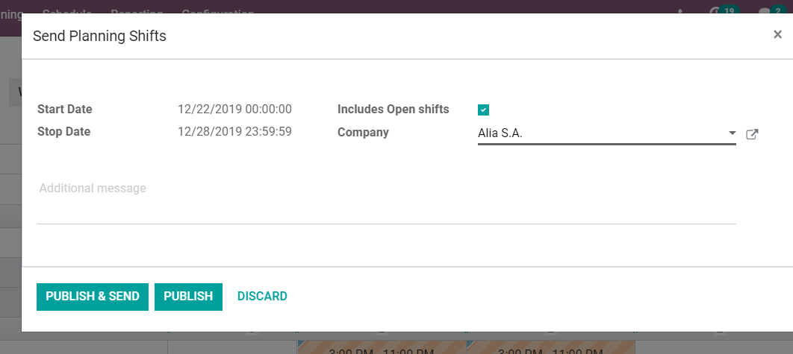
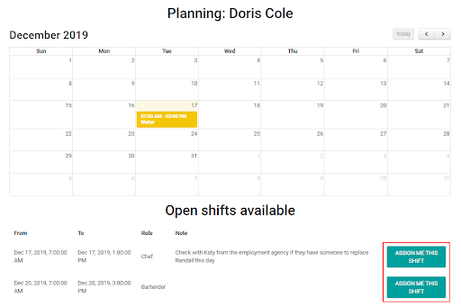
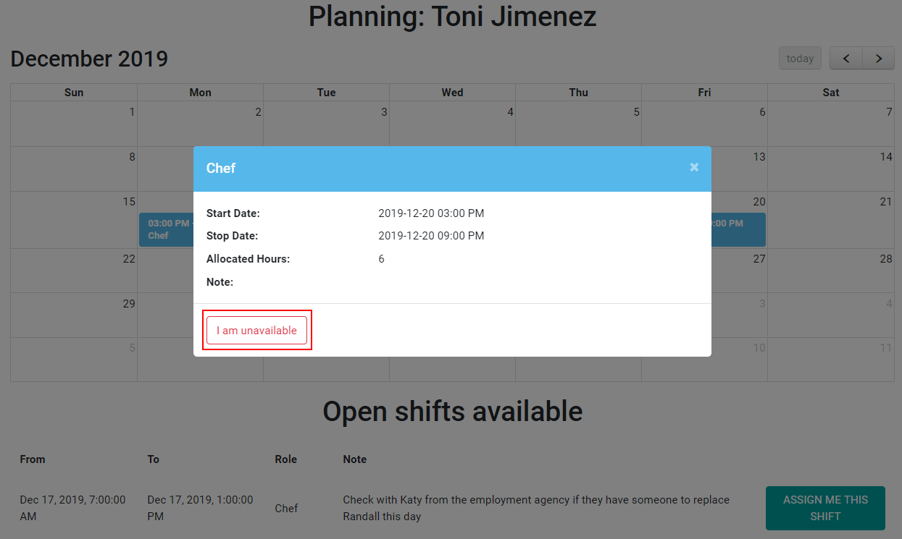
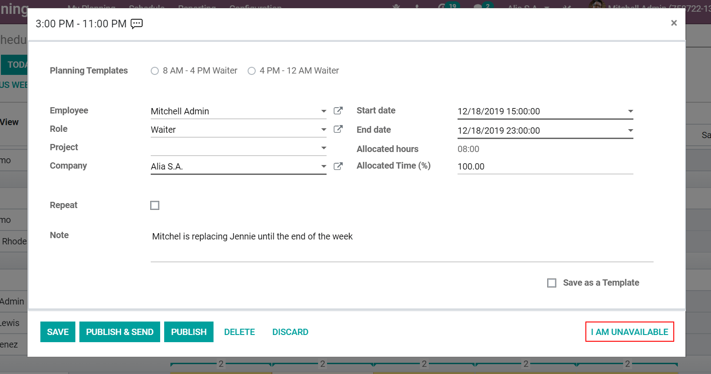

============================================================
Send Planned Shifts and Give Employees Autonomy Over Shifts
============================================================
If you are not on top of your tasks and shifts you might fall behind, loosing productivity.
Allowing your employees to have a say over shifts helps you to be on top of your workload, and
gives them flexibility.

Publish and send the planned week by email
===========================================
Once you have your shifts planned, click on *Send Schedule*. Select *Include Open shift* if
you would like the *Unassigned* shifts to be seen.

Choose if you just want to *Publish* or *Publish and Send*. If you *Publish and Send*, employees
will get an email that will redirect them to their planned tasks:

.. note::
   Employees will not be able to see shifts until they have been published.

Let employees unassign themselves from shifts
===============================================
Go to *Configuration* and enable *Allow Unassignment*.
From now on, when an employee opens his tasks, he can indicate his unavailability clicking
on *I am unavailable*. The shift will be opened again, allowing someone else to take it.

.. tip::
   Employees have portal access; users have access to the database.
