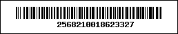
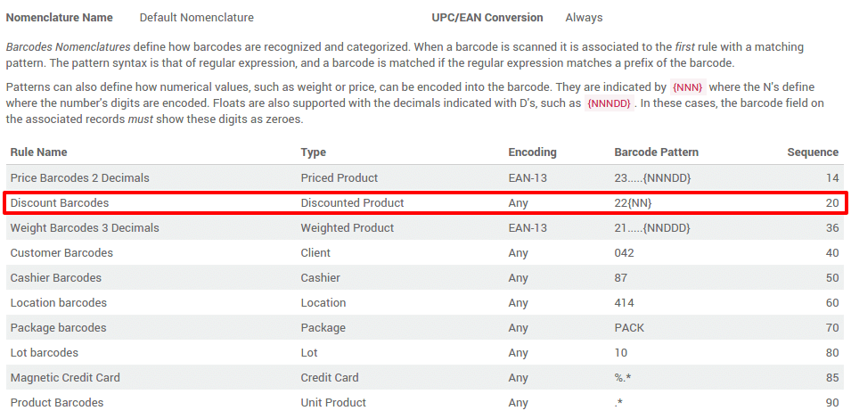
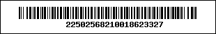
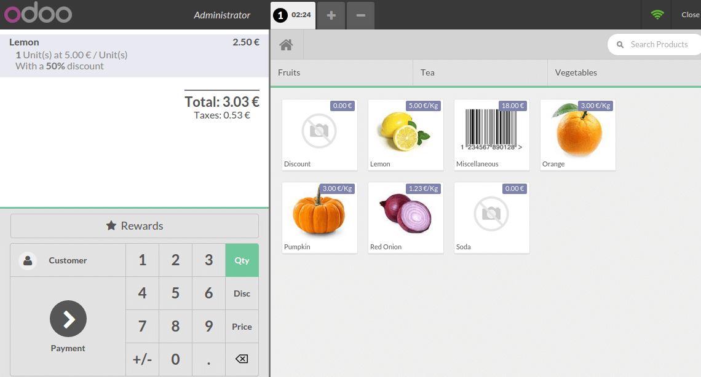

=====================================
How to use discount tags on products?
=====================================

This tutorial will describe how to use discount tags on products.

Barcode Nomenclature
====================

To start using discounts tags, let's first have a look at the **barcode
nomenclature** in order to print our correct discounts tags.

I want to have a discount for the product with the following barcode.

Go to :menuselection:`Point of Sale --> Configuration --> Barcode Nomenclatures`. 
In the default nomenclature, you can see that to set a discount, you have to
start you barcode with ``22`` and the add the percentage you want to set for
the product. 

For instance if you want ``50%`` discount on a product you have to start you
barcode with ``2250`` and then add the product barcode. In our example, the
barcode will be:

Scanning your products
======================

If you go back to the **dashboard** and start a **new session**

.. image:: media/discount_tags04.png
    :align: center

You have to scan:

1. the product

2. the discount tag

When the product is scanned, it appears on the ticket

Then when you scan the discount tag, ``50%`` discount is applied on the
product.

That's it, this how you can use discount tag on products with Odoo.

.. seealso::
    * :doc:`../shop/cash_control`
    * :doc:`../shop/invoice`
    * :doc:`../shop/refund`
    * :doc:`../shop/seasonal_discount`